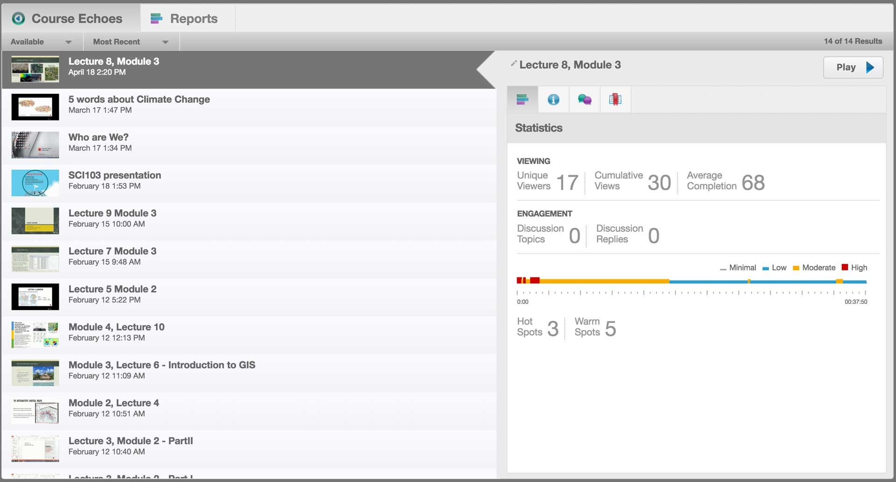
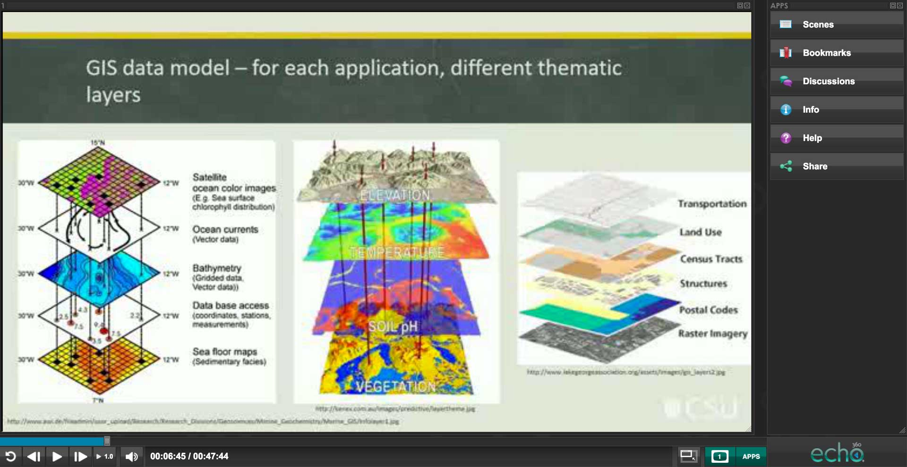
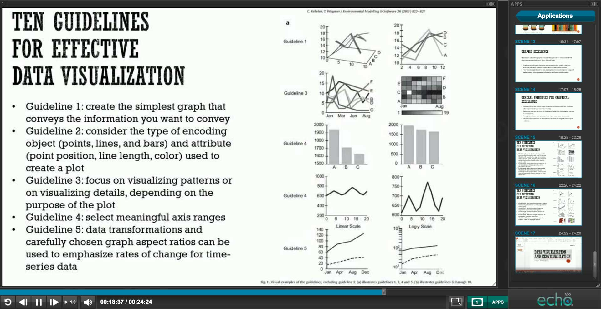

### Title

Video Lectures

### Element Tags

Teacher Presence

### Overview

Recording Video Lectures for online students provides a richer engagement with the subject concepts than is possible with text. The sound and ‘live’ nature of the resource helps to convey the presence of the teacher. The tone of voice and other aspects of the audio contribute to students understanding of the topic and possible nuances in concepts. Video provides a rich medium to convey information as it can combine visual elements with animation and footage of the lecturer speaking. It also provides an avenue to embed and share some of the teacher's personality. 

### Engagement

Video Lectures provide a version of ‘the lecture’ that is more tailored to the online environment. CSU Replay recordings of the internal lecture can sometimes have issues with the audio as the lecturer moves in relation to the microphone and can come across to students as second best. Specifically recording videos shifts the priority to the online students and opens up new possibilities for internal students as well. 

### In Practice

#### Subject

SCI103: Communicating Environmental Data

#### Teaching staff 

Ana Horta 

#### Motivation

The Video Lectures help the online students to feel that they are not missing out because of their study mode. They provide an effective way of augmenting the existing content students have and provide a timely way to address questions and provide support to the whole cohort of students. 

#### Implementation

The SCI103 video lectures include screen-captures as well as audio and video, and mostly range from 20-40 minutes. They were created to provide online students with more coverage and explanation of the concepts presented in the online modules, textbook and recommended readings. Like lectures, there is one for each week. Through these video lectures the voice and personality of the lecturer comes through as a real human being, and so helps convey teacher presence. 

        

            

            
>

            
>

        

        

        

        

### Guide

Video lectures can be utilised in a variety of ways to augment and support your teaching and engagement with students. They provide a way to communicate directly with the class as a whole but also provide a channel to embed your personality into the subject too. There are however some pitfalls in that make transferring lectures done face-to-face quite challenging, but also some important affordance you can take advantage of. 

- **Maintaining Attention** - This can be a challenge in a video and it’s why many experts suggest keeping the length of online videos short. There are often more distractions available when studying online and it’s a lot easier to duck off to another Tab in the browser than it is to leave a classroom. 
- **Audio and Visuals** - Videos require an effort to both audio and visual components. Talking to a single slide is quite common in a face-to-face lecture because there is other visual stimuli available, but that’s not the case in a video. Spending less time on a slide and creating some visual diversity 
- **Pause and Rewind** - One of the unique aspects of video lectures is that it provides students with the ability to pause and rewind. Pausing means that they can come back to the lecture and provides students with added flexibility. The rewind allows students to re-watch the video multiple times. This is great for demonstrations or showing processes to student. It allows them to see how it fits together.
- **Communicate** - Use video lectures to maintain a dialogue with your students. Keep them up to date with their progress, upcoming deadlines, tips for study and assessment tasks and respond to their questions from the forums or email as a group. 

### Tools

[CSU Replay](https://www.csu.edu.au/division/dit/staff/training/self-help/teaching-technology-and-support) provides a desktop capture solution that allows you to record and upload presentations back into the system for students to access. 

### Further Reading

Anderson, T., Rourke, L., Garrison, D. R., & Archer, W. (2001). Assessing teacher presence in a computer conferencing context. *[Journal of the Asynchronous Learning Network, 5](http://auspace.athabascau.ca/bitstream/2149/2725/2141/assessing_teaching_presence.pdf%20on%20Oct-2014)*(2), 

Anderson T. (Ed.), (2008) *Theory and practice of online learning* (pp. 343-365). Athabasca University, Edmonton, AB: AU Press.

Arbaugh, J. B. (2001). How Instructor Immediacy Behaviors Affect Student Satisfaction and Learning in Web-Based Courses. [Article]. *Business Communication Quarterly, 64*(4), 42-54.

Borup, J. West, R.E., Graham C.R. (2012) *[The Internet and Higher Education](http://www.sciencedirect.com/science/article/pii/S109675161100073X)*, Elsevier

Dunlap, J. C., & Lowenthal, P. R. (2009). Tweeting the Night Away: Using Twitter to Enhance Social Presence. [Article]. *Journal of Information Systems Education, 20*(2), 129-135. 

Garrison, D. R., & Arbaugh, J. B. (2007). Researching the community of inquiry framework: Review, issues, and future directions. *[The Internet and Higher Education, 10](http://dx.doi.org/10.1016/j.iheduc.2007.04.001)*(3), 157-172. and p.168 

Ostashewski, N. (2015). A tale of three MOOCs: Designing for meaningful teacher presence in large-enrolment courses. In S. Carliner, C. Fulford & N. Ostashewski (Eds.), *Proceedings of EdMedia: World Conference on Educational Media and Technology 2015* (Vol. 2015, pp. 1279-1284): Association for the Advancement of Computing in Education (AACE).

Sheridan, T. B. (1992). Musings on telepresence and virtual presence. *Presence: Teleoper. Virtual Environ.*, 1(1), 120-126 mentions video as part of conveying telepresence

Swan, K., Shea, P., Richardson, J., Ice, P., Garrison, D., Cleveland-Innes, M., et al. (2008). Validating a measurement tool of presence in online communities of inquiry. *E-mentor, 2*(24), 1-12. 

