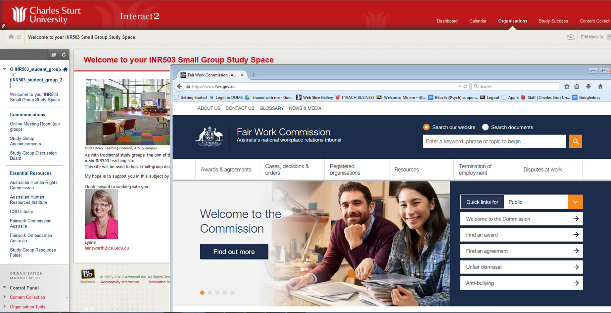

### Overview

Role plays are situations in which learners take on the profiles of specific characters or representatives in a contrived setting. Role plays are designed primarily to build first-person experiences within safe environments (Wills, Leigh, Ip & Albert, 2011, p. 17). They can also be utilised with groups of students to develop empathy and understanding of the different relationships and situations they may encounter. By providing students with realistic scenarios, similar to those in the workplace, students are able to solve problems and consider different perspectives while collaborating with classmates. This is consistent with Herrington’s description of ‘cognitive reality’ (Herrington et al., 2009, p. 45) where students are able to apply new knowledge and develop skills needed for the real world. Role play is widely acknowledged to be a powerful teaching technique in face-to-face, blended and online settings and has been singled out as an example of good practice by the Australian Learning and Teaching Council (UoW, 2003).

### Engagement

Students work with each other in assumed roles which leads to deeper engagement and understanding of both the content and professional practice. It can be argued that being online makes this easier for the students. Some go so far as to describe the online persona as an empowering experience. Within role plays, students have the opportunity to behave in a  more proactive manner and must demonstrate judgement and professional behaviours based upon their learning. 

### In Practice

#### Subject 

INR503: Industrial Relations Practice

#### Teaching Staff

Lynnette Ainsworth

#### Motivation

To develop students professional readiness through engagement in authentic learning experiences based on current topics and relevance to industry.

#### Implementation

Students enrolled in *INR503 Industrial Relations Practice* work within small groups of 6 to 8.  Each student assumes a professional role - a company representative, union representative, employee representative, HR manager, HR assistant or industry representative. The class is given an enterprise bargaining agreement midway through the session. This sets the scene, as each group of students must negotiate a new agreement.  Based upon the negotiation process, the role play lasts around three weeks. Once completed each student reflects upon the process and writes a critical analysis.  This is a major summative assessment task. There is a minor, less formal group presentation in which each team shares their experiences via an online meeting tutorial.  This also serves as a debriefing session and allows for peer feedback.

### Guide

Role plays provide a unique way for students to engage with and practice their learning. The situations, scenarios and roles require an element of planning, but can be garnered from case studies. Roles and situations can be controlled by placing limits on the scenario and scope, but students could also be provided with more freedom to explore the scenario, roles and interactions.  Some useful ideas/advice:

- Conducting role plays later in the session means that students are less likely to dropout which can disturb the group dynamics and it allows time for relationships between students to be established.
- Provide students with a briefing document that outlines the scenario and clearly states the objectives and constraints of the activity.
- Things don’t always go to plan so ensure that you provide students with a way to debrief and discuss what happened. This can be a valuable learning opportunity in itself, and provides students with a chance to be reflective of their own practice. 

### Tools

Interact2 can provide an excellent basis for role play. By utilising the resources folder, announcements and discussion boards, lecturers are able to provide students with information and space for discussion. 

Lecturers are encouraged to give each group (role play team) an Interact 2 Organisation site in which to conduct their role play as well as communicate among themselves. This is a relatively easy task in that Organisation sites can be copied to accommodate the number of students/role play teams per session. The inclusion of online meeting rooms for real time and synchronous discussion is highly recommended. 

### Further Reading

Herrington, J., Reeves, T., & Oliver, R. (2009). *A practical guide to authentic e-learning. * Retrieved from EBL collection.

Palloff, R. & Pratt, K. (2010). *Collaborating online: Learning together in community.* Retrieved from EBook Library.

Wills, S., Leigh, S. & Ip, A. (2011) Games, simulation and role plays. In *The power of role-based elearning: Designing and moderating.* Retrieved from EBL collection.

