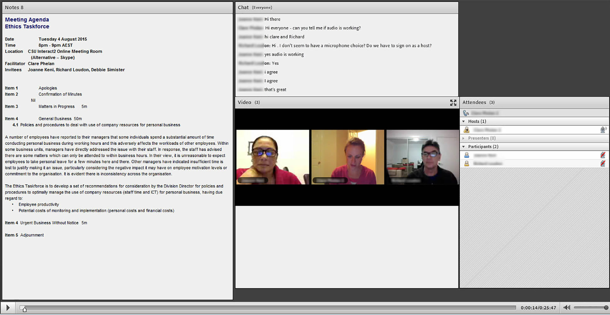
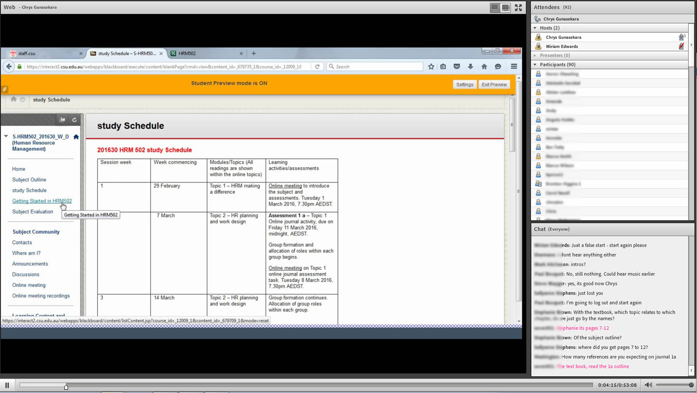

> ETL523 Digital Citizenship in Schools is a subject in the postgraduate degree Master of Education in Knowledge Networks and Digital Innovation (School of Information Studies). It explores the concept and practice of digital citizenship. Technological, political and ethical issues concerning digital citizenship are examined, including intellectual property, plagiarism, cybersafety, freedom of information, transliteracy and the effective use of a range of technologies to support learning and teaching. Issues in policy and practice are examined to understand how learning programs and school community practices can build capacity and resilience in students to enable them to become effective and responsible digital citizens in global online learning environments.

 

        

            

            

            

            

            

            

        

        

        

        

    

##### Teaching staff - Julie Lindsay

### Example 1: Learning Communities

#### Strategies Alignment

- **Collaborative group projects** - Essential skills are developed for co-creating a final assessment piece leading to deeper engagement and ability to learn within an online environment
- **Creating a shared resource** - Student teams form common goals and share responsibility for co-creation of the final learning module thereby learning together how to communicate and collaborate in a largely online environment

#### Motivation

This group assignment required students to develop communication and collaboration skills in order to co-create a learning module for use within an education setting. Successful groups self-organised, developed a common mission despite possible professional differences and motivations, and shared responsibilities towards the co-creation of the learning module. Through independent team communication they solved content and design issues related to module completion in an ongoing capacity - much of this was visible via the wiki discussion interface. This task provided group collaborative skill development in addition to enhanced facility with digital technologies along with an authentic, real-world scenario and final usable product.

#### Implementation

**Part 1: Group and then topic selection**

Teams were self-selected and topics approved within set digital citizenship concepts. Organisation of teams and group topic selection was via a Google doc. The module was developed via a wiki interface. Concepts for topic development:

- Digital Learning Environment (DLE)
- Digital citizenship in the curriculum
- Content creation and curation in digital environments
- Social media and networking
- Leading for digital citizenship in the DLE

**Part 2: Wiki development**

The subject coordinator sets up a Wikispaces ‘Project wiki’ (free education account). In their groups students collaborated on authoring via the wiki interface. The result was a co-developed group learning module in a style appropriate to education. The expectation of the task was that all collaborative work be shown via the digital tools used for collaboration and a digital footprint of each user's contributions be left by each participant. Essential communication and conversation to show the process of material development was to be readily available to others.

**Part 3: Overcoming the challenges of this collaborative group project**

All groups in this subject were challenged by the need for effective communication and contribution. It was expected that students would work this out themselves and adopt necessary communication and collaboration tools and methods. Tools used beyond email included Twitter, google docs, Skype and the wiki discussion forum. Successful groups held regular synchronous meetings - including face-to-face if the opportunity arose, as in Team 5.2. Between meetings asynchronous communication supported project content design and development. 

**Part 4: Final outcomes of group collaborative work**

Groups were self-organised, developed a common mission despite possible professional differences and motivations, and shared responsibilities towards the co-creation of the wiki-based learning module. Participants visibly communicated and solved content and design issues related to module completion in an ongoing capacity. This task provided group online communication, collaborative skill development in addition to enhanced facility with digital technologies in an authentic, real-world professional learning scenario.

#### Words of advice for wider implementation

This group project takes some setting up time, including the Google doc for team and topic selection as well as the Wiki design and setup. Once it is all in place student contributions and collaborative workflow is without issues. 

3-4 min. Screencast

 

        

            

            

            

            

            

            

        

        

        

        

    

### Example 2: E-Assessment

#### Strategies alignment

Creating rich media artefacts - Student development of technical and communication skills using multimedia and online tools.

#### Motivation

The individual multimedia artefact is Part B of Assignment 1: ’Digital Citizenship Learning Module’. In small teams students collaborated on building an online learning module based on a digital citizenship concept. As part of this they selected a sub-topic for an individual digital artefact that needed to ‘fit in’ with the module content. The individual creation of a digital artefact required students to be able to demonstrate an understanding of key concepts of digital citizenship and the social, political, ethical and technological issues affecting digital citizenship development. It also encouraged transliteracy skills and clear communication of ideas through the use of multimedia.

The final artefact was meant to align with the group learning module project and be embedded into the team wiki interface. Students’ ideation and creativity afforded a successful artefact that showed evaluation of certain resources and ideas and brought together a definitive statement and set of information regarding the chosen topic. 

#### Implementation

**Part 1: Team module building and artefact sub-topic selection**

Students collaborated on the learning module content and chose a unique sub-topic to build their individual digital artefact.

**Part 2: Development of the digital artefact**

Once a topic was chosen students then explored a range of digital tools to find one they were comfortable using to create the digital artefact. The digital artefact could be any reliable Web 2.0 tool for audio, video or image/text production such as Voicethread, Smore, or Slideshare. This was a self-help process - with of course students connecting and collaborating and sharing ideas, resources, and support for tool skill development. It was encouraged, but not mandatory, that students explore a combination of tools e.g. Powtoons and YouTube, to create and deliver the final artefact. 

**Part 3: Artefact completion, upload and embed**

It was a requirement that the artefact be uploaded (if not already online) and in a state where it had a unique URL and could be embedded (not just linked from) the wiki-based learning module.

**Part 4: Final outcomes for students** 

This task provided for expression of ideas and communication of a message using online multimedia as well as exploration of tools that could be used to support learning and teaching beyond the assignment. Although some students found working with digital media challenging, all students gained confidence with online tools and the ability to create a communication piece that could be shared with others. Many students used their artefacts in conjunction with the learning module in their schools and learning environments to support both teacher and student understanding of digital citizenship.

 

        

            

            

            

            

            

            

        

        

        

        

    

#### Words of advice for wider implementation

This activity/assignment is a communication task, not a digital tools task, and this is important to remember. It challenges students and those with a lower ability using digital technology need to be provided with satisfactory examples and suggestions for tools that will allow them to successfully meet the rubric requirements. It was made clear however that a typical PowerPoint response was not adequate to meet criteria for success. Students are assessed on their ability to ‘express ideas and communicate a message’ and ‘understand key digital citizenship concepts and issues affecting digital citizenship development’.

