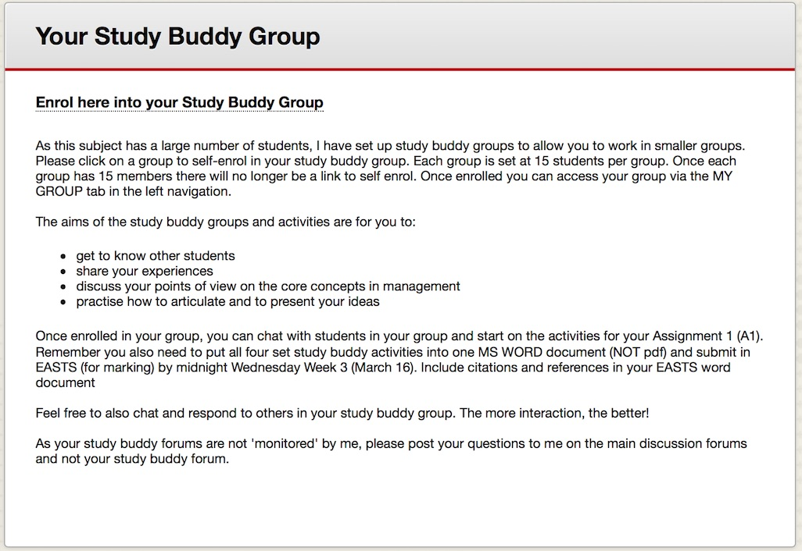

This strategy entails dividing up a large cohort of student in a subject into smaller sub-cohorts. These sub-cohorts provide a more manageable way to for teaching to occur and provide a way to allocate teaching staff to specific groups of students. These staff members can then take a more active role in the facilitation of discussions, marking of assignments and providing feedback as well as answering student queries. For students a small group makes it easier to interact with each other as they are less likely to be lost or overwhelmed.

### Engagement

Small groups are beneficial to online students in large cohorts because they have the potential to provide an increased sense of connectedness and belonging and increases the chances that students will interact repeatedly with other students and therefore form bonds with their peers. 

### In Practice:

#### Subject

MGT 100: Organisations and Management

#### Teaching staff 

Dr. Wendy Webber 

#### Motivation:

*MGT100 Organisations and Management* is one of the foundational management subjects within the Faculty of Business at CSU. The motivations for running a small grouping pilot were (and remain) multifaceted. 

#### Implementation:

A key lesson from this pilot would be that ‘compulsory’ group membership and engagement up to the first assessment supported the aims of the project, which was to make students comfortable and engaged in the online learning space.

### Guide

Consider why you want students to engage in a grouping strategy. 

- Is it to collaborate in an authentic manner? 
- Engage students early to help familiarise with the online learning space? 
- Develop some peer connections?

There are many reasons why you would choose a grouping strategy within a large online cohort, but keeping one or two of the most key reasons in mind helps to clarify both what you expect of students and what the students can expect of you. 

Consider the practical implications-in large cohorts of hundreds of students, what strategies will you implement to ensure that the grouping process is a positive for both you and students? For example, how likely is it that you will be able to communicate in a nuanced way with students in (potentially) 20+ small groups without considering workload and logistical aspects? Having a timely discussion with your Head of School and Course Director about the grouping strategy you’d like to trial can provide the impetus to explore how workload of casual teaching and marking staff can be used to support the objectives of your planned changes. Having an active student mentor to support the academic in fielding questions and providing responses in a large first year cohort such as this seemed to provide some alleviation to the communication demands inherent in a grouping strategy. 

### Tools

**Blackboard** provides a basic grouping tool that allows each group to be provisioned with their own set of tools for collaboration and communication. u!magine are currently working on a new grouping tool for Blackboard to provide more options and to make the process quicker