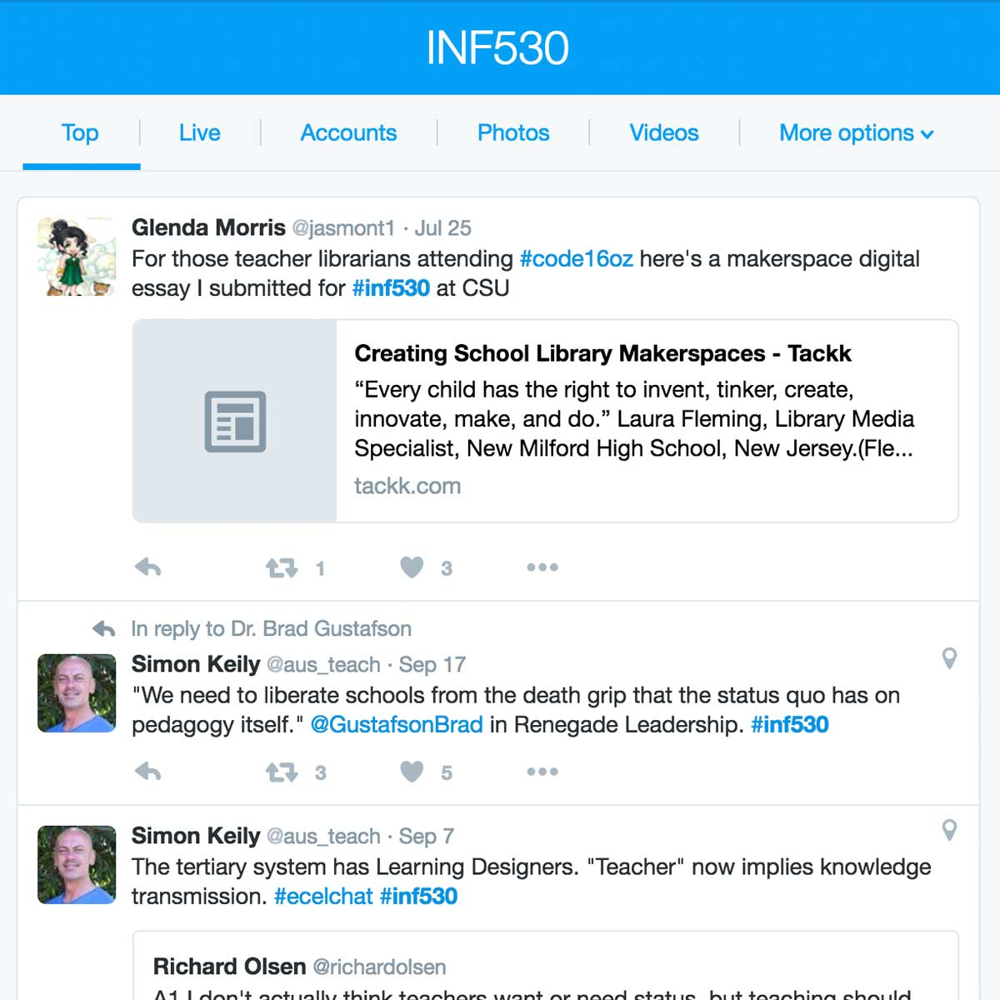
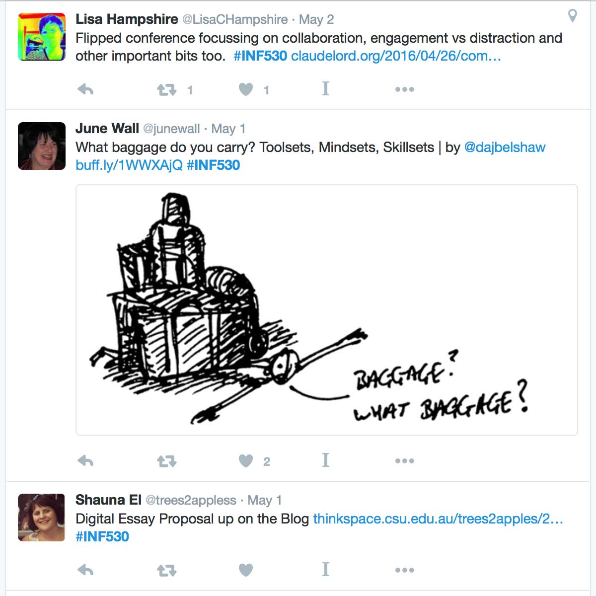
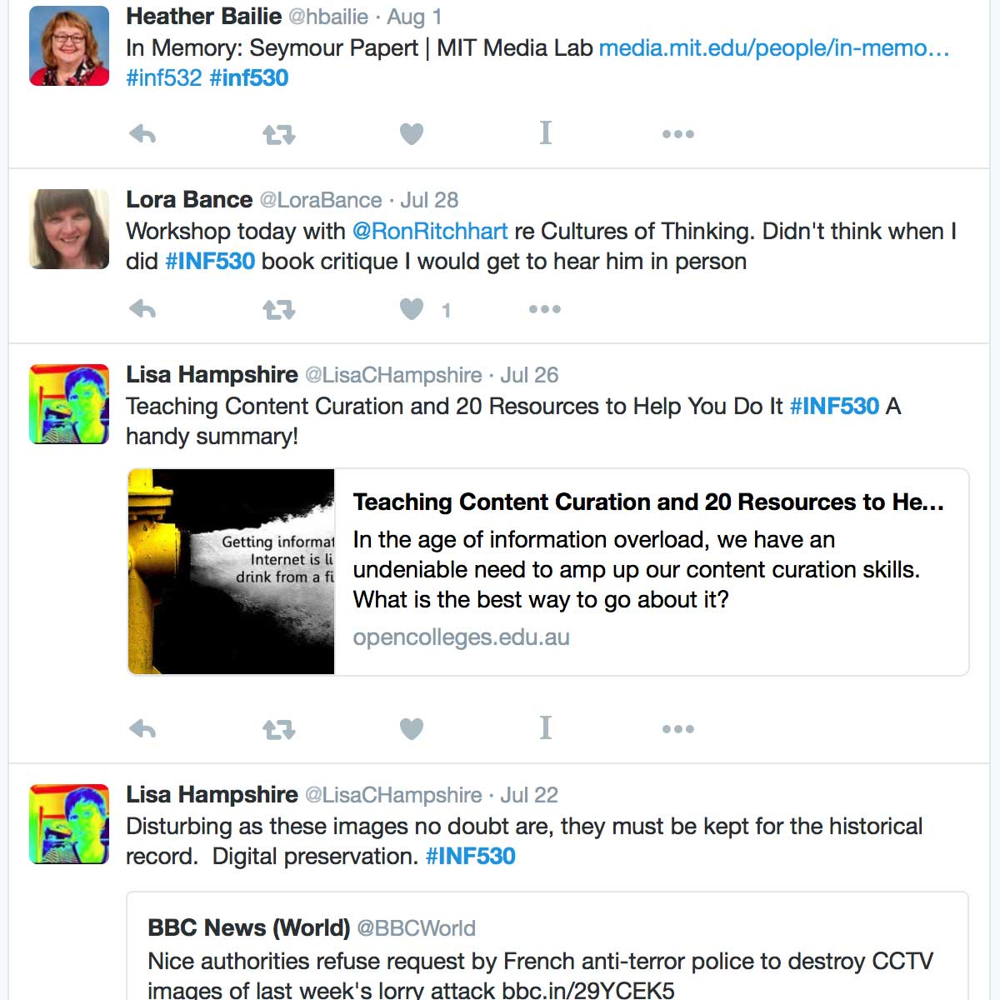

---

layout: post
title: "Social Media Streams"
date: 2016-09-19 15:34:00 +1100
category: strategy
tags: [Learning Communities, Interaction Between Students, Interaction with the Professions,] 
description: "Using social media to publish and accessing information in realtime"
subjects: "INF 530,"

---

### Overview

Social Media provides an incredibly powerful tool for learning and teaching. It enables real-time communication, sharing and dialogue to occur at a global level. The streams created by social media provide a realtime way of publishing and accessing information relevant to students learning. Educators can use social media streams to promote their learning and professional communities of practice by sharing interesting stories or news relating to course work. Social media streams provide an opportunity for substantial collective thinking and action (NMC, 2014).

### Engagement

Social media streams provide a way to publish, collect and curate information in real-time. Social media itself allows students to engage in a variety of ways, with not only lecturers and peers but with individuals, professionals and experts worldwide. This contextualises study beyond the University, reflecting the broader profession and global setting. 

### In Practice

#### Subject 

INF530: Concepts and Practices for a Digital Age

#### Teaching Staff

Judy O’Connell

#### Motivation

Social media and networking tools are used to connect all cohorts within the course and promote ongoing dialogue, sharing of resources and the development of professional presence. 

#### Implementation

The course- level site (Knowledge Networks and Digital Innovation) was served as a portal, housing links to individual subjects as well as a Twitter feed, Thinkspace login (ePortfolio, blogging tool) and Diigo (social bookmarking). 

        

            

            
>

            
>

            
>

        

        

        

        

### Guide

Social media is an incredibly powerful tool that allows student work to be published to a global audience and enable dialogue between students, educators, university staff, professional and experts, in a less formal and more immediate form. Utilising hashtags and creating specialised accounts to harness social media streams means that the learning community as a whole can benefit from the wealth of information available. They provide a way to structure and share interactions, thoughts, ideas and relevant information. While each platform can be used on it’s own the streams created can often be embedded into course and organisational sites in Interact2, providing students with a simple way of interacting and engaging. See [How to Embed Facebook Feed](https://cms.drupal.ku.edu/how-embed-facebook-feed) or [How to Embed Twitter Feed](https://elearn.southampton.ac.uk/blackboard/addtwitter/)

As education aligns more closely with technological trends, lecturers need to carefully consider the use of social media for teaching and learning purposes. Students will often set up their own Facebook groups, but whether or not lecturers use social media in their teaching is another matter. It is recommended they consider the appropriateness and desired outcomes when using social media and [the affordances of the different platforms](https://www.youtube.com/watch?v=g_is3gT7X0Y). [CSU’s Social media use policy for staff](https://policy.csu.edu.au/view.current.php?id=00384) is also worth perusing.

Tomayess’ 2015 examination of social media use within Australian higher education identifies clear advantages and disadvantages. While in general terms social media and networking tools can improve students’ personal and professional skills such as writing, speaking, listening, discussion and debating, she goes on to argue that the risks should be considered from four perspectives: cognitive development, social development, physical development and security (Tomayess, 2015, p. 18). 

### Tools

There are several social media and networking tools to choose from and in this short video [Harold Jarche discusses some of the differences between the social media platforms](https://www.youtube.com/watch?v=g_is3gT7X0Y). Facebook, Twitter, Instagram and Pintrest are popular choices for sharing content and media. Diigo is a handy tool for sharing useful websites. PebblePad and Thinkspace are both blogging, ePortfolio tools supported by CSU which allow student to publish externally.

### Further Reading

Charles Sturt University. (2014). [Social media use policy for staff](https://policy.csu.edu.au/view.current.php?id=00384)

Ferris, S. & Wilder, H. (2013) *[The plugged in professor: Tips and techniques for teaching with social media](http://www.csuau.eblib.com.ezproxy.csu.edu.au/patron/FullRecord.aspx?p=1574982)*. Ebook Library

Manca, S. & Ranieri, M. (2016). [Facebook and the others. Potentials and obstacles of Social Media for teaching in higher education](http://www.sciencedirect.com.ezproxy.csu.edu.au/science/article/pii/S0360131516300185). *Computers & Education, 95*.  216-230. doi:10.1016/j.compedu.2016.01.012

NMC Horizon Report: [2014 Higher Education Edition](https://www.nmc.org/pdf/2014-nmc-horizon-report-he-EN.pdf)

[Social Media News Australia](http://www.socialmedianews.com.au/social-media-statistics-australia-february-2015/) 2016. Accessed July 20, 2016 website

Tomayess, I. (2015). [Social Networking in Australia: Opportunities and risks](http://www.csuau.eblib.com.ezproxy.csu.edu.au/patron/Read.aspx?p=4178203&pg=25), In I. Tomayess,  P. Isaias, & P. Kommers, *Social networking and education: Global perspectives*. Ebook Library

