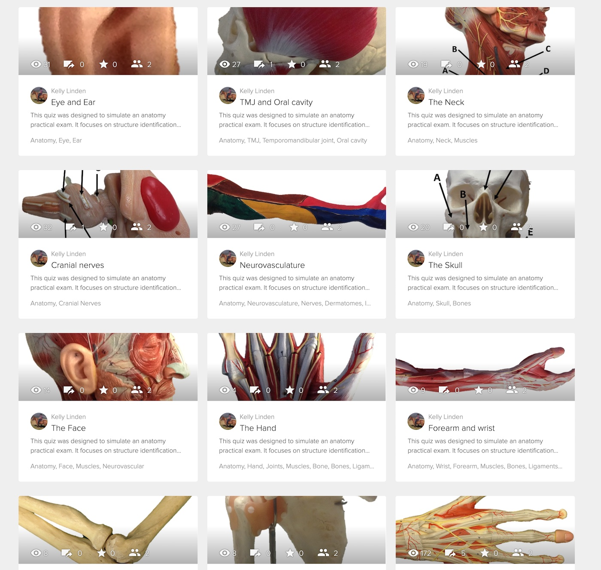

---

layout: strategy
title: "Adaptive Lessons"
date: 2018-12-17 12:00:00 +1100
category: strategy
tags: [Flexible & Adaptive Learning]
description: "Alter tasks and information based on students demonstrated knowledge and skills"
subjects: "BMS171"
subjectnames: "Introduction to Functional Human Anatomy"

---

### Overview
Adaptive lessons is the name given to the design of a learning experience for students that is pre-designed to alter the information or tasks presented to students based on their demonstrated knowledge or skills. The aim of enhancing personalised learning within online courses is to make learning more immediately impactful and relevant to learners’ current needs. Adaptive lessons can help students develop and apply knowledge and skills more effectively because it both addresses current need and scaffolds learners into more complex areas of learning. Students arrive in the subject with a variety of existing knowledge and experiences. Pushing all students through exactly the same content and learning activities in a one-size-fits-all approach disregards the fact that students may be on different levels and stages of their learning. The use of data automatically collected by online teaching platforms can be the impetus towards a more personalised learning approach, which would enable students to have more effective learning experiences. Online technologies make it possible to create a better learning experience, tailored for a specific learner’s needs, when subjects are enhanced with adaptive, interactive lessons that align with students’ individual abilities and level of knowledge.

When the idea of flexible learning designs are taken on board, personalised learning journeys can then be provided through flexible or adaptive lessons and resources that provide individualised pathways through content, based on student knowledge, behaviours and special needs. Alternatively, flexible and adaptive course designs can allow students to proceed at their own pace through differentiated or individualised pathways based on their demonstration of knowledge and competency.

### Engagement
Research suggests that online students "who have access to better designed, and more personalised courses tend to have higher engagement and better outcomes" (Ben-Naim, 2015). The challenge is therefore to move beyond static subject content to a measure of personalisation that gives students more opportunities to learn in different ways.

Adaptivity in learning content is a way in which a student’s unique needs are met by providing different learning pathways and real-time feedback based on their performance and success. Learning strategies can also target motivations through adaptivity — and this is another way of meeting individualised learning experience and individual student needs.

Personalising learning can be fostered by using learning analytics plus adaptive release. Adaptive release, using a variety of technologies and approaches, allows students to progress through content at their own pace. In a thoughtful adaptive learning design, formative tests or quizzes and other online assessment techniques provide students with feedback and guidance to allow them to skip over material they have already mastered or to engage more deeply with components where they need additional help (Irwin, Hepplestone, Holden, Parkin, & Thorpe, 2013).

### In Practice

#### Subject
BMS171 Introduction to Functional Human Anatomy

#### Teaching Staff
Adam Brett & Kelly Linden

#### Motivation
This subject serves a number of courses. Students studying anatomy through online subjects don’t get the same access to donated cadavers, used for studying anatomy, as their on-campus peers. As a replacement to semester-long access, online students spend a week on campus undertaking the laboratory work. This concludes with a "flag" exam, where students are asked to identify features indicated on cadavers. Through comparison of the two student groups, it became clear that online students needed further support and resources to compensate for their reduced time in the laboratory.

As a result, a series of Smart Sparrow lessons were developed. These modules quizzed students on images of body structures. In the interest of equity, Smart Sparrow modules were also made available to on-campus students for their revision. For the first time ever, all online students passed the exam.

#### Implementation
Initially, students gained access to Smart Sparrow lessons through provided individual LTI links within learning modules. However, last year Smart Sparrow was engaged to develop a “Learn Space” – think of this as a specialist ‘classroom’ – that students now use to access all their interactive tutorials. A well-designed and visually appealing portal enables individual students to access the interactive tutorials all from one place instead of thoroughly linked lessons. A schematic human model highlights the region of the body that each module focuses on and pop-up boxes provide feedback regarding student progression through the module.

The Learn Space is integrated into the Smart Sparrow Classes system so that course coordinators and tutors are able to track student completion and results for individual interactive tutorials as well as across the course as a whole.

{: .u-full-width}

---

A number of Kelly Linden’s interactive tutorials are available for use or adaptation through the [BEST Portal](https://www.best.edu.au/courseware/?sort=2&q=kelly% 20linden)

The [BEST Network](https://www.best.edu.au/) (Biomedical Education Skills and Training) is a not-for profit network of biomedical Schools developing and sharing next-generation courseware and technology. Their vision is that every educator and every student, wherever they are, will have access to the best biomedical education.

[Smart Sparrow Learn Space](https://aelp.smartsparrow.com/c/ls/qljf2da7): integrated into the Smart Sparrow Classes system so teaching staff are able to track student completion and results for individual modules as well as across the course as a whole.

**Other examples of Smart Sparrow lessons**

- LAW220 These lessons were developed from flow charts, and they let students work through the lessons by taking them through different paths, depending what answers they choose. [Example 1](https://aelp.smartsparrow.com/learn/open/39elxpzj) and [Example 2](https://aelp.smartsparrow.com/learn/open/bduviuym)
- ITC354 This Smart Sparrow example is an assessable lesson worth 10% of the marks. There are 30 slides, using 3 different question sets: multiple choice, drag and drop, and short answer. [Example](https://aelp.smartsparrow.com/learn/open/u5yz553d)
- BMS337 These Smart Sparrow lessons are assessable tests worth a total of 20% of overall mark in the subject. There are 5 lessons (tests) throughout the session covering 7 different case studies. It has short answer and drop down questions based on slides from the BEST Network. For better slide viewing, students are able to zoom right in for detail. [Example](https://aelp.smartsparrow.com/learn/open/v7ywqsp5)
- NRS312 This lesson was developed from a practical manual that was all text based, with the aim of making things more engaging for students. The subject had 300 students the first session the practice manual was offered in this way. Many of the students were introduced to the lesson at a residential school. [Example NRS312 shortened version](https://aelp.smartsparrow.com/learn/open/sy2iubk7)

### Guide

When adopting personalised learning approaches, pedagogical frameworks come first before technology development or employment. Prior to any use of adaptive learning technologies comes the central consideration of how they will fit in with the existing course/subject design or the desired learning outcomes (Johnson, Adams Becker, Cummins, Estrada, Freeman & Hall, 2016, p. 28). Therefore, serious thought and planning need to happen:

* A clear goal: What you are trying to achieve by using adaptive learning;
* Use of adaptive lessons/courseware viewed within the broader context of pedagogical practice;
* Development of interrelated learning objectives and lesson outcomes;
* Alignment of learning objectives, learning activities and assessments;
* Storyboarding adaptive lessons: alignment to subject study schedule; linear and branching aspects; scaffolding efforts to support students.

*Tricks*

Interact2 (Blackboard Learn) permits a few different ways of employing Adaptive Release of course content, and the trick is –deciding when adaptive release is appropriate and how to achieve this.

Adaptive release is the release of learning materials/activities based on (Fisher, Gardner, Brinthaupts & Raffo, 2014):

* Action (e.g. access a resource);
* Achievement (e.g. must achieve 60%+ on a task);
* Teacher control (e.g. pace the release of content based on date)

Explore these possibilities, using the guidance provided in [Interact2 Help](http://www.csu.edu.au/division/learning-and-teaching/interact2_help/faculty-and-csu-staff/site-content/release-content).

Ideas are found here too, using Smart Sparrow:

- [How Does Adaptivity Motivate Learners?](https://www.smartsparrow.com/2017/03/22/qa-how-does-adaptivity-motivate-learners/)
- [What is Adaptive Learning](https://www.smartsparrow.com/what-is-adaptive-learning/)

*Traps*

Significant time and planning are essential first steps when creating an adaptive lesson, for much more is involved than setting up a test or survey as an ‘adaptive strategy’. The use of a Smart Sparrow lesson is, for example, a longer term project that requires substantial lead time to bring in what’s necessary from Division of Learning and Teaching support and development teams.

The suggestion is sometimes raised by teaching staff that content should be withheld from students until they have completed initial learning activities or an assessment task. Good teaching practice, however, does not disadvantage students or limit unnecessarily their ability to move forward or back in their learning progress through content. Adaptive release may, however, be a useful tool to support hurdle tasks like mandatory certification (eg. working with children checks).

Building a more personalised learning approach into a subject will mean working closely with the educational design team. It is not a simple effort to develop interactive and adaptive lessons that match students' knowledge levels. Content, design and production expertise are needed to build adaptive lessons that select the best content for each learner by automatically aligning content with lesson-level learning objectives, activities and assessments.

Focussing adaptive technology deployment at the individual lesson level ensures that it is used in conjunction with a range of other strategies. While this kind of a approach can provide a more engaging experience for students in terms of how they interact with the content or learning outcome, learning design needs to be balanced to ensure students don’t become isolated from the social components of study. Furthermore, it can be quite time consuming to repeat this kind of approach across a whole subject. 

The creation of adaptive lessons is often but not exclusively achieved through the software capability offered by various online technologies. For CSU, these technologies include:

* Interact2 built-in components
* Smart Sparrow
* Realizeit
* Pearson Education MyLab

Through the software capability offered, each of these platforms help create alternative learning paths and provide data and insight directly to learners and teaching staff. Personalised learning is really a two pronged approach to really tailor the students’’ learning experience

Employing such online technologies allows teaching staff to do such things as:

* Find and fix learning gaps;
* Provide adaptive lessons based on assessment information;
* Create personalised learning pathways which lead to better learning outcomes for students;
* Avert problems of students perseverating in unproductive directions, because automated responses of students’ choices will be integral to the lesson.

### Tools

Here are a few technology-related means for producing adaptive lessons available for teaching staff.

* Within Interact2 - Interact2/Blackboard Learn [Adaptive Release rules](http://www.csu.edu.au/division/learning-and-teaching/interact2_help/faculty-and-csu-staff/site-content/release-content) that are based upon a number of selection criteria, such as date, Grade Centre grade, task completion.
* Pearson Education MyLab - A collection of online texts accompanied by adaptive components of homework, tutorial and assessment products, designed with the purpose of providing personalisation of learning experiences and improving the results of students.
* Smart Sparrow - Smart Sparrow is an adaptive learning technology that provides the tools to create, deploy, share and analyse lessons that are interactive and adaptive. Smart Sparrow can capture, measure and report nuanced details about student learning, providing individualised feedback to students that lets them know where their strengths and weaknesses lie. This means that teaching staff have the ability to give each student a more personalised learning experience by providing real-time feedback and adaptive pathways that, for example, may specifically target misconceptions. [Smart Sparrow Interact2 Help pages](https://www.csu.edu.au/division/learning-and-teaching/interact2_help/faculty-and-csu-staff/smart-sparrow),
[sign up for a free Smart Sparrow account](https://aelp.smartsparrow.com/login/signup), view the Smart Sparrow [Facebook page](https://m.facebook.com/smartsparrow).
* [Realizeit](http://realizeitlearning.com/) - A cloud-based platform providing adaptive content authoring to create interactive online tutorials and lessons that are responsive to a student's achievement. Realizit uses real-time analytics to capture and report on analytics relating to accesses, attempts, activity, progress, duration and achievement. This enables you to see things like who has and hasn't commenced specific lessons/tutorials, how students are progressing through those lessons, if/where students are "getting stuck" and how they are performing on tests/quizzes.

To commence the development process for a Smart Sparrow or RealizeIt adaptive lesson, use the DSL Service Request System (SRS) icon from the desktop of a University PC, [or online](https://online.csu.edu.au/de/dewsrsc.sqt?run=TopicRequest).

### Further Reading

7 things you should know about adaptive learning. (2017). [ELI Educause website](https://library.educause.edu/~/media/files/library/2017/1/eli7140.pdf)

Ben-Naim, D. (2015, November 25). Online learning can work if universities just rethink the design of their courses. *The Conversation*. Retrieved from [The Conversation](http://theconversation.com/online-learning-can-work-if-universities-just-rethink-the-design-of-their-courses-50848)

Conole, G. (2010). Personalisation through technology-enhanced learning. In J. O’Donaghue (Ed.), *Technology supported environment for personalized learning: Methods and case studies*. Hershey, PA: Information Science Publishing.

Fisher, L.S., Gardner, J. G., Brinthaupt, T. M., & Raffo, D. M. (2014). Conditional release of course materials: assessing best practice recommendations. *Journal of Online Learning and Teaching, 10*(2), 228‐239. Retrieved from [JOLT](http://jolt.merlot.org/vol10no2/fisher_0614.pdf)

Gardner, J. G., Fisher, L. S., Raffo, D. M., & Brinthaupt, T. M. (2011). Best practices for using conditional release in online classes. *International Journal of Instructional Technology and Distance Learning, 8*(10), 3-15. Retrieved from [ITDL](http://www.itdl.org/Journal/Oct_11/Oct_11.pdf)

Irwin, B., Hepplestone, S., Holden, G., Parkin, H. J., & Thorpe, L. (2013). Engaging students with feedback through adaptive release. *Innovations in Education and Teaching International, 50*(1), 51-61 [http://dx.doi.org/10.1080/14703297.2012.748333](http://dx.doi.org/10.1080/14703297.2012.748333)

Johnson, L., Adams Becker, S., Cummins, M., Estrada, V., Freeman, A., & Hall, C. (2016). *NMC Horizon Report: 2016 Higher Education Edition*. Austin, Texas: The New Media Consortium. Retrieved from [NMC](https://www.nmc.org/publication/nmc-horizon-report-2016-higher-education-edition)

Tuckman, B. W. (2007). The effect of motivational scaffolding on procrastinators' distance learning outcomes. *Computers & Education, 49(*2), 414-422. doi: 10.1016/j.compedu.2005.10.002

