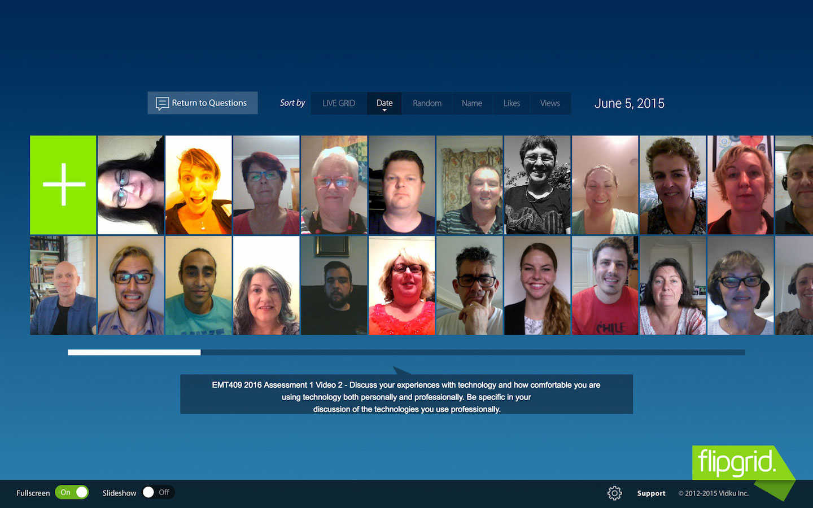

---

layout: strategy
title: "Asynchronous Discussions"
category: strategy
tags: [Learning Communities, Interaction Between Students, Teacher Presence,]
description: "Creating opportunities for flexible dialogue"
subjects: "EMT 409, "

---

### Overview

Asynchronous discussions are tasks that students can access and engage with at anytime, they do not have to be on their computer at a set time or in a set place. Asynchronous discussions are specifically designed to be flexible and are able to be engaged with at anytime in order to fit into the student’s study schedule, be it midday or midnight. These discussion can be made compulsory and tied to assessment tasks or optional and act as a support tool for students. Like all discussion tasks they need to have a specific purpose or discussion point in order to motivate students. While traditionally text based discussion forums have been the tool of choice,  there are a range of new tools that utilise rich media such as video and audio to facilitate these discussions.

### Engagement

Providing asynchronous discussion opportunities from your students is an essential element of the Online/DE learning experience for all CSU students. If students are engaged with *you* as the teacher, and engaged with *peers* as learning colleagues, they are far more likely to participate and contribute, and achieve better results.

Additionally, ensuring that all subjects provide Asynchronous discussion opportunities is essential given the needs of our students whilst completing their degree. So many CSU Online students work part-time or even full time, are caring for children or sick relatives, or even travelling abroad for work. Students cannot always participate in the synchronous Online Meetings so they need suitable asynchronous engagement opportunities to integrate with their individual study schedules.

### In Practice

#### Subject  

EMT409: Technology for Adult Learning and Teaching

#### Teaching Staff

Alissa Brabin

#### Motivation

Throughout the Course, students were indicating they had minimal social interaction between themselves, and limited use of online tools. This subject was redesigned to focus on developing social presence, interaction between students and sharing of ideas and developing a Community of Practice (CoP). The early assessments and learning tasks were also designed as a stepping stone for developing a CoP as required in Assessment 3. Students reported that after 2 years of studying part-time as a cohort, this was the first time they had actually heard or seen each other!

#### Implementation

The lecturer used FlipGrid to provide short video updates to students throughout the session that were then embedded in the Home Page. FlipGrid was also used for assessment purposes for students to introduce themselves to the class and to engage students in a discussion about their own experiences with technology. There were only 46 students in this class but some of these videos had over 2000 views.

### Guide

Be clear about the use of the tool as well as the question or focus of the activity. Linking discussions to Assessment provides an extrinsic motivation and can be a key strategy to encourage student participation. Be sure to make the engagement opportunities simple for student to access by providing embedded links to reduce the navigation required to find the point of engagement.

Different tools have different affordances and can be used in quite different ways:

- **Discussion Forums** - Set up Forums with specific and structured questions designed for open discussion amongst students. Highlight recent events / current issues as applicable to real world practice. Academic may need to lead/closely monitor for the first 2-3 but aim for student lead discussion
- **Blogs** - Ideally suited for summative assessments. If students are able to see and comment on each other's work, they are more likely to engage due to the inherent benefit that a CoP offers.
- **Recordings of Online Meetings** - *always* record Online Meetings and always provide the link to students. Those who could not attend are then given the chance to benefit from the interaction and questions of their peers.
- **FlipGrip** - Allows the academic to ask a question or present discussion topic, and students create a 90 second video response using the URL provided. Easy and highly effective tool for developing a sense of community amongst learners by allowing them to see and hear each other. Videos embed easily into i2 pages. Flipgrid has a $60 annual fee for staff to create and use grids but is free for students to access and use.

### Tools

There are a wide variety of tools available to support the implementation of Asynchronous Discussions, many of them CSU supported technologies including Interact2 Discussion Forums, Blogs and Online Meetings. External technologies could include [FlipGrip](http://www.flipgrid.com) and [Celly](https://cel.ly/)

### Further Reading

Aragon, S (2003). Creating Social Presence in Online Environments. *New Directions for Adult and Continuing Education*, (100) pp. 57-68.

Boud, D., Cohen, R., & Sampson, J. (Eds.). (2014). *Peer learning in higher education: Learning from and with each other*. Routledge

Karel Kreijnsa, Paul A. Kirschnerb, Wim Jochemsb (2003). Identifying the pitfalls for social interaction in computer-supported collaborative learning environments: a review of the research. *Computers in Human Behavior* (19). pp. 335–353.

McLoughlin, C. & Lee, M.J.W. (2010). Developing an online community to promote engagement and professional learning for pre-service teachers using social software tools. *Journal of Cases in Information Technology, 12*(1), 17-30.

