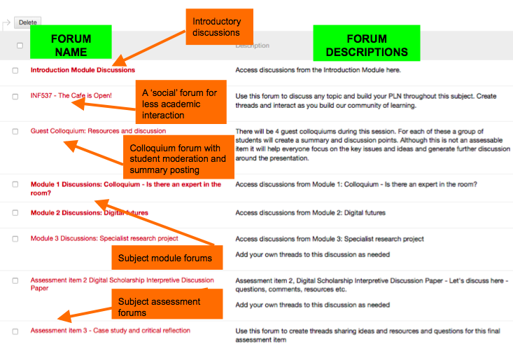

---

layout: strategy
title: "Asynchronous Discussions"
category: strategy
tags: [Interaction Between Students, ]
description: "Discussions that can utilise online technologies and take place without students having to be present at the same time. "
subjects: "EMT409, INF537, "
subjectnames: "Adult Learning and Teaching Technologies, Digital Futures Colloquium, "

---

### Overview

Asynchronous discussions are tasks that students can access and engage with at anytime; they do not have to be on their computer at a set time or in a set place. Asynchronous discussions are specifically designed to be flexible and fit into the student’s study schedule, be it midday or midnight. These discussions can be made compulsory and tied to assessment tasks or optional and act as a support tool for students. Like all discussion tasks they need to have a specific purpose or discussion point in order to motivate students. While traditionally text-based discussion forums have been the tool of choice, there are a range of new tools that utilise rich media such as video and audio to facilitate these discussions.

### Engagement

Providing asynchronous discussion opportunities for your students is an essential element of the online learning experience for all CSU students. If students are engaged with *you* as the teacher, and engaged with *peers* as learning colleagues, they are far more likely to participate and contribute, and achieve better results.

Many CSU online students working part-time or even full time, are caring for children or sick relatives, or even travelling abroad for work. Students cannot always participate in scheduled synchronous online meetings so they need suitable asynchronous engagement opportunities to integrate with their individual study schedules.

### In Practice

#### Subject

EMT409 Adult Learning and Teaching Technologies

#### Teaching Staff

Alissa Brabin

#### Motivation

Throughout the Course, students indicated they had minimal social interaction with other students, and limited use of online tools. This subject was redesigned to focus on developing social presence, interaction between students and sharing of ideas and developing a Community of Practice (CoP). The early assessments and learning tasks were also designed as a stepping stone for developing a CoP as required in Assessment 3. Students reported that after 2 years of studying part-time as a cohort, this was the first time they had actually heard or seen each other!

#### Implementation

The lecturer used Flipgrid to provide short video updates to students throughout the session that were then embedded in the Home Page. Flipgrid was also used for Assessment 1 for students to introduce themselves to the class and to engage students in a discussion about their own experiences with technology.

{: .u-full-width}

[We've set up a Flipgrid so you can try it yourself!](http://flipgrid.com/271f9f)

#### Subject

INF537 Digital Futures Colloquium

#### Teaching Staff

Julie Lindsay

#### Motivation

The goal in this subject was to affect ongoing, reliable and regular participation in asynchronous discussion. Using Interact 2 each forum was carefully designed to maximise different aspects of the subject experience. Being a capstone subject for a Masters degree another objective was to provide an avenue for deeper student involvement in the asynchronous forum through moderation and summary production.

#### Implementation

The Interact 2 Forum for this subject is designed to be a typical discussion area with many pre-established forums to meet the needs of learner-content and learner-learner interaction objectives. The Introduction forum is a starting point for students to connect and share; the ‘Cafe is open’ forum deliberately segments any social chit-chat and interaction; the Subject module and Subject assessment forums provide clear pathways for interacting around the content and student synthesis of this; the colloquium forum provides another area to share and discuss guest colloquiums. In addition the guest colloquium forum applies a requirement (not assessed) for students in groups to provide a summary of the colloquium and then moderate an ongoing discussion, further supporting interactive learning and deeper understanding of the content through active collaboration.

This presentation by Julie *[Discussion Forums: Dissection and design](https://docs.google.com/presentation/d/13gdFkfMJfmSbdRmiTYBQsTDspgFdE71OJ5sqI2Gl3LI/pub?start=false&loop=false&delayms=3000)* provides further insight into this practice.

{: .u-full-width}

### Guide

In looking for opportunities to develop and facilitate online Asynchronous Discussions with students, there are a range of considerations that need to be made:

* Purpose of discussion, currency and relevance to content.
* Timing between Discussions, how frequently will staff and students be expected to "check in".
* How to organise the Discussions - which tools, using headings, groups, allowing students to self-select.
* The level of scaffolding required for early discussions.
* Ease of access and use for students when selecting tools.
* If assessable, ease of marking for staff.

Once these key issues have been identified and addressed, providing a sound justification to students as to why this selected Discussion tool is a valuable learning activity is an essential step.

### Tools

There are a wide variety of tools available to support the implementation of Asynchronous Discussions, many of them CSU supported technologies including Interact2 Discussion Forums, Blogs and Online Meetings. External technologies could include [Flipgrid](http://www.flipgrid.com) and [Celly](https://cel.ly/).

Be clear about the use of the tool as well as the question or focus of the activity. Linking discussions to Assessment provides an extrinsic motivation and can be a key strategy to encourage student participation. Be sure to make the engagement opportunities simple for student to access by providing embedded links to reduce the navigation required to find the point of engagement.

Different tools have different affordances and can be used in quite different ways:

* **Interact2 Discussion Forums** - Set up Forums with specific and structured questions designed for open discussion amongst students. Highlight recent events / current issues as applicable to real world practice. Academic may need to lead/closely monitor for the first 2-3 but aim for student lead discussion.
* **Blogs** - Ideally suited for summative assessments. If students are able to see and comment on each other's work, they are more likely to engage due to the inherent benefit that a CoP offers.
* **Recordings of Online Meetings** - *always* record Online Meetings and always provide the link to students. Those who could not attend are then given the chance to benefit from the interaction and questions of their peers.
* **Flipgrid** - Allows the academic to ask a question or present a discussion topic, and students create a 60-90 second video response using the URL provided. Easy and highly effective tool for developing a sense of community amongst learners by allowing them to see and hear each other. Videos embed easily into Interact2 pages.

### Additional Resources

Aragon, S (2003). Creating Social Presence in Online Environments. *New Directions for Adult and Continuing Education*, (100) pp. 57-68.

Boud, D., Cohen, R., & Sampson, J. (Eds.). (2014). *Peer learning in higher education: Learning from and with each other*. Routledge

Karel Kreijnsa, Paul A. Kirschnerb, Wim Jochemsb (2003). Identifying the pitfalls for social interaction in computer-supported collaborative learning environments: a review of the research. *Computers in Human Behavior* (19). pp. 335–353.

Lindsay, J. (2016). Discussion forums: Dissection and design [Slideshow]. Retrieved from [Google Docs](https://docs.google.com/presentation/d/13gdFkfMJfmSbdRmiTYBQsTDspgFdE71OJ5sqI2Gl3LI/pub?start=false&loop=false&delayms=3000)

McLoughlin, C. & Lee, M.J.W. (2010). Developing an online community to promote engagement and professional learning for pre-service teachers using social software tools. *Journal of Cases in Information Technology, 12*(1), 17-30.

