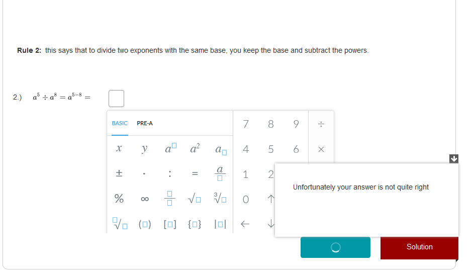

---

layout: strategy
title: "Auto Marked Quizzes"
category: strategy
tags: [E-Assessment,]
description: "Create automatically marked quizzes to provide students with instant feedback."
subjects: "FIN516, PSY468, MTH135"
subjectnames: "Corporate Finance, Psychology of Learning, Mathematics And Statistics In Health Sciences"
label: LEF

---

### Overview

Using a scoring system many quiz based learning technologies can provide auto-marking and feedback. The use of scoring can help motivate students as it introduces an element of competition, whether it is with themselves or with others. The element of competition encourages multiple attempts to achieve mastery. There is also the reduction of anxiety as the students get to play with the tools, environment and practice the types of questions that they will have in their summative assessments. Additionally, auto marking of quizzes reduces the wait time between task completion and students receiving their results, meaning they can progress with their learning immediately.

### In Practice

#### Subject

FIN516 Corporate Finance

#### Teaching Staff

Ruhina Karim

#### Motivation

To provide authentic questions in a way that gives instant feedback to students without the need for subject coordinator intervention. Multiple attempts allow for mastery and gamification to beat their own score.(formative)

Two online assessments are also BB quizzes with one attempt but these are based on the same format of questions that the students have had the opportunity to practise.(summative)

Smart sparrow lesson was developed for pre and during skills and knowledge development. It has practice questions with worked answers and detailed feedback.

#### Implementation

BB tests were set up with these options turned on in the settings, score, *correct* and incorrect answers, and very detailed feedback. Highest score is recorded and the test can be taken as many times as needed. (formative)

The assessments however, are one attempt only with detailed feedback after they have submitted (there is a window of submission times).

A Smart sparrow lesson was created from static PDF documents.

{: .u-full-width
}

#### Subject

PSY468 Psychology of Learning

#### Teaching Staff

Jill Harris

#### Motivation

To develop mastery of the topic and use gamification to motivate students to beat their own score.

#### Implementation

The quizzes are worth 10% and students can repeat them as many times as they want.

There are a limited number of questions and students get the same questions but no feedback other than the score. These quizzes are open for submission all session.

#### Subject

MTH135 Mathematics And Statistics In Health Sciences

#### Teaching Staff

Dmitry Demskoy

#### Motivation

Use BB quizzes for end of topic tests to assess topic knowledge.

#### Implementation

These quizzes are open from start of session and close progressively on set dates. They are time limited to 1 hour and only one attempt is allowed.

### Guide

A lot of thought needs to go into the feedback and scoring/penalties that each question or quiz will have. Depending on the tools used, some of the design work is very detailed and labour intensive but it gives the students greater autonomy and should provide academics with a pool of questions they can build on. Much of the design work can be supported by or shared out to Educational Support Coordinators (ESCs).

Also think about appropriate use of images within these quizzes, which may help prompt or guide students along the way.

### Tools

H5P, Kahoots, Blackboard, Smart Sparrow, Quizlet, SBLi
