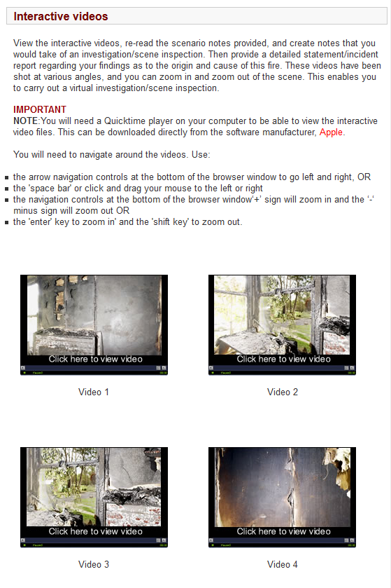

---

layout: strategy
title: "Contextualising Discussions with Video"
category: strategy
tags: [Interactive Resources, ]
description: "Use of rich media to provide a more immersive context for learning activities."
subjects: "ECO130, JST415, "
subjectnames: "Business Economics, Foundations of Fire Investigation, "

---

### Overview

The use of video to contextualise discussions can stimulate interaction, but also push the notion that video is simply a consumable resource. The visual medium provides unique opportunities to communicate information with students and form the basis of further discussion with the class. Video is incredibly useful in providing historical context, footage of the real world, working environments and to provide examples of performative skills. These are then used to trigger students engage beyond the content by responding, reacting, assessing and discussing what they have seen. Video can also be used for individual learning with footage being broken up into segments to allow for reflection or practice.

### Engagement

Video as a learning resource has traditionally been used in passive ways and used to primarily allow students to ‘consume’ information. Combing discussions with video is a technique that instils a more active approach to learning and engaging with the materials related to the subject. Students can get a more authentic sense of the learning and professional environment they are part of and engage and interact with it as active participants.

Video can be segmented into smaller units for micro lessons, the video can also be interspersed with exercises or quizzes to allow for reflection or practice of the current materials as students progress. For example, Echo360 allows for this with bookmarking and Captivate can be used to embed quizzes and questions into the video. To help contextualize segments of a video it is possible to annotate and embed hyperlinks which can link to documents, webpages or other material relevant to the video section.

### In Practice

#### Subject

ECO130 Business Economics

#### Teaching Staff

Rod Duncan

#### Motivation

Video is used to give students an introduction to topics and a summary overview through reflection and peer discussion.

#### Implementation

Media services recorded Rod in a studio and then the videos were uploaded to YouTube.

{: .u-full-width}

#### Subject

JST415 Foundations of Fire Investigation

#### Teaching Staff

Ross Brogan

#### Motivation

The interactive videos detail the scene of a fire as you would find it based on a number of key scenarios. The videos provide a rich way of presenting information as well as contextualising key skills students need to develop during the course of their study.

#### Implementation

The videos are able to be navigated as the user wishes to look at different parts of the scene in order to gain more detail. The students have to provide notes that would be taken during the investigation or scene inspection and provide a detailed statement for The Coroner regarding findings as to the origin and cause of a fire.

{: .u-full-width}

### Guide

Different application are available to facilitate this strategy. It is important to ensure that you align your goals with the software you aim to use. In the tools section below is an overview of some of the available options.

### Tools

#### CSU Replay

In CSU Replay:

- You can reuse your recordings[ Copy an Echo](http://confluence.echo360.com/display/55/Copy+an+Echo)
- You can edit your replay videos[ Edit Echoes for Academic Staff](http://confluence.echo360.com/display/55/Edit+Echoes+for+Academic+Staff)
- add bookmarks to your replay videos

**Bookmarks Tab**

You or a student can add a bookmark to an Echo by clicking the Bookmarks button (shown below) while viewing the Echo in the EchoPlayer.

Bookmarks are important for students because they can:

* Tag important parts of the Echo, allowing the student to quickly navigate to a certain point
* Can serve as brief course notes, offering an overview of what was covered in a particular lecture

**Personal Capture Echo 360**

Echo360 Personal Capture is a stand-alone application that runs on Windows and Mac laptops and desktop computers. It is designed primarily for the Academic Staff user. With Echo360 Personal Capture, staff members can create captures external to the classroom that students can review both before and after class.

- [ Download the desktop software](https://ecessprod-secure.csu.edu.au:8443/ess/download/ListDownloads.html)
- [ Working With Cameras and Personal Capture](http://confluence.echo360.com/display/55/Working+With+Cameras+and+Personal+Capture)

#### Screencast-o-matic

Screencast-o-matic is a simple to use cloud based screen and webcam recorder. It allows you to record on-screen activity for short tutorials, visual presentations, and communicate while you demonstrate! There are free and paid versions of the software available. The free version has a few limitations place on what can do with it but it does allow you 15 minute of recording time, the ability to publish to youtube or save as a file. The paid version (which some staff and schools may have access to) allows you to remove the company's watermark, make longer recordings, record computer audio as well as edit your recordings and publish to Google Drive, Vimeo and Dropbox.

#### Immersive Video

An immersive video is basically a video recording of a real world scene, where the view in every direction is recorded at the same time. During playback the viewer has control of the viewing direction, up down & sideways. Generally the only area that can't be viewed is the view toward the camera.

Clickable 360-Degree & branching video scenarios is new technology that is being developed and a significantly more advanced approach, which combines 360º videos with clickable hot spots. One of the most popular online platforms for these videos is[ YouTube](https://elearningindustry.com/?s=YouTube). The site allows you to embed clickable annotations into your online training video that redirect users to another YouTube video. For example, at the end of your 360-degree branching video-scenario you can ask online learners to choose from 3 different paths. They click on the hotspot that appears on the screen, which reveals the outcome of their decision. You can even create a web of online training videos to develop a longer video-scenario. Clickable 360-degree branching video-scenarios are beneficial for your online learners, but they also bring new learners into the fold. For instance, YouTube users who come across your 360-degree online training video and want to know more. You can find out more about [Facebook's implementation of 360 Degree](https://www.facebook.com/facebookmedia/get-started/360)
 video and view examples from [this Wired article](http://www.wired.co.uk/article/9-mind-blowing-360-degree-videos)

### Additional Resources

Smyth, R. (2011). Enhancing learner-learner interaction using video communications in higher education: Implications from theorising about a new model. *British Journal of Educational Technology*, *42*(1), 113–127. [http://doi.org/10.1111/j.1467-8535.2009.00990.x](http://doi.org/10.1111/j.1467-8535.2009.00990.x)

Chambel, T., Zahn, C., & Finke, M. (2004, 30 Aug.-1 Sept. 2004). Hypervideo design and support for contextualized learning. Paper presented at the Advanced Learning Technologies, 2004. Proceedings. IEEE International Conference on. [http://ieeexplore.ieee.org/stamp/stamp.jsp?tp=&arnumber=1357433](http://ieeexplore.ieee.org/stamp/stamp.jsp?tp=&arnumber=1357433)

Open video annotation project (Creative Commons) [http://www.openvideoannotation.org/index.php](http://www.openvideoannotation.org/index.php)

