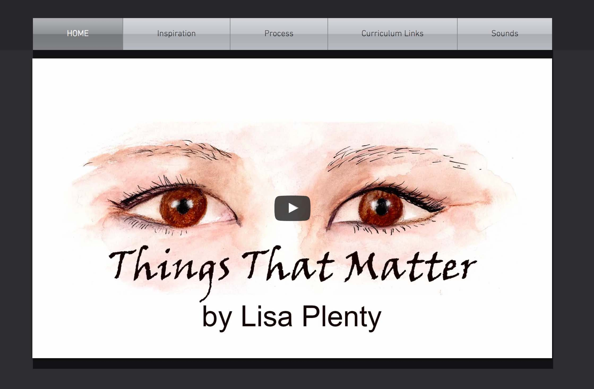
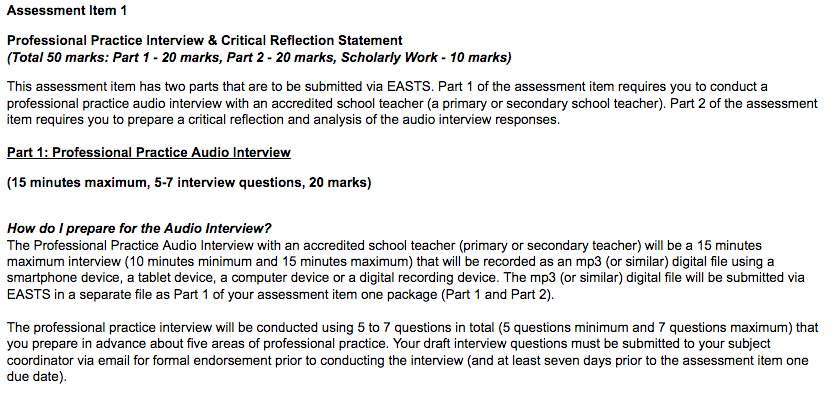

---

layout: strategy
title: "Creating Rich Media Artefacts"
category: strategy
tags: [Interactive Resources, E-Assessment,]
description: "Students produce and submit rich media for assessment tasks."
subjects: "ETL523, EED408, INF533,"
subjectnames: "Digital Citizenship in Schools, Successful Teaching, Literature in Digital Environments,"

---

### Overview

Rich media is commonly defined as "technologies that enable users to engage in interactive communication, with the ability to see, hear and interact with multiple communication streams synchronously or access them asynchronously" (Andrews et al. 2008, pp. 3). Rich media technologies also have the capacity to support non-verbal communication such as body language and vocal inflection making them valuable learning media for many profession (Andrews et al. 2008). Furthermore, the rapidly increasing access to various type of often open source video and web conferencing technologies creates a number of opportunities for use in higher education (Andrews et al. 2008). The creation of rich media artefacts including photographic evidence, video records and multimedia presentations by learners can provide an authentic way for learners to develop a variety of digital literacies, technical and communication skills that will be useful in the professions. In addition, the co-construction of rich media artefacts can also offer an authentic collaborative experience for learners and due to advancing and readily available mobile technologies, a range of interactive experiences can be integrated into the collaborative learning environment. In many ways rich media such as video can provide better evidence of students work, their skills and abilities than written assessments, which can greatly improve the effectiveness of the assessment.

### Engagement

The use of rich media artefacts can create an engaging learning experience by shifting the attention away from the physical product and on to the learning process. Learners can also engage further with self- and peer-assessment and reflection in an authentic setting. Working with rich media provides an alternative to written assessment tasks and a way for students to express themselves in different ways.

### In Practice

#### Subject

INF533 Literature in Digital Environments

#### Teaching Staff

Lee Fitzgerald

#### Motivation

Using and responding to professional, workplace requirements, modelling curriculum practice, developing assessments that engage in online environments, and allowing students to extend themselves in these areas is vital. INF533 Literature in Digital environments does just that in Assessment 4: Digital Story Telling Project and Reflection. In some respects it is also an innovate approach to eAssessment.

#### Implementation

Students were asked to prepare a 3-5 minutes digital storytelling project that could be used in their schools, library or institution. A list of possible content creators was provided by the teacher, and students were also invited to choose their own tool. [This is website and associated work](http://lisaplenty.wixsite.com/thingsthatmatter) is great example of the work produced by students

{: .u-full-width}

#### Subject

ETL523 Digital Citizenship in Schools

#### Teaching Staff

Julie Lindsay

#### Motivation

ETL523 Digital Citizenship in Schools is a subject in the postgraduate degree Master of Education in Knowledge Networks and Digital Innovation (School of Information Studies). The focus of Assignment 1, Part 2: Individual Digital Artefact is to develop an artefact using any reliable tool in order to share a digital citizenship concept. The choice of topic needs to align with the student group project and be embedded into the wiki interface. This task provides for expression of ideas and communication of a message using online multimedia as well as exploration of tools that could be used to support learning and teaching beyond the assignment.

#### Implementation

Students collaborate on the learning module content and choose a unique sub-topic to build their individual digital artefact. Once a topic is chosen students then explore a range of digital tools to find one they are comfortable using to create the digital artefact. The digital artefact could be created using any reliable Web 2.0 tool for audio, video or image/text production such as VoiceThread, Smore, or Slideshare. It was encouraged, but not mandatory, that students explore a combination of tools e.g. Powtoons and YouTube, to create and deliver the final artefact. It was a requirement that the artefact be uploaded and in a state where it had a unique URL and could be embedded the wiki-based learning module. This is [a great example of student work produced](https://youtu.be/622OHuEMM38) in this assessment.



#### Subject

EED408 Successful Teaching

#### Teaching Staff

Paul Grover

#### Motivation

Students are expected to interact with workplace situations and to create a digital legacy of this interaction in order to also write a reflective statement around the experience and knowledge gained. This is included in the ‘rich’ media artefacts practice examples as a way to show how deeper understanding of the task can produce more successful results when using multimedia.

#### Implementation

For Assessment 1 students are asked to interview a practicing educator. This simple assignment requires preparation and understanding of the use of audio files. Some students also prefer to edit the file down to the required length before submitting for assessment.

{: .u-full-width}

### Guide

Rich Media provides a different way for students to document, explain or demonstrate their learning. It provides ways of capturing information about what students are learning that are not possible in other mediums. Rich media can capture important information about the student’s environment and situation and provides a way to capture more authentic tasks - in particular getting students to demonstrate and reflect.

Some important considerations for structuring assessments that utilise rich media include:

* Build additional work around the task. Developing rich media can be time consuming so don’t use it as an add on, but look at opportunities to centre other assessments or activities the student’s work to make it worthwhile.
* Use it for self-evaluation and diagnosis. Ask students to record themselves and let them review their performance and get them to link their work to theory and the profession.
* Build relevant skills with a focus on the what they would benefit from in the profession. What would they do on the job? Tasks that are common and adaptable are presentations of information and literature, in depth discussion of a situation or topic, or taking a side and creating an argument for a debate.
* Rich media lends itself particularly well to engaging in peer-to-peer evaluation and feedback on the work. Students could be asked not just to identify issues but to make suggestion and provide constructive feedback which is often quite challenging, but engages a deeper level of knowledge.

To know if using rich media is the right choice in your subject then ask yourself some of the following questions

* Can it provide you with better evidence to assess your students?
* Will it capture the student’s learning better than an essay?
* Is it a more authentic and more contextual way to assess the student?

### Tools

There are many readily available tools that students can utilise to produce rich media artefacts:

* Mobile devices can record audio and video as well as take photos.
* Use PowerPoint and similar software to combine audio and visuals.
* [YouTube](https://www.youtube.com/), [Vimeo](https://vimeo.com/), [SoundCloud](https://soundcloud.com/) and [Flickr](https://www.flickr.com/) provide free and easy ways for students to publish their artefacts
* Other online tools such as [PowToons](https://www.powtoon.com/), [GoAnimate](https://goanimate.com/), [Voki](http://www.voki.com/), [VoiceThread](http://voicethread.com/) and more can be used individually or in combinations

### Additional Resources

Klapdor, T. (2014). Recording video on your Mobile, *CSU mHub*. Retrieved from [http://mhub.csu.edu.au/guides/recording-video-on-your-mobile/](http://mhub.csu.edu.au/guides/recording-video-on-your-mobile/)

Faculty of Science CSU. (2017, March 22). How to make a video for your subject site and using YouTube to edit. Retrieved from [https://youtu.be/cAnAFdTCF8Y](https://youtu.be/cAnAFdTCF8Y)

Andrews, T., Smyth, R., Tynan, B., Vale, D. & Caladine, R. J. (2008). Rich media technologies and uncertain futures: Developing sustainable, scalable models. ASCILITE 2008 - The Australasian Society for Computers in Learning in Tertiary Education (pp. 36-40). Australia: Deakin University.

Digitales - The art of digital storytelling - [http://www.digitales.us/](http://www.digitales.us/)

Digital storytelling wheel - apps and tools for teachers - [http://www.educatorstechnology.com/2016/12/digital-storytelling-wheel-apps-and.html](http://www.educatorstechnology.com/2016/12/digital-storytelling-wheel-apps-and.html)

Cool Tools for Schools - Web 2.0 tools for creating multimedia - [http://cooltoolsforschools.wikispaces.com/](http://cooltoolsforschools.wikispaces.com/)

