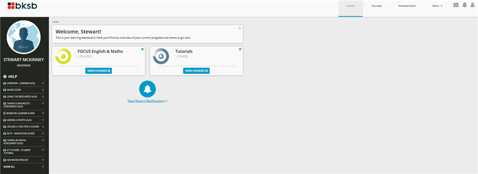

---

layout: strategy
title: "Using Data to Connect Students with Services"
date: 2018-12-17 10:10:00 +1100
category: strategy
tags: [Flexible & Adaptive Learning]
description: ""
subjects: "ACC100, BMS105"
subjectnames: "Accounting 1, Science Communication and Methodology"

---

### Overview

Using data analytics to connect challenged students with institutional support people and programs can play a significant role for these students to reach their goals and navigate their way to academic success.

Students often require assistance outside of the subject and course space for their learning. Some students may lack certain literacies and skills required in their learning or may be having difficulties in other areas of their personal life that are impacting on their studies. To augment things, they may not be able to identify or address these issues on their own. Data that students create passively while engaged in their learning, such as access patterns, performance in activities, or actively through self-disclosure, may actually be useful indications of a need to engage with the range of support services and programs provided to students. In many cases this can be achieved by providing feedback that doesn’t simply describe what went wrong, but ways students can address the issues and pointers to additional resources and services. Formative assessment tasks create a way for students to understand their initial level of understanding and might prompt or enliven help-seeking behaviour.

### Engagement

The use of data to connect students to support services is a way of delivering targeted and informed recommendations. This practice improves learner engagement with the services provided by institution as a whole, making them feel part of a broader community that is invested in their welfare and success. It is a purposeful way to encourage a connection with students at risk of leaving or not graduating, with timely interventions aimed at improving overall retention and success.

### In Practice

#### Subject
ACC100 Accounting 1

#### Teaching Staff
Emmett Berry

#### Motivation

A survey was implemented to achieve a number of goals. Students enter the subject, an initial accounting subject, from many different courses and discipline backgrounds. Knowing where they are coming from would help the academic draw in examples that relate to students' own backgrounds. We wanted, particularly, to find out students' level of confidence in some of the key GLOs that were being targeted in the subject, and were necessary for successful completion of assessments. We knew that in past subjects, students who didn't do well in assignment two were largely falling down on some key skill areas. We wanted to put those who were already starting from a shaky position in touch with ALLaN support right from the start of session. While we'd embedded support in topics and with the ALLaN person coming into online meetings, we wanted to be proactive and contact those very early who expressed a lack of confidence, so that we could connect them with individual support, or draw them into some of the relevant ALLaN workshops.

The pre-activity was also a way to determine initial student engagement and those students who did not complete this activity by the first week were contacted by the subject coordinator. The pre-activity was used alongside other site analytics to provide the basis for contacting the student.
We wanted to get a sense of student expectations: What did they want to learn from the subject? Were they aiming for a HD or a P? This information would also be used to guide how the subject was taught, the focus of the online meetings, and which students might need additional support, like challenges with accessing Interact2, uncertainty about learning resources, time pressures.

We wanted to know, in a more systematic way, when to schedule online meetings. But also, if students intended to come (regardless of the time), and if not, the reason why.
We also wanted to know how students wanted to interact with each other. This would guide a more flexible approach to setting up small groups. We asked if they preferred lots or no interaction, when they'd rather meet, and also how they'd rather meet (e.g. in Interact2, Facebook, Skype etc). We used this to set up small groups that students were able to join, based on how they preferred to meet and interact with others.

#### Implementation

Between one to two weeks before the session, students are sent an emailed Announcement welcoming them and asking them to complete an online survey (Pre-Activity 1) that provides additional background information about themselves, such as:

- Which course they are enrolled in
- If this is their first session
- What they are hoping to improve on (eg, writing, referencing, computer skills)
- Their work commitments (part-time or full time employment),
- How they’d like to interact in the subject
- What grade they are aiming to achieve
- Areas of confidence
- Any specific ALLaN concerns
- Contact details

Where the student indicated in this pre-activity survey that they would welcome some additional support, they were followed up soon afterwards by a member of the ALLaN team.

Part of the teaching strategy means dedicating some of online meetings specifically to incorporate support for identified ALLaN skills, with an ALLaN adviser attending the identified sessions. So, for example, in the second online meeting, the ALLaN adviser tailored content in response to the survey results. For instance, if referencing featured as high in the survey result, then this was covered during one of the first online sessions.

Because of the importance of gaining early insights into students’ needs and situations, late enrolled students are encouraged to go back to complete the Pre-Activity 1 Survey.

A second Announcement is sent between one week before or right as session commences. This message reminds students to complete Pre-Activity 1 Survey, and tells them about Pre-Activity 2. This second pre-activity leads students to sign up to one group, using the Group tool and a maximum of 8 students per group. The groups are based on the preferences students indicated in Pre-Activity 1, regarding how they’d like to interact with others, as in:

- Working together via Group Discussion Boards
- Working largely independently

In these groups, students will then discuss selected activities, and nominate a spokesperson to share a summary of their discussion with the whole class during an online meeting. Group activities all have a clear purpose, task outline and time frame.

You can view a copy of the [ACC100 Pre-activity Survey](https://goo.gl/forms/Hr2bw15aC8Cs3AP13)

#### Subject
BMS105 Science Communication and Methodology

#### Teaching Staff
Noelia Roman

#### Motivation
Literacy and numeracy skills are seen as critical for academic and professional success.  It is therefore considered important for students to understand and develop these skills from the beginning of their programme of study so they can complete all academic tasks confidently and capably. Using bksb Initial Assessments is designed to help identify students who may struggle with the subject and the degree course unless they get help from the very start. The Initial Assessment is due before census date in order to identify at an early date students who may be at risk of failing the subject.

#### Implementation
Basic and Key Skills Builder (bksb) is a collection of online assessments and learning resources that help students to develop their literacy and numeracy skills. bksb assessments and resources have all been mapped to the Australian Core Skills Framework (ACSF) – the national reference point for assessing performance in the core skill areas – meaning that all reports, certificates, results and resources are labelled with the ACSF levels.

In BMS105, students firstly complete the Initial Assessments tests in Maths and English to identify their skills level. This is a non-graded assessment item for the subject, for which students are given either SY or US in Grade Centre. However, bksb also offers diagnostic tests to identify students’ strengths and areas which could be improved, and all students are encouraged to complete these tests. The bksb software uses the captured data from Diagnostic Assessments to provide students with a tailored programme of learning resources, called modules, that will assist them to work on their own skills gaps at their own pace.

Students are provided an ACSF level between 1 (lowest) and 5 (highest) on the literacy and numeracy initial tests. Based on their initial bksb test results, the subject coordinator contacts students after the due date with suggestions on how they can improve literacy and numeracy skills to help them complete learning tasks confidently and capably. The Division of Student Services helps at this point by making contact with students who have an ACSF score of 1 or 2, or those that have not attempted the Initial Assessment. The ALLaN team will then help students with study support options and study coaches.

You can explore the [Basic Key Skill Builder website](http://www.bksb.com.au) and learn more about the [bksb Process in Australia](https://youtu.be/7LvqQhLoF1w)

{: .u-full-width}

### Guide

The goal of learning analysis and the information it provides is to enable better decision making by teaching staff. Not all learning can be addressed within the subject. This strategy offers:

* academic advice and other support services to students.
* includes a coalition of University services that collaborate to help departments and faculty identify and address the needs of students in crisis.
* various student support interventions in close to real time.

**Tricks**

A simple but effective thing to do, particularly within first year subjects, is offer a ‘commencement’ self-assessment quiz or survey, using Interact2 Tests and Surveys tool. Questions might relate to how students perceive their academic, literacy or numeracy readiness, and depending upon their responses, they can be directed to university support teams (eg. ALLaN), or support services staff can be brought in to provide more embedded guidance and support for the full subject cohort.

**Traps**

Experience has shown that the easy bit is gaining the data which indicates students are not doing as well as they could in the subject, for whatever reason. The problematic issue is getting the connection to happen between institutional support services and the students experiencing difficulty.

Currently, at the institution level, clarification is needed regarding responsibility areas for identifying and supporting students who are academically at risk in some way. In the recent past, the Office for Students used a Priority Contact List (drawing data from Banner, Student Portal and Interact2) and Talisma CRM to make call-outs to students who were at risk of failing a subject, or at risk of withdrawing from uni.

This process is under review, particularly in relation to how things might be shaped by the Transform Online Project.

### Tools

Data analytics are available in a number of systems used at CSU. Here is a short list of current affordances:

* *BKSB@CSU* Interact2 Org site for students. Search for the site then you can self-enrol.
* Interact2 Site Analytics - To access Site Analytics, within the Control Panel menu of each subject site, select Evaluation, then the Site Analytics link. [Interact2 Help and Support](http://www.csu.edu.au/division/student-learning/interact2_help/faculty-and-csu-staff/analytics-and-performance)
* Analytics for Tests and Surveys - [Interact2 Help and Support](http://www.csu.edu.au/division/student-learning/interact2_help/faculty-and-csu-staff/tests,-pools-and-surveys)
* Grade Centre - [Interact2 Help and Support](http://www.csu.edu.au/division/student-learning/interact2_help/faculty-and-csu-staff/grade-centre)
* CSU Reply - Find out more about the analytics available in [CSU Replay](http://www.csu.edu.au/division/dit/staff/training/self-help/teaching-technology-and-support/csu-replay) (Panopto)
* If you post videos on YouTube you can utilise the analytics available in the platform. [YouTube Help: Analyse and optimise your channel](https://support.google.com/youtube/topic/3025741?hl=en&ref_topic=1115985)
* YouTube has a resource called [Measure your success with YouTube Analytics](https://creatoracademy.youtube.com/page/course/analytics-series?hl=en) available from the Creator Academy. Another useful resource has been developed by Marc Bullard and [available from his website](http://marcbullard.com/wp-content/uploads/2011/12/YouTubeAnalytics.pdf ).
* A School or Faculty channel will be needed, in preference to a personal one, since this will allow other staff (eg. ED support) to access the channel rather than just the one person who has set up a channel. [Talk to an ED](https://online.csu.edu.au/de/dewsrsc.sqt?run=TopicRequest) if you want to use Youtube effectively.
* Smart Sparrow analytics - More information from [Adaptive Learning & Teaching team](http://www.csu.edu.au/division/learning-and-teaching/home/analytics-and-evaluations/adaptive-learning-and-teaching-services), or use the [DSL Service Request System](https://online.csu.edu.au/de/dewsrsc.sqt?run=TopicRequest) (SRS).

### Further Reading

Beile, P., Choudhury, K., & Wang, M. C. (2016). Hidden treasure on the road to Xanadu: What connecting library service usage data to unique student ids can reveal. *Journal of Library Administration, 57*(2), pp. 151-173. Doi:[ http://dx.doi.org/10.1080/01930826.2016.1235899](http://dx.doi.org/10.1080/01930826.2016.1235899)

Irwin, B., Hepplestone, S., Holden, G., Parkin, H. J., & Thorpe, L. (2013). Engaging students with feedback through adaptive release. *Innovations in Education and Teaching International, 50*(1), 51-61. Retrieved from [http://dx.doi.org/10.1080/14703297.2012.748333](http://dx.doi.org/10.1080/14703297.2012.748333)

Oakleaf, M., Whyte, A., Lynema, E., & Brown, M. (). Academic libraries and institutional learning analytics:  One path to integration. *The Journal of Academic Librarianship, 43*(5), p.454. Retrieved from [Megan Oakleaf](http://meganoakleaf.info/oakleaflibinterop.pdf)

