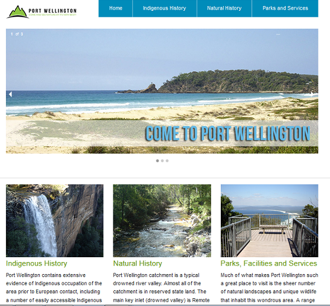

---

layout: strategy
title: "Develop Immersive Experiences"
date: 2018-12-17 10:50:00 +1100
category: strategy
tags: [Interactive Resources]
description: "An environment that mimics the real world but makes it safe to make mistakes."
subjects: "ACC200, ITC372, ENM309, ENM509, NRS313"
subjectnames: "Systems Accounting, Advanced Games Programming, Managing Projects & Resources, Professional Nursing Transition to Practice"
label: new

---

### Overview

A pervasive learning strategy will allow you to develop eLearning experiences that are informal, effective, and immersive for your learners. Immersive environments mimic the real world and make it safe to make mistakes. You then get to correct your mistake or if you are working with others, have the opportunity to discuss the options and recalibrate your thinking. Virtual worlds also provide visual 3D interfaces which recreate environments or even explore new environments for experiential learning.

Pervasive learning can leverage technology to create an experience in which learners become totally immersed in the learning process ultimately making the context and technology ubiquitous. The integration of personal, situational and contextual factors can support autonomy and competence and encourage active, deep learning. Learning according to this concept goes beyond learning in traditional classroom settings and encourages lifelong learning by leveraging everyday life experiences as learning opportunities.

### Engagement

Employing the tools/software used in the real-world is a good way to introduce students to the work environment. Working with the tools of the profession in a safe environment encourages risk taking and exploration of what is possible. Maybe even discovering new ways of working within the discipline. If designed with social interaction, pervasive learning allows for seamless collaboration and encourages the acquiring of new knowledge outside of the classroom environment. It creates a learning environment wherein learners can interact, offer feedback, and work together to solve problems and overcome learning challenges.

### In Practice

#### Subject
ACC200 Systems Accounting

#### Teaching Staff
Jennifer Hodges

#### Motivation

Students are presented with versions of professional software which they will encounter in the workplace. They are given the opportunity to practice and explore in a safe environment, from installation to reporting from the data.

- Yellowfin Business Intelligence software for building dashboards and analytics of case studies.
- SAASU: cloud based accounting software - used to produce a set of accounts for a fictitious organisation.

#### Implementation
A link was placed on the interact site to give access to the software.
Assessments were based around the ability to install and use the software.

This is external software and there were issues with students getting access -the hosts needed to add students to their trial users. Platform issues were also reported from a small number of students.

#### Subject
ITC372 Games 2 - Advanced Games Programming

#### Teaching Staff
Alexander Zawadski

#### Motivation
To give students a framework to make sense of why they would do the assessment

#### Implementation
It can be as simple as adding a sentence to your background and rationale:
"This project requires frequent and daily communications with members your team, this is essential for your success in this subject. Remember this subject is based around the team environment you are expected to experience when entering the industry. Working by yourself and leaving other team members in the dark is a poor practice; it will frustrate your team members, your team will become unorganized, and you will fall behind on work. Skype, Steam, emails, Facebook, whatever you feel is easiest to keep in contact with each other, do it. If you think you can complete this subject by yourself, you are very wrong."

And contextualise the assessments within this environment:
“Background
Congratulations on your new position in the research and development section with [Insert Your Team Name Here]. This company has a team based philosophy; all employees collaborate to produce new products. [Insert Your Team Name Here] is diversifying into game development and you are part of one of a handful of teams comprised of all new employees. Your company has yet to make a splash within the industry and it is your group’s task to pitch a new game concept idea to your team leader that will break the company through into the big leagues.

Your task involves creating and presenting a first draft of your game Design Document which will outline the game’s core, primary, secondary and tertiary mechanics and control schemes based on your game idea discussed in weeks 1 and 2 tutorials.

You will also need to provide evidence that you are a capable employee. To do this you will need to learn the basics of the Unity3D engine by following a simple tutorial. But that is not all; you will need to complete this tutorial under version control. This means that you have to individually set up a BitBucket account, and upload your project there..”

#### Subject
ENM 309/509 - Managing Projects & Resources

#### Teaching Staff
Prue Gonzales

#### Motivation
To give students a framework for the assessment

#### Implementation
Assessment Items 1, 2 and 3 use problem based learning and a virtual role play where you will apply your prior learning in environmental studies to the cut and thrust of day to day management. You will complete a number of tasks within each assessment item. The role play information is available on the subject Interact2 site. Each assignment will be based on a specific role play relating to your course of enrolment:
- Environmental Science students will take part in the Port Wellington Catchment Management Authority role play
- Parks, Recreation and Heritage students will take part in the Port
- Wellington Parks and Gardens Authority role play
- Ecotourism students will take part in the Port Wellington Outdoor Education Centre role play

{: .u-full-width}

#### Subject
NRS313 Professional Nursing: Transition to Practice

#### Teaching Staff
Linda Deravin

#### Motivation
To give students practice in conducting and attending interviews. This will mitigate some of the anxiety students experience when participating in interviews.

#### Implementation
An interview stream has been set up as an assessment as part of a professional e-portfolio:
"In order to prepare you for an interview for your future employment, practising interview techniques is a useful process to undertake.
This will be an online video assignment where you can try out your skills in being interviewed. You are to log in to Interview Stream (a link will be available in the I2 site) and respond to the questions asked by the interviewer."

### Guide

When it comes to creating Immersive Experiences ‘Content is King’. The more detailed examples will need Media Services support to create a professional looking implementation but more simplistic options can use powerpoint or web-based site design to create a fictional environment. Narration (text or audio) is another way to help create an authentic experience.

### Tools

The requirement of fidelity to provide truly engaging and immersive experiences often requires the use of professional software and services. Environments can be created using a variety of technologues including HTML5 but also through virtual worlds and 3D environments.

### Further Reading

C Pappas. (2015, January 22). The Pervasive Learning in eLearning [Web log comment]. Retrieved from[ https://elearningindustry.com/pervasive-learning-in-elearning](https://elearningindustry.com/pervasive-learning-in-elearning)

