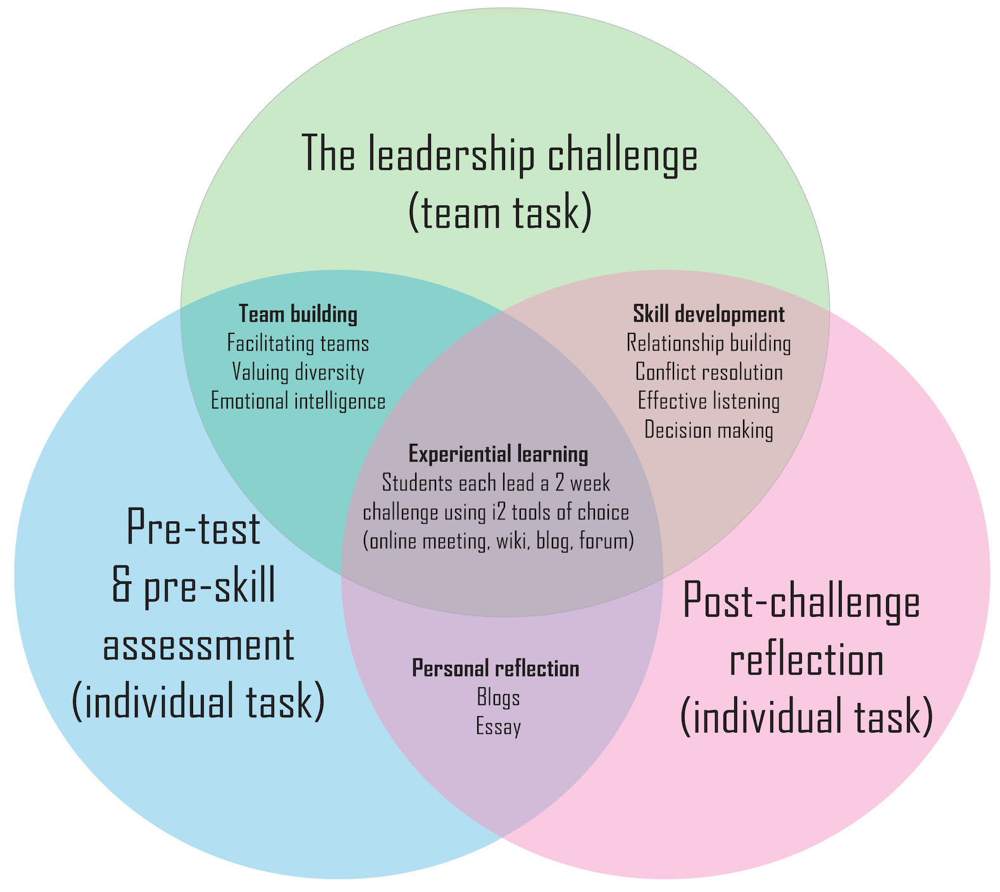

---

layout: strategy
title: "Distributed Leadership "
category: strategy
tags: [Learning Communities, ]
description: "Empowering students to assume leadership roles within their learning experience."
subjects: "MGT584, FIN230, "
subjectnames: "Leadership in Teams, Financial Institutions and Markets, "

---

### Overview

As noted by Garrison (2011), true leadership can create a sense of purpose and cohesion through open communication and trust. This is usually the role of lecturers and as such is detailed by the Teacher Presence element of this CSU Online Learning Model. At the same time it is important to recognise that technologies now allow ‘communities’ and ‘leadership’ to occur in new ways. By permitting students to assume leadership roles within online learning environments, lecturers not only build a strong sense of community, they provide students the opportunity to demonstrate professional readiness. This includes digital literacies, effective communication, time management and negotiation skills.

As stated by Hu (2016), virtual teams are common practice in organisations today, which provides further justification for incorporating such strategies into assessment design. Giving students the opportunity to lead and be led allows them the opportunity to demonstrate key professional skills. Students learn from the leadership styles and techniques of their classmates as well as reflecting upon their own leadership practice. This could happen through activities such as students taking turns in moderating forums or hosting online meetings.

### Engagement

Students engage in the learning process by assuming the role of ‘leader’. This may play out in simple ways such as asking them to moderate a discussion forum, lead small project teams, or perhaps by using more sophisticated technologies such as Online Meeting (Adobe Connect) to host stimulus presentations.

### In Practice

#### Subject

MGT584 Leadership in Teams

#### Teaching Staff

Zelma Bone

#### Motivation

This is an authentic assessment experience. As the name of the subject implies, student practice leadership skills as part of their Business degree.
Implementation

This is very much a case of learning by doing. Students take turns leading the others through a leadership challenge. Each team must complete 3 challenges in total and consist of:

- Pre-test and pre-skill assessment (individual task)
- The Leadership Challenge (team task)
- Post challenge reflection (individual task)

#### Implementation

Students are assigned to virtual teams (4-5 students per team) they are each given their own online meeting room and discussion board. Guidance about working in teams is provided through a staged process:

1. Each student completes the pre-test and pre-skill assessment task. This will identify for you where you are ‘starting from’ in this topic area. (Approx. 2 days)
2. Designated leader, in the role allocated for the leader, introduces the Challenge to the team and organises the team. All students scan the readings to gain the theory background that can be applied to the practice of the Challenge. (Approx. 3 days)
3. The Challenge. Adobe Connect meeting with leaders of each team challenge and the subject coordinator. (Approx. 6 days)
4. Complete submission requirements for the Challenge. (Approx. 2 days)
5. All students complete the Post Challenge individual task – Reflection. (Approx. 1 day)

{: .u-full-width
}

#### Subject

FIN230 Financial Institutions and Markets

#### Teaching Staff

Julia Lynch

#### Motivation

The rationale for this assessment is to build students’ skills and knowledge in order to meet the Graduate Learning Outcome of Digital Literacies by using technology to select, create and share information and participate in online learning, professional and social communities. In addition it is designed to assess your progress towards meeting Learning Outcome 3 - be able to apply analytic skills to the interpretation of developments and changes in financial markets.

#### Implementation

Students self-select into a group to discuss a ‘Current Issues in Finance’. Several topics are provided to ensure each student gets a chance to be a leader. They are each asked to lead the group for one week, guiding and commenting on the posts of others, just as a lecturer would.



### Guide

When using online meeting rooms ensure that you allocate one per team with accompanying discussion boards allow students to share leadership responsibilities. This allows groups to engage in both asynchronous and synchronous communication.

When using Interat2 each small group can use the discussion board but may also extend their experience using external technologies like email and file exchange to co-author.

Much of the success of these kinds of assessment task is the need to ensure that there are clear expectations of what should be done and the manner it's conducted. It should also be clear that the intention to create a sense of community is communicated is communicated by the lecturer, for example, in an introductory video.

### Tools

A variety of tools are available to facilitate this kind of program:

- Adobe Connect online meeting rooms to facilitate chat discussion.
- Email for essential communication and file exchange.
- Screencast-o-matic for the teacher videos, but clearly this could be done using an Online Meeting recording or CSU Replay recordings.

### Additional Resources

Garrison, R. (2011).[ Collaborative leadership](http://www.csuau.eblib.com.ezproxy.csu.edu.au/patron/Read.aspx?p=668750&pg=138) in *E-learning in the 21st Century: A framework for research and practice* 2nd ed. Retrieved from EBook Library

 Hu, H. (2015).[ Building virtual teams: Experiential learning using emerging technologies](http://ldm.sagepub.com.ezproxy.csu.edu.au/content/12/1/17.full.pdf+html). *E-Learning and Digital Media. 12*(1), 17-33. doi: 10.1177/2042753014558373

