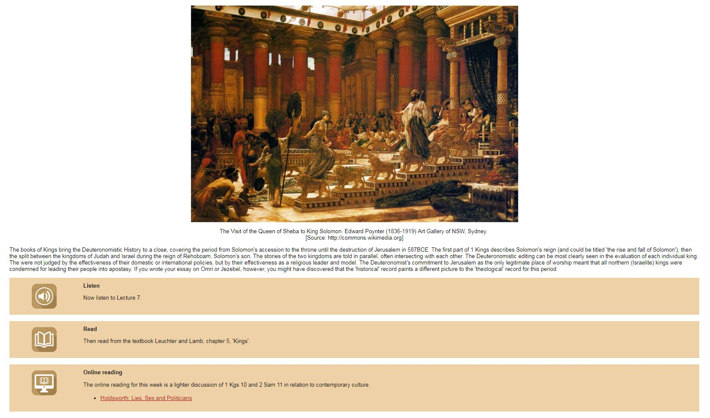
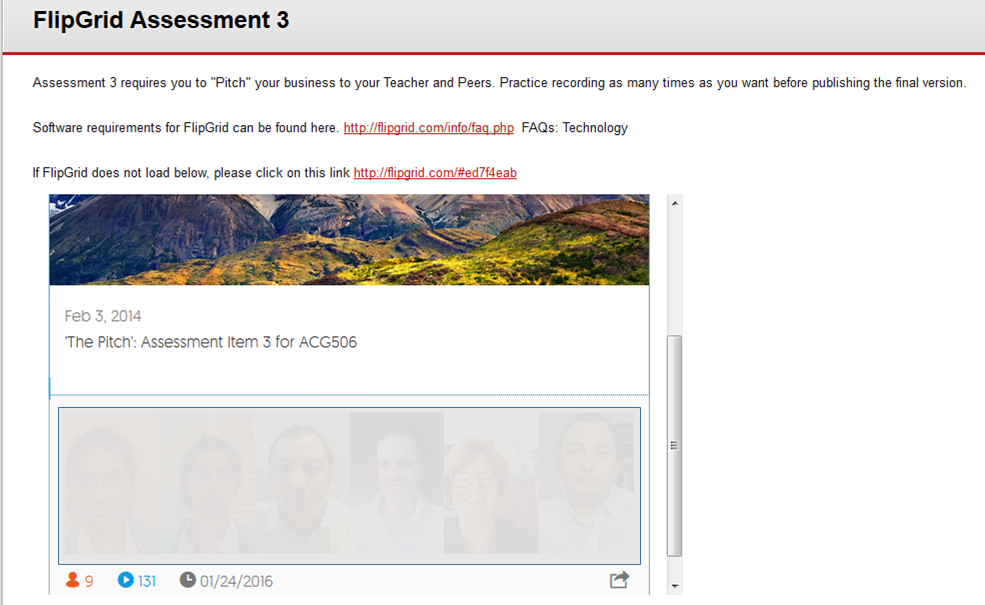
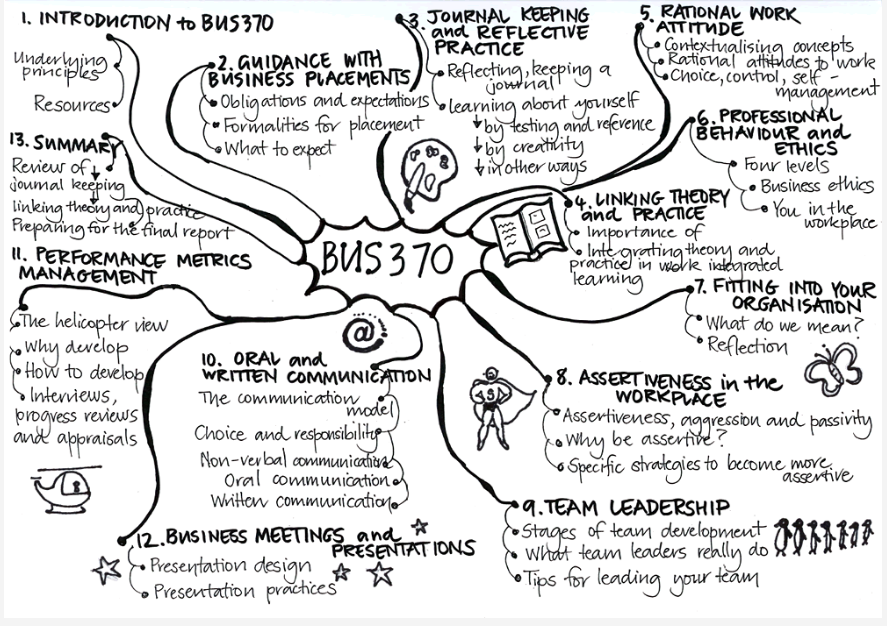

---

layout: strategy
title: "Engage the Learner with Multimedia"
date: 2018-12-17 10:30:00 +1100
category: strategy
tags: [Interactive Resources]
description: "Utilse a variety of media to bring content to life and allow students to explore."
subjects: "THL202, ACG506, BUS370, BMS171"
subjectnames: "Old Testament History and Narrative, Financial Management of Small Business, Workplace Learning 3, Introduction to Functional Human Anatomy"
label: new

---

### Overview

Learner to content and learner to community engagement can be greatly enhanced with the use of multimedia such as photos, audio, video and graphics. These mediums can convey complex information, illustrate context, bring content to life and provide stimulation for further discussion and engagement with ideas across the subject. The use of different media also caters to different learning preferences and exposes all students to a range of learning opportunities. This may be challenging for some but can also provide openings for discussion and peer support.

### Engagement

Multimedia can provide a range of different types and levels of engagement and motivation for learners. This can be as simple as the use of photos in learning materials to provide context and authenticity or graphics as a visual cue to memory. Complex information or cases can be illustrated with paintings, photographs and graphics and explained using audio or video. Visual-based instruction can provide a helpful focal point for other interactive techniques such as creating video responses to a topic. Visualisation of connecting ideas, e.g., mind mapping, can stimulate students to generate new knowledge (Fong and Wong, 2015). Audio and video can be used to start a conversation – a topic is provided and students can debate either in a text forum, an online meeting or a recording. Audio and video can also provide more engaging feedback to students with tone and expression adding a dimension that is not possible in written feedback. Self reflection and peer to peer feedback may also be more spontaneous and engaging in the visual and aural mediums. Multimedia can also be used for assessment, encouraging students to think creatively.

### In Practice

#### Subject
THL202 Old Testament History and Narrative

#### Teaching Staff
Jeanette Mathews

#### Motivation
This subject is about the historical and literary background of the Old Testament. Each study module consists of a recorded lecture and guided readings. Using an artwork to illustrate the topic of each module provides a visual context and makes the topic engaging and memorable. These biblical paintings are often epic and reflect the style of the era in which they were created thus providing another historical layer of interpretation to the narrative.

#### Implementation
The images were copied from electronic sources and referenced in the caption. See this [CSU guide for information on images and copyright](https://www.csu.edu.au/copyright/quickguides).

{: .u-full-width}

#### Subject
ACG506 Financial Management of Small Business

#### Teaching Staff
Kylie Gumbleton

#### Motivation
Flipgrid is used in this assignment to facilitate students’ pitch to a prospective financier. The purpose of the assignment is to provide students with experience in communicating a business plan idea in a concise manner.

#### Implementation
Students develop a 90 second ‘Dragon's Den’ or ‘Shark Tank’ style presentation using the FlipGrid application. Students first have to sign up for a free Flipgrid account: https://flipgrid.com/

{: .u-full-width}

#### Subject
BUS370 Workplace Learning 3
#### Teaching Staff
Jennifer Weller

#### Motivation
To give students a representation which links ideas or elements into a network, to help with orientation and understanding of a subject.

#### Implementation
A hand drawn diagram was created and digitized as an image. Hot spots were added for navigation.

{: .u-full-width}

#### Subject
BMS171 Introduction to Functional Human Anatomy

#### Teaching Staff
Adam Brett and Kelly Linden

#### Motivation
This anatomy subject is taught over multiple courses, cross campus and both face to face and online. The quizzes scaffold learning and enable students to practice and get feedback on the knowledge required to pass the assessable components of the subject. The assessment timelines are different for face to face and online cohorts and making all the quizzes available from start of session enables each cohort to work as required to meet their assessment due date . Online students in particular benefit from these Interactive resources

#### Implementation
Smart sparrow quizzes were created and uploaded to topic modules. They consist of drag and drop quiz questions and short answer questions in which students have to identify and name anatomical structures.



### Guide
Thanks to the Internet, there is an ever increasing variety of multimodal resource making tools available to educators, which can potentially add additional levels of engagement to existing learning materials. Sustainability is potentially the most important consideration when actioning this strategy:

* Reusability - Is the resource decontextualised (i.e. not bound to a particular cohort / session)?
* Are ‘specialists’ required to edit / create additional resources?
* Are there any licensing limitations which impact on the use of the tool?
* Is the tool endorsed (i.e. resource / supports available) by the institution?

### Tools

- [H5P](https://h5p.org/)
- [Padlet](https://padlet.com/)
- [Mindmapping](http://www.mindmaple.com/Default.aspx);
- [Smart Sparrow](https://www.smartsparrow.com/)
- [Stock music](http://theelearningcoach.com/media/audio/music-for-elearning/)
- [Audacity](https://sourceforge.net/projects/audacity/)
- [Flipgrid](https://info.flipgrid.com/)
- [SoundCloud](http://soundcloud.com)

### Further Reading

Fong, J., & Wong, K. t. y. (2015). A personal assistant authoring e-book for e-learning in higher education using inverted files of hyperlinks. *International Journal of Innovation and Learning, 18*(3), 333-349. doi:10.1504/IJIL.2015.071499

