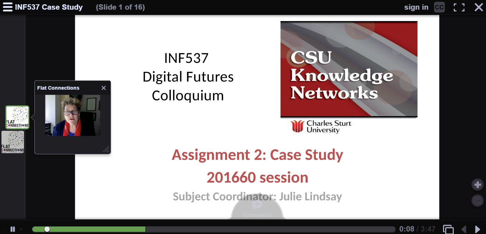

---

layout: strategy
title: "Feedback and Learning Commentary"
category: strategy
tags: [Teacher Presence, ]
description: "Providing students with timely and relevant information about their learning."
subjects: "INF537, ACC322, "
subjectnames: "Digital Futures Colloquium, Company Accounting, "

---

### Overview

Feedback and Learning Commentary refers to the full range of communication techniques an academic has at their disposal which can be utilised to provide learners as individuals and the class for timely and relevant information about their learning. Although providing a ‘learning commentary’ could have a broad range of definitions, in this context, learning commentary is considered to have at least some connection to the notions of feedback/feedforward - in other words, the commentary is focussed on both the learning that has been displayed or is in progress and there is a constructive element to the commentary that students can build upon in order to improve future performance in some way. According to Ferrell and Gray (2013), "Clarifying what purpose feedback is expected to serve and analysing tutor feedback needs to become normal practice for academic staff."

Learning commentary can be provided informally (e.g, general discussion during an online meeting,) or more formally (e.g. formal assessment feedback). Learning commentary can have a range of audiences, from providing feedback to an individual student all the way through to providing commentary to a large group or entire cohort, for example, providing generalised information to a group of students based on the results of a mid term exam. Another form of feedback/feedforward is the use of ‘worked’ examples which can be used to elaborate upon and further build student learning.

### Engagement

The notion of learner commentary has strong connection to other broad areas of this model such as building and maintaining teacher presence and the development of learning communities and should be viewed in the context of plans made in these areas. Learning design that includes one or more forms of feedback and/or commentary through the use of one or more tools enhances the interaction between the learner and the teacher and supports engagement with content.

The use of rubrics for assessment is a form of feed forward as it creates a context in which expectations are clear and provides a basis for the teacher to provide very specific commentary based on student work.

### In Practice

#### Subject

INF537 Digital Futures Colloquium

#### Teaching Staff

Julie Lindsay

#### Motivation

The problem here is how to share student work in an effective way so that feedback and encouragement and professional collegiality can be fully accessed. The goal was to make the research process transparent and through that visibility encourage cross-fertilisation of ideas.

#### Implementation

This strategy shares the use of Voicethread as a multimedia (audio, video, text) tool for communication between students and between the teacher and students. As part their assessment, a Case Study, students proposed their research ideas, a slide was made for each student, and peer-commenting and feedback was encouraged. This continued from the time of the initial proposal right through the data collection and analysis and final report.

Students shared a final reflection on their study and invited further questions from the community. After assessment the teacher also contributed final individual feedback to each student as closing remarks and observations.

You can [view the VoiceThread](https://voicethread.com/share/8103352/) here.

{: .u-full-width}

#### Subject

ACC322 Company Accounting

#### Teaching Staff

Emmett Berry

#### Motivation

Students in ACC322 are required to understand and utilise significant volumes of in-depth technical information. The use of regular feedback/feedforward mechanisms helps support student learning and helps them address misunderstandings prior to completion of high stakes assessments.

#### Implementation

ACC322 ‘Company Accounting’ Provides a strong demonstration of how online learning space design choices can be effectively paired with a strong teacher presence to support student learning, and be viewed as a comprehensive process. In this instance, we see ‘Learning Commentary and Feedback’ deployed primarily through several methods. Firstly, the lecturer scaffolds learning at the commencement of each topic through the use of short introductory videos (active teacher presence) which provide context and draws students attention to links with prior learning and possible areas of concern. This is paired with effective use of the discussion forum (design choice), which has been designed to make it very easy for students to identify the correct location to ask a question for each topic, but perhaps more importantly, makes it easy for fellow students to see where answers have been provided by the academic. Complemented by the use of online meetings, students within this subject are part of an effective feedback/feedforward loop due to the effective design of scaffolding, feedback provided in a non threatening and ongoing formative manner.



### Guide

For there to be an effective learning commentary provided, some elements must be in place and therefore considered when planning for the teaching and learning that will occur in a subject. Answering the following questions may assist this planning:

* **What are you going to provide feedback/feedforward on?** Whilst providing feedback on assignments or other assessment tasks is an expected and standard part of assessment practice, using a well designed rubric to base specific recommendations for improved future performance and steps to make these improvements is something which students often value as much as comments which reflect the actual performance in a given task. To that end, your well designed rubric will clearly signpost to students where the greatest value lies in an assessment task, and to you as a marker what the bulk of the commentary should be about.
* **What learning needs do students have, and how could feedback support learning?** If in your experience as an academic you’re aware that a given subject or topic presents issues for students each time the subject is offered, how can you use learning commentary as a ‘circuit breaker.’ One example is to use ‘mini tasks’ or simple ‘practice examples’ (even on the forum) which provide students with the chance to practice a skill/concept and allows you to provide a whole of cohort response in the form of a demonstration of the ‘answer.’ It is in that response where you can plan to provide additional insights that students can learn from.
* **Where will the feedback be provided?** Whilst individual feedback is regularly provided in the form of comments and annotations on assessments, there are numerous ways in which you can generalise important themes or issues and provides these in order to support students and enable them to learn from these in a feedforward manner. Methods to do this include providing a succinct i2 announcement with ‘General Feedback’ from assessments, running ‘post assessment’ meetings on Adobe Connect’ or creating a discussion forum or thread with this information, which allows students the chance to engage asynchronously.

### Tools

There are many tools which can utilised to provide learning commentary and feedback/feedforward, both supported by CSU and unsupported external educational technologies.

CSU Supported:

* Interact2 supported tools - Announcements, Discussion Forums
* NORFOLK provides text and audio annotation on assignments
* Adobe Connect Meeting tools

External Educational Technologies

* Flipgrid
* Externally available meeting tools
* Microsoft Word comment tools
* Podcasting platforms
* Youtube videos
* Voicethread

### Additional Resources

Ferrell, G & Gray, L. (2013, December 4). Feedback and feedforward: Using technology to support students’ progression over time [Website]. Retrieved from [JISC](https://www.jisc.ac.uk/guides/feedback-and-feed-forward)

