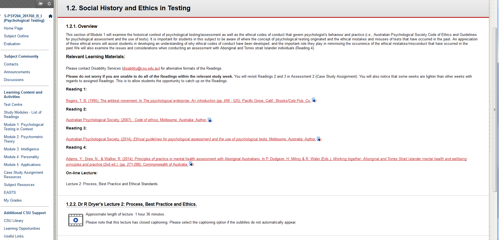

---

layout: strategy
title: "Be Inclusive - Universal Design"
date: 2018-12-17 10:40:00 +1100
category: strategy
tags: [Interactive Resources]
description: "Provide better access to the learning experience by designing materials to be accessible by default."
subjects: "PSY204, ETL523"
subjectnames: "Psychological Testing, Digital Citizenship in Schools"

---

### Overview

The principle of universal design is that we anticipate and plan for the diversity of students who might enrol in a course. It expands on the principle of accessible design in which the needs of people with disabilities are specifically considered. Australian law, CSU policy and social justice demand that education be made accessible to all students. Universal design addresses accessibility problems for all students, not just those who identify as having a disability.

The end product of universal design is an artefact, experience or course in which everyone can participate. Flexibility, choice, independence and the ability to schedule study around other commitments, such as work and family are key factors. Universal design will consider and cater for people with disabilities and needs of all kinds, and for different learning styles.

### Engagement

Being proactive and anticipating the needs of all students is key to creating an engaging learning experience. Many students, for instance, do not report their disability or particular learning need, so may have problems that you have no knowledge of.

Universal design will include consideration of accessible pedagogies that enable all students to engage with content. There will be:

* multiple means of representation (provision of information and content in different ways),
* multiple means of action and expression (provision of different ways for students to express themselves), and
* multiple means of engagement (to stimulate interest and motivation for learning).

Universal design will allow students to engage with study in ways that fit their own time management practices and commitments, for instance by providing opportunities for multi tasking and for mobile interaction with the subject site.

### In Practice

#### Subject
PSY204 Psychological Testing

#### Teaching Staff
Rachel Dryer

#### Motivation

This subject was modified to follow web accessibility principles in Interact2 for the purpose of an Accessible Design pilot project.

#### Implementation

Modifications and enhancements included:

- Inclusion of structured study modules that integrated all the learning materials and resources based on topic and session week.
- Inclusion of Blackboard ReadSpeaker for all the study module text.
- Web pages were formatted to include semantic structure of content.
- Images selected to convey information and alternative text provided.
- Tables only used to present table information not for layout or formatting purposes.
- Inclusion of meaningful web links.
- Removal of colour as an indicator of importance.
- Inclusion of closed captioning and transcripts.
- Provision of alternative files for recorded lectures.
- Wherever possible Word files were used or pdf files were formatted to be accessible by screen reader.
- Inclusion of structured discussion forum.

{: .u-full-width}

#### Subject
ETL523 Digital Citizenship in Schools

#### Teaching Staff
Julie Lindsay

#### Motivation
In conjunction with a weekly announcement the motivation for using podcasts was to share vital updates, review new module material, and check-in on pending assessment requirements. It complements the principles of universal design by reducing screen time required and allowing students to manage their time and multi task. It also supports the Teacher Presence element because students get to know the teacher via their voice and enthusiasm about the subject. Podcasting is a mobile form of media and relatively fast, easy and inexpensive to produce. Anyone with a microphone enabled device can create a podcast. Podcasts are a great way to utilize ‘dead time’ such as driving to work or washing the dishes, and can provide opportunities for experts to share their skills and knowledge, through interviews or guest lectures, for example.

#### Implementation
Podcasts were recorded using an iPhone and Voice memos app that comes with the basic setup. This was then uploaded to an online podcasting tool called Soundcloud (http://soundcloud.com). Soundcloud provides a direct URL as well as an embed code which allows a 'window' and an image to be added for extra effect. It also offers around 200 minutes free podcasting before having to pay to subscribe. Podcasts were then embedded onto the dynamic landing page and also sent out as a link via weekly Announcements.



### Guide

As a starting point Universal Design should consider:

**Navigation and format**
- Inclusion of a welcoming access statement
- Simple and consistent navigation
- Semantic structure
- Reducing clicks
- Colour should not be used to emphasise or give information about importance
- Legibility of text

**Tools**
- Suitability of tools
- Compatibility with assistive technology
- Structured discussions

**Accessibility**
- Description of graphics and images
- Closed captions for video
- Transcriptions for audio
- Redesigning presentations with closed captions and transcripts
- Does an online subject comply with WCAG 2.0 web standards?
- Compatibility with screen readers
- Hyperlinks from reading title, not web address
- No pop ups which block screen readers
- PDFs accessible, not image based
- Reduce screen time where possible

**Learning styles**
- Provide content to cater for different learning styles
- Include alternatives to traditional assessment, students producing a video or podcast for example
- Time management - allow students to multi task and have mobile interaction with the subject material

### Tools
Blackboard integrated tools

* Editing tools to format study modules including hyperlinks
* Embed audio and video files
* Readspeaker

Adobe Acrobat

* To create accessible pdfs

Youtube, to upload videos

* [Youtube help](https://support.google.com/youtube/?hl=en#topic=7505892)

Smart phone recording apps, for example:

* [Voice Memo](http://osxdaily.com/2016/05/04/record-audio-iphone-voice-memos/)

* [Smart Voice Recorder](https://play.google.com/store/apps/details?id=com.andrwq.recorder&hl=en)

Soundcloud for podcasting

* [Soundcloud](https://soundcloud.com/)

### Further Reading

Bundrick, Melissa; Goette, Tanya; Humphries, S. A.; and Young, Dale (2006) ‘An Examination of Web Site Accessibility Issues,’ *Communications of the IIMA*: Vol. 6: Iss. 2, Article 2. Available at: [http://scholarworks.lib.csusb.edu/ciima/vol6/iss2/2](http://scholarworks.lib.csusb.edu/ciima/vol6/iss2/2)

Explore the [CSU Wiki](https://bjbs-share.csu.edu.au/index.php/Accessibility) for information and tips on accessibility

