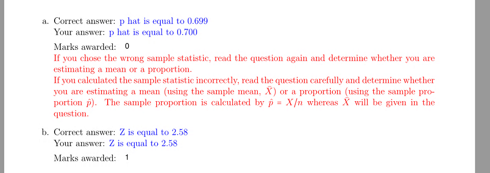

---

layout: strategy
title: "Individualised Tasks"
category: strategy
tags: [Flexible & Adaptive Learning,]
description: "Variables are used to modify assessment tasks to provide individual questions."
subjects: "MTH135, FIN516, "
subjectnames: "Mathematics And Statistics In Health Sciences, Corporate Finance"
label: TOL

---

### Overview

This strategy provides a way to help mitigate plagiarism as well as create equitable but varied assessment items. Using a variety of learning technologies, each student receives the same or similar assessment questions but with individual values as variations within their questions. For example different case studies but with the same questions requiring students to identify the same elements or mathematical questions with different values for the elements. In each case students receive the same questions but with individual values as variations within the questions.

### In Practice

#### Subject

MTH135 Mathematics And Statistics In Health Sciences

#### Teaching Staff

Dmitry Demskoy

#### Motivation

To replace hand written submissions with individualised assessment.

#### Implementation

Adobe Forms are used to create individual assessment questions which students complete and submit via EASTS. The files are downloaded and passed through MAPLE software which evaluates the answers against a set of requirements and mathematical algorithms. The resulting file with feedback generated by MAPLE is uploaded back to EASTS.

{: .u-full-width}

#### Subject

FIN516 Corporate Finance

#### Teaching Staff

Ruhina Karam

#### Motivation

Create a set of questions and calculations which walked students’ through a scenario.

#### Implementation

Smart sparrow was used to replicate a series of questions and calculations from a scenario used for assessment. Variables were created to hold the values of student’s calculations which were then used in subsequent workings. Feedback allowed students to adjust their answers or to carry their answers through the scenario to discover the consequences of incorrect calculations.

A pool of questions was set up using calculated formulas type questions. Each question has a variety of placeholders that substitute for a number. This allows for an exponential number of question variations for students to practice.  Question sets were created in the tests to draw from these pools of calculated questions, so no attempt would get the same questions or variety of a question.

### Guide

Some disciplines are better suited to this strategy than others. It is possible to provide a range of individualised mathematical and statistical challenges which use the same skills and are equally challenging. Calculated questions may be developed through blackboard. [Help Guide to creating calculated questions in BlackBoard Learn.](https://help.blackboard.com/Learn/Instructor/Tests_Pools_Surveys/Question_Types/Calculated_Formula_Questions)  Scenario based questions may be duplicated by the development of a range of contexts dealing with the same issues.

This process can be very time consuming and adds a level of complexity to the marking process but it adds credibility to the steps to avoiding plagiarism.

### Tools

- Adobe Forms
- Google forms
- Survey Monkey
- Interact2 Quizzes
- Smart Sparrow.
