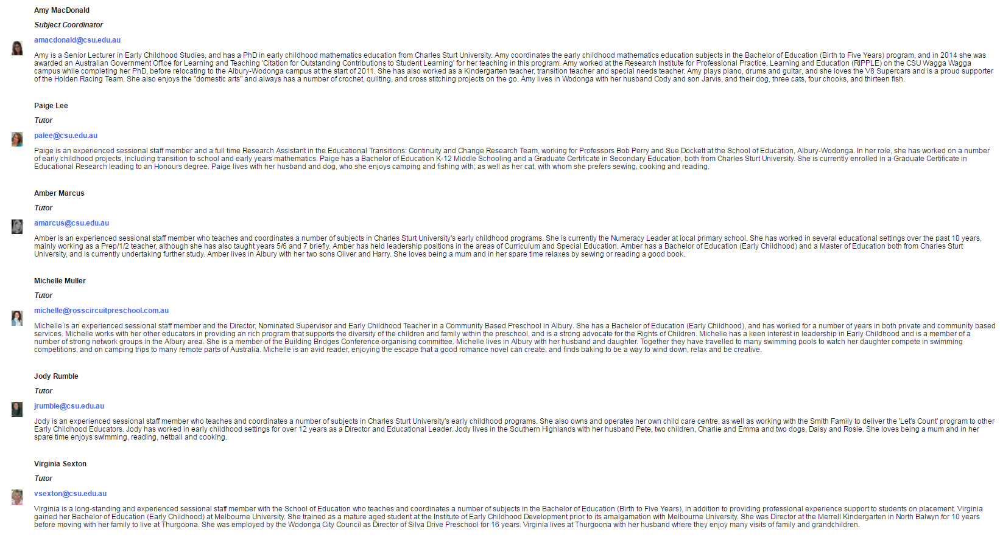

---

layout: strategy
title: "Introducing Involved Staff"
category: strategy
tags: [Teacher Presence, ]
description: "Take the time to introduce the staff students will be interacting with."
subjects: "EMC305, ACC585, "
subjectnames: "Investigation: Mathematics, Science and Technology, Financial Statement Analysis and Valuation, "

---

### Overview

This strategy involves introducing _all_ the staff who are present in the online teaching and learning environment within the subject. These introductions may be text, audio or video based, or indeed a combination of all three approaches. Within each of these broad approaches, there are a number of tools that can be used to facilitate these introductions. Introductions can be quite varied in their formality and level of detail. This is as effective and as important for introducing just one staff member, or many.

### Engagement

Taking the time and effort to introduce the staff involved in the subject delivery supports student engagement because it allows student to see the different skills, interests and professional experiences of their teachers, and this helps build student confidence in both these teachers and the wider institution. Introducing involved staff can be particularly powerful when these introductions provide some kind of articulation of how these staff progressed through their careers to this particular point in time. Complementing this kind of ‘formal’ information with smaller ‘insights’ into personal interests and background information also assists in making the online learning space more personal and human, helping to create a virtual space students want to enter (and re-enter).

### In Practice

#### Subject

EMC305 Investigation: Mathematics, Science and Technology

#### Teaching Staff

Amy MacDonald, Paige Lee, Amber Marcus, Michelle Muller, Jody Rumble, Virginia Sexton

#### Motivation

The primary motivation for providing a team teaching approach, and therefore the need to introduce involved staff within EMC305 is to create a more personalised, welcoming and collaborative environment for students. Utilising a team teaching approach means that tutors are available at different times throughout the week for the students to meet synchronously with a staff member. This is important as the students in the Birth to Five Bachelor of Education are predominately female, working in child care centres (at least part time) and frequently juggling family demands such as raising their own children.

#### Implementation

In this subject, a combination of short text based introductions on the welcome page and the addition of some short videos achieved the desired result of introducing the teaching team.

{: .u-full-width}

#### Subject

ACC585 Financial Statement Analysis and Valuation

#### Teaching Staff

Nick Pawsey

#### Motivation

To provide an informative and engaging introduction for the individual staff member to online post-graduate accounting students.

#### Implementation

In this scenario, the ‘home’ page of the interact2 site acts as a simple and efficient way to provide both a comprehensive introduction to the subject and more specifically to the academic. This is achieved through a simple combination of text, video, and imagery. The text features a short biographical feature of Nick’s professional and research areas of expertise, whilst the video provides further context for the planned learning. Both the content and method of delivery that Nick uses to introduce himself help establish him as a knowledgeable and skilled online educator.

{: .u-full-width}

### Guide

There are a number of prompts which are useful to keep in mind when planning on how to introduce the staff involved in the teaching of a subject. In essence, these reflect the wider approach to the development of teacher presence in the online environment:

* **Relevant and Relatable** – think about the needs of your students in regards to teacher presence. Yes, your biography presents your credentials and helps instill a sense of confidence that students are in expert hands (and is required within subject outlines) , but can these credentials be complemented by some insight into your journey to this point in time? Helping students see aspects such as your approach to ‘lifelong learning’ helps presents a more nuanced profile of you as a staff member and might even provide students with a discussion starter.
* **Keep it brief** – an introduction needn’t be long and involved. Whilst there is no right or wrong answer as to where you include your introduction, it’s perfectly ok to include as part of an e.g. ‘welcome to this subject’ video. Besides assessment, you’ve perhaps never got a better chance to engage your online students than with your introduction-keep your key messages in mind-what do you want students to know about you and how will this information help engage them.
* **Context** – with the affordances of technologies such as GoPro and mobile phone cameras, can you create an introduction which provides students with a mental hook of sorts which adds to your relatability and further contextualises the subject as part of a broader set of subjects?

### Tools

There are literally dozens of ways to create an introduction for the staff involved in the teaching of a subject. Thinking about the types of students with your cohort will also influence the choices you make. These tools can be categorised as:

Text-based - the simplest to prepare and easiest for students to access, the majority of staff introductions at CSU are still made through text, as an included paragraph within the welcome page of an Interact2 site. Useful for students who may not be particularly tech savvy or may lack sufficient bandwidth to access richer content such as videos. The downside of text is that it can be lost amongst the other materials you’re expecting students to engage with and in and of itself is the least engaging medium to convey this kind of information.

Audio and Video (one way) - Another (relatively) widespread practice within CSU is the use of audio and video to present students with information about the teacher/teaching team within the subject. These are normally called a podcast. Audio is normally included through the inclusion of either a link to a hosting service (such as SoundCloud or one of the many podcasting platforms) or can be saved directly within your Interact2 site as a file for students to download. The overwhelming majority of videos included for this purpose are hosted within the YouTube environment, although there are a few other ways to include/embed video directly into your subject site. It is worth noting that this requires more bandwidth/data for students to access but does provide a more engaging teacher presence. A discussion and tutorial on the available options with an ESC or Educational Designer can provide you with a more nuanced approach for your subject.

There is an ever changing and growing list of tools available for you to access in order to create a staff introduction which features interactivity-including the ability for students to respond with introductions of their own through text, audio and video (most student introductions currently occur most frequently within Interact2 discussion boards). These interactivity tools are generally hosted remotely but most can be embedded within Interact2. Within CSU there are increasing numbers of staff using tools such as Flipgrid and VoiceThread to engage students (to name but two). It’s worth also noting that there are increasing numbers of staff utilising approved social media channels such as Facebook to engage with their students. With reference to both social media and the use of third party tools such as Flipgrid and Facebook, it is worth remembering that CSU has clearly defined policies, approvals processes and practices around the use of social media and third party tools. Failure to note the requirements of these policies can diminish the student experience due to use of unsupported technologies amongst other possible negative consequences. The submission of a Service Request to the Division of Student Learning will put you in touch with someone who can work with you to develop the best approach for your subject.
Take the time to introduce the staff students will be interacting with.
