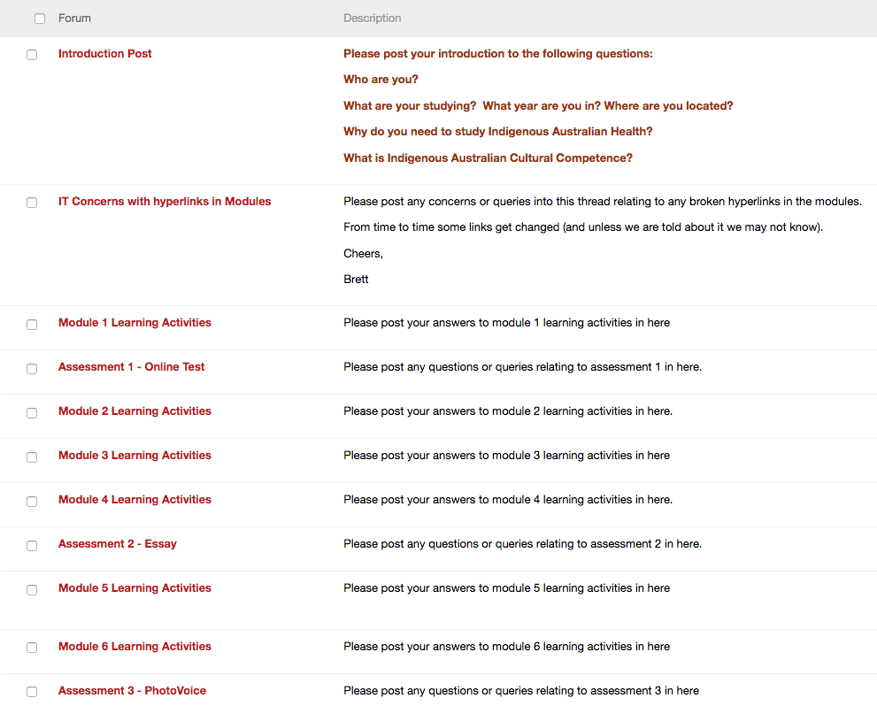
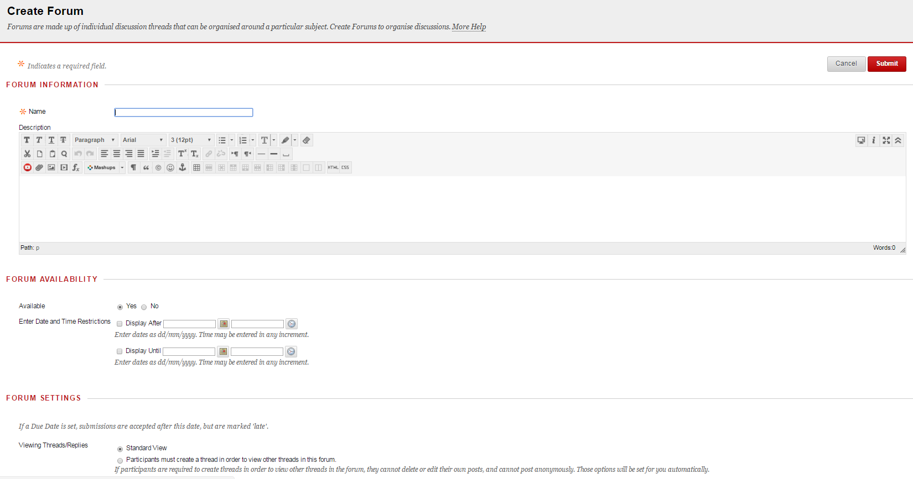
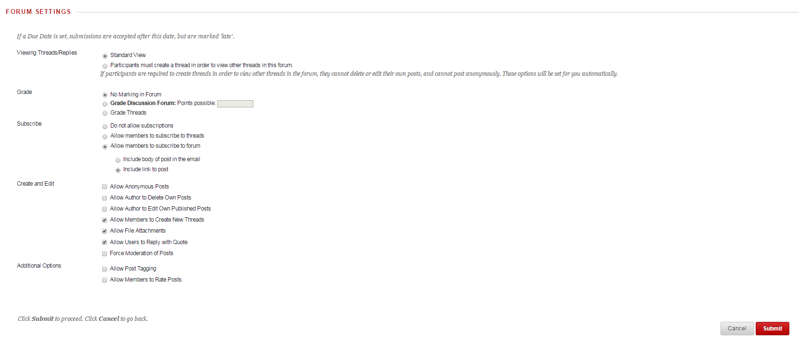
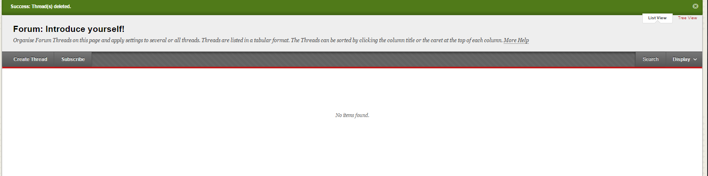
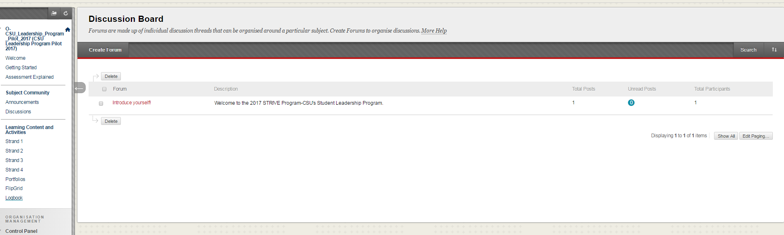

---

layout: strategy
title: "Managing Discussion Forums"
category: strategy
tags: [Teacher Presence, ]
description: "Structuring the forums to be more effective."
subjects: "EED408, IKC100, "
subjectnames: "Successful Teaching, Indigenous Health, "

---

### Overview

The teacher has an important role in actively managing discussion forums and facilitating constructive conversations through this medium. For many online subjects the discussion forums are where the conversations happen, but they need to be facilitated and managed in order for them to maintain relevance to students. In much the same way that on campus classroom discussions need to be facilitated, the same applies online. These discussions are extremely useful in developing a Learning Community and proactive management can ensure the health of that community is maintained throughout the session.

### Engagement

A successfully managed discussion forum may inspire purposeful, structured interaction between students and establish clear expectations of the relationship with the supporting lecturer. Where the engagement is planned, structured and managed, online discussion provides enhanced student-student engagement and enhanced student -teacher engagement. Different approaches to discussion forum design during delivery of the subject can also provide new ways of communicating and sharing knowledge.

### In Practice

#### Subject

EED408 Successful Teaching

#### Teaching Staff

Paul Grover

#### Motivation

Teacher presence has better scope and impact if the discussion forum is carefully designed and implemented. This in-practice example shows that it is not essential for the teacher to be active at all times within students discussion forums, however the design allows for strong teacher presence through observation and summary of student interaction.

#### Implementation

For the module forums additional threads were ‘locked off’ through settings. Therefore students were requested to respond, discuss and reflect within the one main thread for each module or part module. The teacher rarely contributed to these interactive discussions during the week of that module. By the middle of the following week a summary post (as a separate thread) is added to the forum by the teacher/lecturer. This post reveals the teacher has been present, has read and re-read discussions and is keen to share feedback, highlight pertinent contributions and synthesise material as a review of the week.



#### Subject

IKC100 Indigenous Health

#### Teaching Staff

Brett Biles, Sue Broekman

#### Motivation

Within IKC100, there was a need to provide a more streamlined and engaging use of discussion forums in order to foster an environment that allowed students to develop their critical reflection skills.

#### Implementation

In order to utilise the discussion forums more effectively and to foster the desired student attribute of critical thinking, the teaching team has taken a number of steps in regards to the design of the forum and ongoing usage. They have allocated a dedicated staff member to be the ‘Forum manager’ who acts as the ‘primary voice’ within the site, commenting on student posts and providing a consistent approach within the overall forum. The design of the forum also differs somewhat from normal practice within CSU. The forum is designed to make it easy for students to navigate directly to the area they are required to respond in, and aligns with the design of the learning modules within the subject. Critical thinking and reflection is fostered by the student-teacher interaction within the forum, whereby the staff member/s will encourage students to reflect on the content they have engaged with, encourage collaboration between students and also model this behaviour through their own postings.

{: .u-full-width}

### Guide

Students need to be prompted and communicated with in a way that promotes dialogue. Students may need to be invited to participate otherwise they may become observers by default or simply not contribute and instead opt out. There are a number of design aspects to keep in mind when planning for participation through discussion forums, as well as management considerations.

*  Question hierarchy and taxonomy - Considering the types of questions you will pose to students in the discussion forum is an important design approach. For example, using open questions has the potential to stimulate higher order thinking and creates opportunities for students to collaborate and build on each others responses, but may also be less attractive for students to engage due to the longer time needed to respond, when compared to a closed question.  
* As with many other aspects of teacher presence there is a  need to consider what "role" you will play in the discussion forums. Do you want to actively facilitate conversations in a hands on way, or will you be more of a reflective practitioner who may create a periodic summary of the activity within the forum(s), similar to strategies outlined in[ ‘Learning Commentary.’ ](https://docs.google.com/document/d/1v3U0MMopjlTtQKj8tfHMYvxYc9490sD0SzU4ZpMeXKw/edit#heading=h.lbr9293rwfg)  
* Layout is important. The chances are that in most subjects, there will be common themes or ‘conversation clusters’, whereby the bulk of student interaction and communication with you and each other will be focused on a relatively small number of topics. Could you anticipate some of these? Common themes include ‘Assessment’ and ‘Weekly Responses.’ For example, creating a discussion forum called ‘Assessments’ and then creating threads called ‘Assessment One’ and ‘Assessment Two’ etc makes it quicker and easier for students to locate both initial questions and responses from both yourself and other students when compared to ‘trawling’ through an unstructured discussion board.
* Consistency - the key to managing the discussion forum is to do so actively. This includes directing students who may email you learning queries back to the discussion forum (where appropriate) where the answer you provide can be known by all students. Complementing the creation of this expectation is the need to be visible and active in the forums and threads. Although there is no mandated response time on forums, a practice utilised by many academics is the practice of ‘updating’ the forums through responses etc at known, multiple times.  Building the culture and expectation that the discussion forum is a primary place of interaction for learning is important for the successful use of discussion forums.
* Although the discussion forum is an important component of the online learning environment, like all other approaches, it should be viewed as complementary, in that its’ effectiveness increases when partnered with other complementary approaches to teaching and learning online. For example, a discussion board becomes much more powerful when students are asked to pre-submit questions before an online tutorial run through ‘Adobe Connect.’ Finding authentic purposes for discussion board interaction, such as using it to drive participation in other areas of your subject, is vital.   

### Tools

Setting up the discussion forum involves the use of the available options within Interact2, namely the ‘Create Forum’, ‘Create Thread’ options and the editing toolbar.

1. With your edit mode on,  Choose the ‘Discussion Tab’ on the left hand menu and select ‘create forum.’ {: .u-full-width}
2. When creating this new forum you will be able to select different options to help you more effectively manage the forum. These options include the ability to:
	* Grade contributions
	* Allow students the option subscribe to a forum or thread (and receive these as emails)
	* Set different levels of creation access and permissions, including the for students to post anonymously; tag others in posts, and edit or delete contributions; require moderation by the instructor.  
{: .u-full-width}
3. Once you have created the forum, you will be able to create different threads within that forum. Simply select the ‘create new thread’ option. For example within the Assessment Forum, you will be able to make different threads like ‘Assessment One’, ‘Assessment Two’ etc.
 {: .u-full-width}
4. Students will be able to access the different forums and threads from the ‘Discussion tab.’ Remember that you have a wide range of tools available within the editor, including the ability to embed youtube videos, audio and a range of text, files and links.
{: .u-full-width}

### Additional Resources

Lindsay, J. (2016). Discussion forums: Dissection and design [Slideshow]. Retrieved from [Google Docs](https://docs.google.com/presentation/d/13gdFkfMJfmSbdRmiTYBQsTDspgFdE71OJ5sqI2Gl3LI/pub?start=false&loop=false&delayms=3000)

