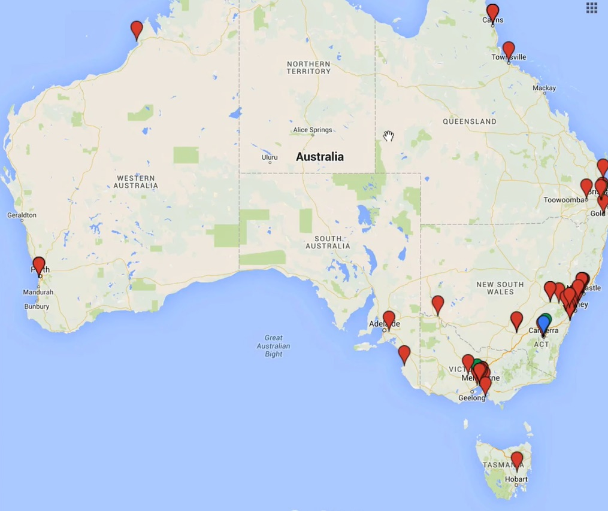
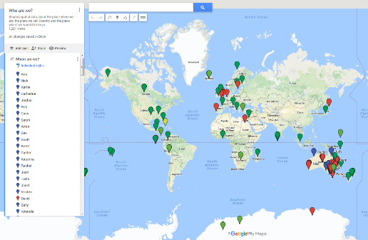
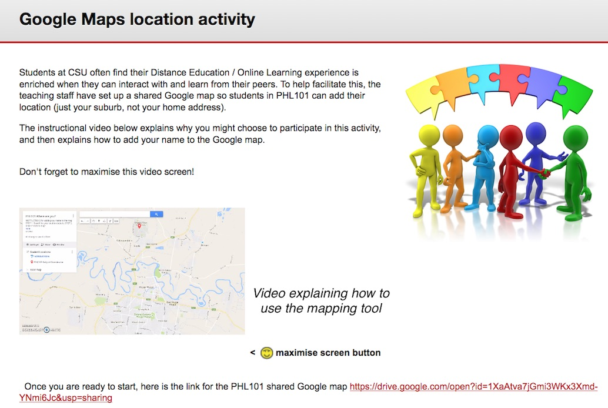

---

layout: strategy
title: "Mapping Students Locations"
category: strategy
tags: [Learning Communities, ]
description: "Students share their place in the world to help connect to one another."
subjects: "HRM502, SCI103, "
subjectnames: "Human Resource Management, Communicating Environmental Data, "

---

### Overview

Studying online means that students can come from anywhere in Australia or around the world. The lack of a shared physical space is often seen as an issue for online learning, isolating students and reducing the likelihood of being able to ‘come together’ with their peers. However, providing students with the ability to define their physical location allows them to gain a better understanding of where their peers are located.

The opportunity to visually identify student locations; such as with an online map, can reduce the sense of isolation, build community and provoke conversation. In some instances students may discover they live in the same metropolitan area and an informal study group could be arranged at a centralised venue. In other instances, students from different countries may choose to schedule conversations based on time zones.

### Engagement

Students have an anchor point around which to initiate discussions of a social nature, which can help to facilitate stronger learning interactions. They are also able to locate other students close by and create study groups or to meet socially.

### In Practice

#### Subject

HRM502 Human Resource Management

#### Teaching Staff

Chrys Gunasekara

#### Motivation

This strategy was deployed to build a sense of community among online students and to assist them in forming virtual study groups. Many students within this subject are returning to university after years in industry. They are located around the world, meaning time zones sometimes may impact on a student’s ability to join a live conversation such as an online meeting.

#### Implementation

This strategy was implemented through an ‘icebreaker’ activity. A Google Map was shared with the cohort using the Interact2 ‘blank page’ so they could easily access the map from the main screen. Students gave a general sense of their location which assists in setting up study groups. For instance; several Canadian students, from the same providence decided to form a study group. (students are advised to not publicly post the home address or other personal info)

{: .u-full-width}

#### Subject

SCI103 Communicating Environmental Data

#### Teaching Staff

Ana Horta

#### Motivation

This activity forms an ‘icebreaker’ activity which also relates closely to the subject content.

#### Implementation

A content area within Interact2 is set up entitle ‘Who are We?’ Within the content area a Google map containing the following instructions is available:

> "Sharing spatial data about the place where we are, the place we call Country and the place where we would like to go."

Students use a blue pin to identify where they are located, a red pin to identify their home country and a green pin to identify where they would like to visit. Very clear instructions are given to step students through the process. Once completed students read

>"Congratulations, you are now part of our Spatial SCI103 Community!"

{: .u-full-width}

### Guide

There are a few issues to be aware of concerning privacy and location data. To minimise the risks ensure that students keep identification of where they are down to local areas, not street locations, so use post codes or pins dropped in town centres.

It is important to remind students not to include personal information, such as their home address, but rather identify a nearby public location such as their nearest public library.

When setting up this activity, see the example from PHL101 below, and include information like a small explanatory video and ensure that the map URL is linked from the navigation.

{: .u-full-width}

### Tools

Google Maps can easily be included within the Interact2 subject site.
A Google account is needed to create an individual map. Go to [Google Maps](https://maps.google.com) and from the menu choose **Your Places**. From the top tab choose **Maps** and select **Create new map** from the bottom of the list. Giving it a meaningful name with instructions for the students for example:

>Students are asked to ‘Use this map to mark your location. Click on the 'add marker' symbol and then click on your location’.

### Additional Resources

[10 Ways to use Google Maps in the classroom](http://www.thethinkingstick.com/10-ways-to-use-google-maps-in-the-classroom/)

