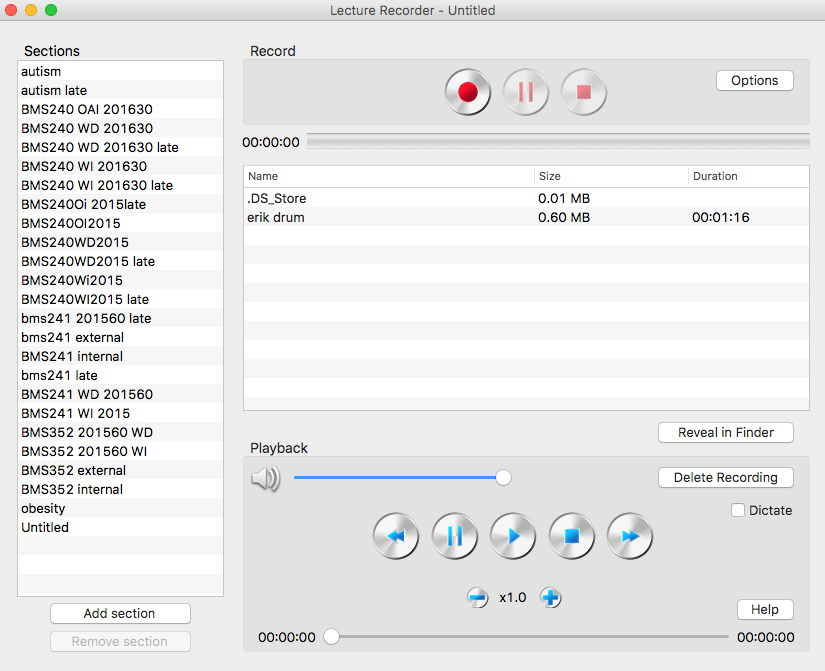
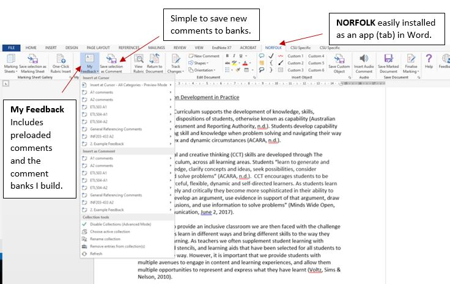

---

layout: strategy
title: "Marking and Effective Feedback"
date: 2018-12-15 10:05:00 +1100
category: strategy
tags: [E-Assessment,]
description: "Utilise feedback to motivate and empower student's learning."
subjects: "BMS352, ETL503"
subjectnames: "Molecular Pathology, Resourcing the Curriculum"

---

### Overview

It is well established that students benefit from constructive feedback on their learning. Everyday learning activities as well as special tasks and tests provide opportunities for the provision of feedback (Wiggins 1998; Ferguson 2011). Effective feedback is critical for motivation, empowerment, retention and the development of self-critical learning skills and this is especially important for students at the start of their degrees (Chetwynd and Dobbyn 2011). Online marking presents a diverse range of tools that are designed to provide much richer options for feedback to students that include verbal, visual and written feedback (Lunt and Curran 2010). Previous research has also suggested that students welcome multimedia feedback and and they are more likely to open the files and take on the feedback as opposed to written feedback (Lunt and Curran 2010).

### Engagement

The digital tools available today can increase the personalisation possible and can greatly increase the turnaround time-that is, the time from submission to reception of marked assessment task. The ability and ease in which quality audio feedback can be incorporated into the marking process allows positive outcomes for both staff and students. The students’ engagement in their assessments is improved with personalised feedback and the teacher’s voice can make distance students feel more connected and reduce feelings of isolation. The use of verbal feedback provides a link for students with someone they know, that is not just a name in a subject outline but a real person, who cares about their progress and achievements.

An initiative in the UK called the *audio supported enhanced learning support project* (Stewart 2008) set out to use technology to enhance and personalise teaching. A study in the USA found that using audio feedback was faster than written feedback but the quality of the feedback increased at least 2-fold (Ice, Curtis, Phillips & Wells 2007). There is widespread agreement in the literature that audio feedback is a superior form of feedback which will enhance learning and teaching (Dickson 2015). Another important aspect of audio feedback is the opportunity to provide a personal connection with the student which could lead them to deeper engagement with their subject, their course and even the university (Rowe 2011). Studies have shown an increased ability to understand the feedback, as there is more nuance and intonation and greater feelings of subject involvement especially in distance education (Oleseva and Richardson 2011). All this means that audio feedback can provide a system to create greater personal contact and maybe even emotional support (Rowe 2011).

### In Practice

#### Subject
BMS352 Molecular Pathology

#### Teaching Staff
Wouter Kalle

#### Motivation
Feedback is one of the most important aspects in student learning and traditionally scores quite low in the SES scores at CSU. This shows that this type of feedback could be an extremely useful tool to increase subject engagement and student retention in online programs at CSU.

This lecturer finds audio feedback not necessarily faster than writing comments, but ‘much more thorough and personalized’ and he would rather spend time talking than writing feedback. ‘I am more consistent in my marking because I have to say something about the assignment, and I am having fun while doing it’.

#### Implementation

Briefly, the audio feedback system is set up as follows:

- Assignments are downloaded from EASTS website on the due date.
- In the text different coloured highlights are made and if necessary comments are created using MS-word.
- Using MS-Word, the criteria are pasted in front of the assignment and the levels attained are highlighted and marks are awarded to each separate criterion.
- Final marks are recorded in spreadsheet.
- Using a very simple Apple Mac app (called lecture recorder) and the computer microphone, audio feedback is recorded for the student. The student’s first name is used and both the criteria and marks are discussed.
- The various highlights and comments in the text are explained.
- The recording is usually between 3 minutes (very good marks, HD level) and 7 minutes (lots of remarks, usually PS/CR level).
- Marked files are sent back to the students through EASTS to record return date.
- An email is sent to the students using the EASTS handing-in email containing the marked file and the audio file. This ‘double-up’ is done as the linking of the audio file to the marked document does not work very well and sometimes the audio file gets lost in the EASTS transition. Also this is a point of Quality Control to check whether all assignments have been marked and marks recorded.
- Quality Control is ensured by using the original file names for the audio files and consistently using student numbers and student names to record audio feedback and marks.
- The audio feedback always flows according to a fixed pattern. Below is an excerpt of a typical audio feedback file: ‘Good morning (student’s first name), I just wanted to give you some audio feedback on your (subject code) assignment. As you can see I have copied and pasted the criteria in front of your work and blocked out the levels you have attained in pink. I added up all the marks and you scored X marks out of a hundred’.
- A description of the levels attained follows including an explanation why these were attained: ‘Looking at your assignment I have highlighted some parts which will be discussed now’. The highlights are in different colours depending on whether they are regarding content, grammar, referencing or general. An explanation of the highlights and comments follows while slowly going through the text. According to personal feedback, students can actually follow the marking and comments through the text and are never lost.

The audio feedback always ends with a conclusion and some words of encouragement. ’In short, you have achieved X marks, if you would pay attention to (a brief repeat of previous comments) you would easily score a (higher) level. I really enjoyed reading and marking your assignment and looking forward to seeing more of your work’.

{: .u-full-width}

#### Subject
ETL503 Resourcing the Curriculum

#### Teaching Staff
Tehani Croft

#### Motivation
Marking is time consuming and often frustratingly repetitive. I was looking for ways to streamline my marking, help avoid RSI, and make things more consistent for feedback purposes. NORFOLK offers a bunch of really useful options to help me do all this and more.

#### Implementation
Straight out of the box (i.e., app installation) there are a range of comments already pre-loaded, thanks to the ALLaN team – these are available to insert as comments or directly into the text, and once added, are completely customisable. The most useful aspect though is being able to build up what is essentially comment banks for each subject and assignment. Each time I write a comment on a task that I think will be reusable, I save it to the relevant comment bank collection (My Feedback). I’ve developed banks for several assignments over multiple subjects, and have also created some generic banks as well, such as those related to referencing. These are the sorts of banks I used to build up in a separate word document, but using NORFOLK is much quicker and simpler to access. I can delete comments that don’t work for later assignments, and add as needed. While comments in banks can’t be edited, it’s a simple matter to delete one and replace with a corrected version. Again, applying the comments means they are fully editable in the document. It saves me an enormous amount of time each session.

There is a great deal of support and training in text and webinar form about using NORFOLK available from the university. I plan to investigate more ways to use it (such as the automated rubrics and audio feedback) in future.

{: .u-full-width}

### Guide

If you want to implement online marking within your subject/s there are some important considerations to make when planning this approach:

* Consider the platform most suitable for your cohort and the assessment task - will you use audio, video or written feedback? Students have different learning styles and it may be possible, particularly in a small group, to offer them a choice of how they would like feedback delivered.
* Remember that feedback is not only for that assessment item, constructive feedback helps motivate and engage students in their learning generally. Feedback can help build a constructive relationship between student and lecturer.
* If similar issues are appearing across the cohort then consider recording or writing a response and posting it for all students to access. The response then becomes a resource that you can refer students to rather than repeating the feedback to individuals.
* Feedback may and should lead to dialogue with students and you might consider using a forum or other online space after assignments are returned to discuss feedback with the class.

### Tools

* EASTS
* NORFOLK
* Voice recording apps such as Lecture Recorder
* Discussion forums
* Online Meeting

### Further Reading

Boud, D. and Associates (2010). *Assessment 2020: Seven propositions for assessment reform in higher education*. Sydney: Australian Learning and Teaching Council.

Chetwynd, F. & Dobbyn, C. (2011) Assessment, feedback and marking guides in distance education, *Open Learning: The Journal of Open, Distance and eLearning*, 26:1, 67-78.

Dickson S. (2015) The pastoral potential of audio feedback: a review of the literature. *Pastoral Care in Education*, 33:2, 96-104.

Peter Ferguson (2011) Student perceptions of quality feedback in teacher education, *Assessment & Evaluation in Higher Education*, 36:1, 51-62.

Henderson, M., & Phillips, M. (2015). Video-based feedback on student assessment: scarily personal. *Australasian Journal of Educational Technology*, 3.

Ice, P., Curtis, R., Phillips, P., & Wells, J. (2007). Using asynchronous audio feedback to enhance teaching presence and students’ sense of community. *Journal of Asynchronous Learning Networks*, 11, 3–26.

Lunt, T., & Curran, J. (2010). ‘Are you listening please?’ The advantages of electronic audio feedback compared to written feedback. *Assessment & Evaluation in Higher Education*, *35 *(7), 759-769.

Olesova, L., & Richardson, J. (2011). Using asynchronous instructional audio feedback in online environments: A mixed methods study. *MERLOT Journal of Online Learning and Teaching*, 7, 30–42.

Rowe, A. (2011). The personal dimension in teaching: Why students value feedback. *International Journal of Educational Management*, 25, 343–360.

Stewart, W. (2008). ASEL project plan. JISC. Retrieved from [http://www.jisc.ac.uk/media/documents/programmes/usersandinnovation/aselplan.pdf](http://www.jisc.ac.uk/media/documents/programmes/usersandinnovation/aselplan.pdf)

Wiggins, G. (1998). *Educative assessment: Designing assessments to inform and improve student performance*. San Francisco, CA: Jossey-Bass.

