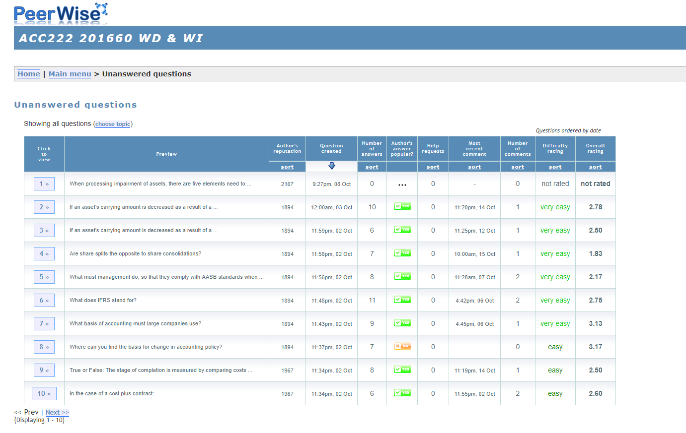

---

layout: strategy
title: "Online Peer Assessment"
date: 2018-12-15 10:20:00 +1100
category: strategy
tags: [E-Assessment,]
description: "Enhance student learning by providing opportunities to demonstrate and reflect."
subjects: "ACC222, "
subjectnames: "External Reporting, "

---

### Overview

Digital technology advances have transformed online learning to be more open, with greater involvement of teachers and students in the learning process and less of a communication from the teacher to the student (Fontanillas et al. 2016). Advances in tools for self and peer assessment allow students to more easily demonstrate and reflect on their learning and achievements and to consider implications for further learning (Boud, 1992; Dochy et al. 2006).

Yang (2010) highlights the learning process around online peer assessment and revealed that peer review enabled students to monitor, evaluate, and adjust their writing processes thus teaching them to self-correct. Students claimed that self-correction helped them detect grammatical errors while peer review allowed them to consider their own texts from others’ perspectives, allowing them to make further revisions on text development, organization, or style (Yang, 2010). Through the process of reflection, self-correction and peer review, students were willing to provide further support to peers and learn from each other while writing, thus enabling a higher level of learning than many other assessment types.

### Engagement

Longhurst and Norton (1997) suggest that self-assessment is important in helping students improve their own learning and it encourages students to take a deep approach to their studies. This results from students focusing their attention on the metacognitive aspects of their learning and teaches them to be more effective at monitoring their own performance (Longhurst and Norton, 1997). Fontanillas et al., (2016) report on the benefits of giving students a voice in the online space around assessment resulting in an increased level of satisfaction and improvement around the entire learning process.

### In Practice

#### Subject
ACC222 External Reporting

#### Teaching Staff
Miranda Dyason

#### Motivation
There are a number of reasons for asking students to write and critique questions. This approach was introduced as an assessment task in ACC222, because the ability to write a good question provides evidence that students understand the topic and when they write alternate answer choices they are also required to show evidence of deep learning because they must understand possible misconceptions. They also receive feedback on their own questions from fellow students. It has been shown that feedback that is given often and quickly is important for learning. The more questions students attempt, the better their grasp will be of the core concepts in this subject. The assessment task is designed to promote peer-to-peer learning, and to encourage students to engage with the subject content on a regular basis.

#### Implementation

This subject utilised an online system called 'PeerWise' (http://peerwise.cs.auckland.ac.nz/) that lets you create and submit multiple choice questions (MCQs), and answer and rate other students' MCQs. The PeerWise activity was formally assessed and worth 10% of the overall assessment mark. The link to peerwise was embedded directly into the i2 site and students had to sign up and create a login and join the relevant course before they could participate. To encourage everyone to participate equally, all activities on PeerWise were anonymous. However, the academic was able to track contributions from each individual.

{: .u-full-width}

### Guide

Students should be prepared for peer learning activities including assessment. This preparation may include: working in groups; developing communication skills; problem-solving; giving and receiving feedback; reflection.

Peer learning activities can include: small group discussions, group projects, seminar presentations; student led workshop activities; debriefing sessions (following a placement for instance).

Successful peer learning and assessment activities require effective implementation and management and need careful planning. The activities should be integral to the course/subject design and not an ‘add on’. Students will need guidelines and resources to support the activities.

Students may need to adjust their thinking on working with and learning from their peers, particular if they have no prior experience of peer learning, or if their educational background has promoted learning as a competitive and individual activity. Students will need to understand that peer assessment is valid, authentic and that will enable them to engage with content more effectively.

### Tools

Peerwise

Interact 2 collaborative tools, e.g., groups, wiki, forums, online classroom.

### Further Reading

Boud, D. (1992). The use of self-assessment schedules in negotiated learning, *Studies in Higher Education*, 17: 185-200.

Dochy, F., M. Segers & D. Sluijsmans (1999). The use of self-, peer and co-assessment in higher education: A review. *Studies in Higher Education 24*(3): 331-350.

Fontanillas, Teresa Romeu, Marc Romero Carbonell, and Montse Guitert Catasús. (2016). ‘E-assessment process: giving a voice to online learners.’ *International Journal of Educational Technology in Higher Education* 13.1: 1-14.

Longhurst, N., & Norton, L. S. (1997). Self-assessment in coursework essays. *Studies in Educational Evaluation, 23*(4), 319-330.

Wride, M. (2017). *Guide to Peer-Assessment*. Academic Practice, University of Dublin, Trinity College. Available online: [https://goo.gl/gcCEPp](https://goo.gl/gcCEPp)

