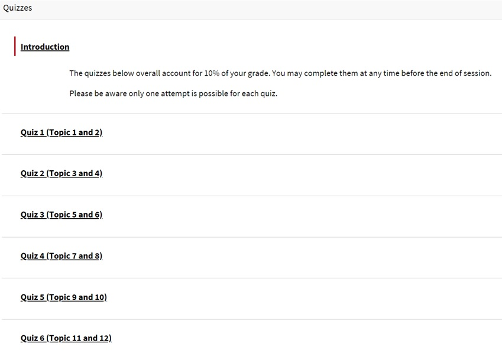

---

layout: strategy
title: "Open Sequential Submission"
category: strategy
tags: [E-Assessment]
description: "Allowing students to complete assessments at their own pace but in a sequential order."
subjects: "MGT220"
subjectnames: "eCommerce"
label: TOL

---

### Overview

The development of open assessment tasks provide students the opportunity, as they progress through the subject, to complete set assessments at any time during the session. The greater flexibility provides students the opportunity to individualise their learning.

There are times however when the development and successful demonstration of outcomes requires a predetermined order. This may include the development of sequential skills, engagement with professional practice or responding to academic or peer feedback. Allowing students to complete assessments at their own pace but in a sequential order ensures outcomes are achieved while maintaining flexibility for the student.

### In Practice

#### Subject

MGT220 eCommerce

#### Teaching Staff

Sam Parker

#### Motivation

To provide the opportunity for assessment that can be completed in sequential order at any pace during the session, maintaining flexibility for students and providing meaningful learning opportunities.

#### Implementation

Assessment 1 consists of fortnightly quizzes, available from the start of session, utilising the i2 quiz tool. All of the tests are available from the start of session. This enables students to progress through the study schedule at a quicker pace if appropriate.

Each quiz is set up with question pools of varying difficulty. Quizzes are randomised so each quiz is unique. Automated feedback is provided to students when they complete the quiz. Assessments 2, 3 and 4 require students to complete a case study based around a client brief. Five possible case studies were created for each assessment. To receive a client brief students

Complete an i2 quiz consisting of a yes, no question. Upon completion of the question, students were randomly allocate a client brief. Students were able to complete the quiz question and receive all assessment items at the start of the session. The only condition on completing each assessment is that students receive feedback from the previous case study before they submit the next task.

To support students through the process, all learning material is provided at the start of session. A series of mini lectures, introduction and topic summary videos, were created to support students throughout the module. An initial online meeting was held to introduce the flexible concept, discuss assessments and the rubric. Weekly ‘chat’ sessions using Adobe Connect (Online Meeting) were then held to discuss topic questions. Students are also able to achieve badges for quiz and module completion. This has been an addition to assist students to track their progress.

{: .u-full-width}

### Guide

Setting up for success:
- Consider your assessment task, sequential tasks are most suited to subjects that have a linear progression in which assessment tasks build on each other or feedback can be used to feed forward.
- Consider what parameters are placed on the tasks. Is the criteria that a certain score be obtained or is it that students must respond to feedback before commencing the next task.
Consider how the tasks will be managed what tools will assist you in their implementation and subsequent feedback.
- Ensure that your plan for submission allows for preparing students for success.
- Ensure students are aware of what you are doing and why. Understanding the importance of engaging with the tasks and developing skills may assist with engagement.
- Hold an initial online meeting with students or provide an assessment video. Explain what your expectations are and provide the opportunity for clarification.

### Tools

There are a variety of technologies supporting the development of Open Sequential Submission. Tools worth exploring include:

- Blackboard quizzes provide a good option for basic quiz functions.
- For more complex application you could consider Smart Sparrow (for help there is a button on the SRS system).
