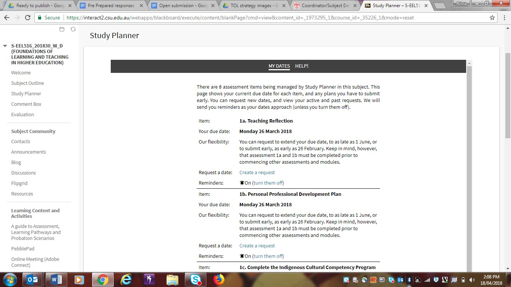

---

layout: strategy
title: "Open submission"
category: strategy
tags: [Flexible & Adaptive Learning, ]
description: "Students submit their assessments whenever the student feels they have developed sufficient knowledge and skill to successfully complete the task."
subjects: "EEL516, GPM512"
subjectnames: "Foundations of Learning and Teaching in Higher Education, Executive Leadership in Law Enforcement and Security, "
label: TOL

---

### Overview

Open submission is an approach to the design and delivery of assessment tasks which encourages students to complete an assessment task whenever the student feels they have developed sufficient knowledge and skill to successfully complete the task. An open submission refers to the fact that there will be no set assessment due date or window, but rather a final date, normally aligning with the end of the session or, in some cases, the end of a major topic or discipline strand within a subject. ‘Suggested dates’ can also be used to keep students engaged with their own progress throughout the session.

Key to the successful use of open submission assessment tasks, is articulating the requisite knowledge and skills students need to develop through scaffolded preparatory learning activities. The primary use cases of utilising open submission dates include the provision of a more flexible learning experience for students so they can plan their own study timetable. Open submission assessment tasks often scaffold to a larger ‘major’ assessment within a subject. It is worth noting that not only is open submission an administrative choice, but also a result of very deliberate consideration of the teaching and learning experience for both staff and students, one which allows for greater flexibility for both parties.

The online *Study Planner* Tool has been designed to assist staff and students to plan their submission program. It enables students to communicate their intentions and negotiated changes in their planning.

### In Practice

#### Subject

EEL516 - Foundations of Learning and Teaching in Higher Education

#### Teaching Staff

Pamela Roberts, Deborah Murdoch, Deborah Clarke & Kellie Smyth

#### Motivation

Students in EEL516 are frequently early career academics at CSU who are delivering subjects for the first time. To help these students manage the demands of both teaching and studying at the same time EEL516 has been offered in both a facilitated and autonomous mode which allows students to progress through at a pace which suits their workload enabling greater control over their study pattern and workflow.

#### Implementation

This subject is aimed at giving students access to a broad cross section of knowledge and skills needed to begin a career in university learning and teaching, whilst giving students choice and variation to pursue areas of their own interest through choice between different assessment topics. Students must firstly complete a series of compulsory assessments based upon the first module (inclusive of a professional learning plan which is agreed to by the subject teaching team) before continuing with the subject content by choosing and completing one assessment task from each ‘pair’ of assessments (Assessment task two OR three; Assessment task four OR five; Assessment task six OR seven). The module/assessment task relationship in this subject is quite nuanced - modules are provided to support student completion of assessment tasks but task completion is not solely reliant on module completion.

To support students in the completion of assessments, a weekly timetable is provided which shows students when particular modules and ‘expert workshops’ will be delivered in ‘facilitated mode’, whilst supporting module content is available at anytime in the subject site to allow students to complete and submit assessments at any stage, in ‘open submission’ mode. A team of subject lecturers is on hand to engage and facilitate student learning and handle marking of tasks as they are submitted.

{: .u-full-width}

#### Subject

GPM512 - Executive Leadership in Law Enforcement and Security

#### Teaching Staff

Andrew McInnes

#### Motivation

To help students manage their workload and give them greater control over their study pattern and workflow. To  empower students to work through the subject at their own pace, and to decide when they undertake the content and submit the assessment tasks.

#### Implementation

Assessment tasks 1 and 2 used a problem-based learning approach featuring real world approaches to real world issues.  Students were required to prepare and present a plausible future scenario at a virtual conference (authentic assessment using a media rich artefact) and review, rate and provide constructive feedback on peers presentations (x 3). Students were then required to prepare an executive briefing paper taking into account their peers feedback

Assessment task 6 comprised a case study essay and a personal leadership development strategy.  
These assessments all had open submission dates however for practical reasons submission beyond the end of session required approval and if students wanted to accelerate through this program, priority marking was available on request.

We provided a table detailing the various assessment elements, and sub-elements, along with recommended submission dates which were offered to assist the students  in sequencing their activities and allocating their time.

### Guide

It is recommended that subjects employing open submissions also provide a suggested study plan and submission dates as a guide to students. It may be necessary to provide increased scaffolding when submission is open as some students may need support to develop autonomy.

### Tools

- Study Planner
- Subject Outlines
