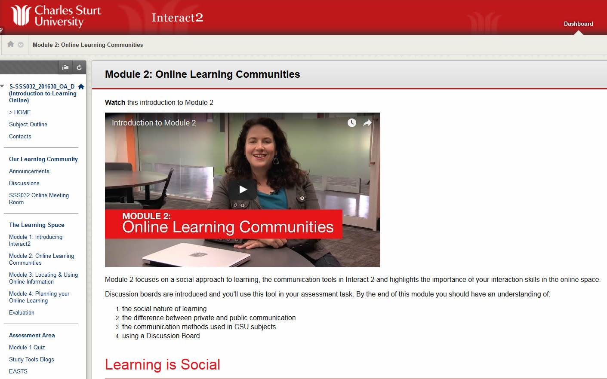

---

layout: strategy
title: "Orientation to the Environment"
category: strategy
tags: [Learning Communities, ]
description: "Defining the online spaces for learning and interaction."
subjects: "SSS032, PSY208, "
subjectnames: "Introduction to Learning Online, Biopsychology"

---

### Overview

The online learning environment can be an unfamiliar place for new and continuing students. Differing from what many students have experienced in a traditional classroom, conventions of learning management systems may require explanation. Students need to be made aware of ‘how’ as well as ‘why’ online  tools will be utilised within their subjects.

Clearly defining places and spaces for students to have discussions, making them aware of where information is located, how it’s expected to be accessed and what channels of communication are available are important steps in this process. Ensuring students are comfortable with the environment and the expectations of how they will be learning are key for students navigating their way through their studies.

### Engagement

If students are familiar with the learning environment they will be more likely to engage in the learning process. If students are unsure of processes or expectations, where to locate information, or how to communicate, the learning environment will feel foreign and difficult to work in. Adopting an orientation process in the subject provides the kind of wayfaring and signage that we find in a physical space. Signposting key information and providing logical navigation assist students in finding their way in the online environment.        

### In Practice

#### Subject

SSS032 Introduction to Learning Online

#### Teaching Staff

Stewart McKinney

#### Motivation

The subject SSS032 Introduction to Learning Online was developed explicitly to orient students to studying online at CSU. Ensuring students are comfortable in using the communication technologies is paramount to their success as it forms the bedrock of their interaction with the peers and teaching staff. Students must be capable of using a variety of Interact2 and other CSU supported technologies to succeed in their study.

#### Implementation

The subject is open to all students throughout the year and provides them with a scaffolded way of exploring the main tools and features of Interact2. Students are introduced to key technologies through simple videos, and text modules that are then enacted upon through a structured activity. In this way students are provided with a model of how a tool works, and then a practical engagement with it by completing a task. By the end of the course which is around 10 hours in total, students have learnt about Interact2 but have used the tools too.

{: .u-full-width}

#### Subject

PSY208 Biopsychology

#### Teaching Staff

Nicole Sugden

#### Motivation

By explaining to students how to navigate their Interact2 site as well as directing them to important information within the Subject Outline, Nicole is setting students up for success. She is also addressing common questions students may have, which should reduce the amount of time she normally spends responding to emails addressing similar questions.

#### Implementation

Desktop video is created; in this case using CSUReplay, personal capture. The video is uploaded to the Faculty Youtube channel and embedded within an Interact2 page.  Nicole works her way down the Interact2 left-hand navigation, explaining each tool as well as how and when students are expected to use each.  Handy tips are also noted. For example, Nicole shows students how to use the Discussion board, explaining the individual threads and responses.



### Guide

While Interact2 provides a common interface and set of tools for students, they can be used in different ways by lecturers. Providing students with a "guided tour" of the learning environment is an excellent way to orient them to the space and how the subject will be taught. Simply explaining how and why the different tools will be used is a great way to kick off the teaching session and will help in establishing expectations and get keen students off on the right foot.

This could be part of a [Welcome Video]({{ site.baseurl }}/strategies/welcome-videos.html) and displayed prominently on the subject landing page. Labelling the navigation in a consistent and obvious way can provide students with the necessary signposts needed to find relevant and timely information. Some like to utilise the sites landing page to offer students an updated weekly schedule with links to the relevant lessons and resources. A more interactive way of getting students to orient themselves would be to set up an orientation activity. This could be a scavenger hunt where students find hidden items or a quick quiz that tests if students have read important information.

### Tools

To create Video Recordings a desktop capture in CSU Replay, recording of an Online Meeting session, Screencast-o-matic or your mobile phone can be used to ‘show and tell’ your Interact2 site to students and is very useful. The subject SSS032 is a useful resource for students in itself as it introduces Interact2 tools and a range of online teaching and learning strategies.
