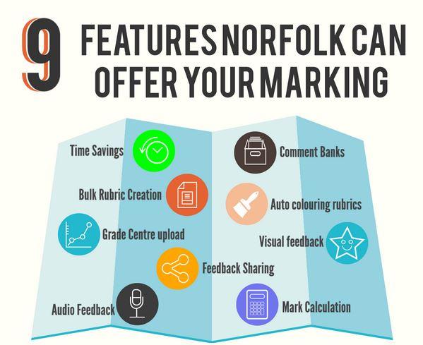

---

layout: strategy
title: "Pre-Prepared Responses"
category: strategy
tags: [Flexible & Adaptive Learning, ]
description: "Use a bank of prepare response to provide feedback to students fast."
subjects: "MGT220"
subjectnames: "eCommerce"
label: TOL

---

### Overview

The use of systems like NORFOLK allows detailed feedback to be quickly provided. NORFOLK allows the opportunity to increase efficiency when marking written assignments by creating comment banks, audio comments, embedding video comments or custom objects that can be saved and automatically inserted when marking. Saved comments or objects can be utilised by academics to address common mistakes or issues within the assignment or provide positive feedback.

They may also provide information for the student to feed forward to support subsequent assessment tasks. The comments can also be shared between markers ensuring consistency and efficient use of time.

### In Practice

#### Subject

MGT220 eCommerce

#### Teaching Staff

#### Motivation

To manage marking of this cohort  a comment bank has been developed over time of Pre Prepared responses that can be easily edited assisting in rapid turn around. Timely feedback is required in this subject as students are required to receive feedback from the previous case study before they submit the next, ensuring students have the opportunity to act on the feedback provided.  

#### Implementation

Through the creation of a comment bank with relevant feedback in NORFOLK, marking time can be reduced allowing the possibility for rapid return.  Feedback can be stored under categories such as "presentation" or "referencing".  

An additional feature used in this subject is the inclusion of  video feedback  from the ‘employer’.  A pre recorded video is attached to the feedback with a generic comment addressed to the student dependent on their grade category.  This feedback aligns with the assessment premise that students are working in a firm dealing with client scenarios.  

{: .u-full-width}

### Guide

NORFOLK is an add-in for Microsoft Word which consists of a collection of tools used to assist in paperless marking.

### Tools

The NORFOLK installer can be downloaded from the following links:

- Windows: [http://bit.ly/NORFOLK](http://bit.ly/NORFOLK)
- Mac: Email [eastshelp@csu.edu.au](mailto:eastshelp@csu.edu.au)

[Further instructions are available](https://www.csu.edu.au/division/learning-and-teaching/interact2_help/faculty-and-csu-staff/assessment/norfolk).
