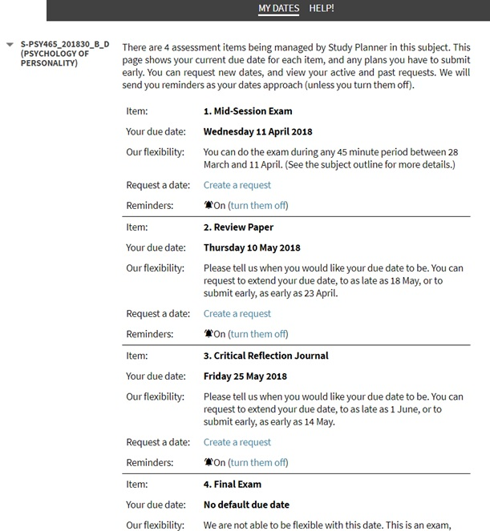

---

layout: strategy
title: "Prescribed Window of Submission"
category: strategy
tags: [Flexible & Adaptive Learning,]
description: "An assessment submission pattern over a prescribed periods of time rather than a single date."
subjects: "PSY465, GPM512, MGT310,"
subjectnames: "Psychology of Personality, Executive Leadership in Law Enforcement and Security, Operations Management,"
label: LEF

---

### Overview

This flexible assessment strategy involves the development of an assessment submission pattern characterised by prescribed periods of time for the submission of each task. Prescribed windows of submission allow students to manage their workload and have greater control over their study pattern and workflow. Tasks may include quizzes, journals, essays, reports and blogs which must be designed to address the challenge of maintaining the integrity of the assessment process.

This strategy:

* Provides students the opportunity to schedule their assessment in response to their individual life circumstances.
* Can be a good guide and signpost to help students distribute their effort across the teaching session dates.
* Encourages the development of the requisite knowledge and skills through assessment scaffolding.
* Allows for deliberate consideration of the learning and assessment process for both learners and markers.

### In Practice

#### Subject

PSY465 Psychology of Personality

#### Teaching Staff

Rob Buckingham

#### Motivation

Provide the opportunity for assessment to be completed in a prescribed period of time, allowing for some flexibility for students within a managed timeframe for the marker.

#### Implementation

This subject has three flexible assessments consisting of a quiz, review paper and journal.  The fourth assessment is an exam and is not a flexible component.

Flexible assessments should be completed within a set time range.  These vary from two weeks to four weeks depending on the complexity of the task and timing within the teaching session.   

 Assessment 1 consists of a quiz, utilising the i2 quiz tool.  Each quiz is set up with randomised question pools providing the opportunity for a unique experience for each student. Students are given two window window i which to complete this task.  In Assessment 2 students, write a review paper on three journal articles they have selected and compare the articles to a set theory. The prescribed window for this task is 4 weeks. Although relating to a specific theory students are able to identify articles of particular interest to them so each response is unique. Finally students are asked to provide a critical reflection on their experience for Assessment 3, which is given a prescribed window of 3 weeks in which students can submit.

 {: .u-full-width
}

#### Subject

GPM512 Executive Leadership in Law Enforcement and Security

#### Teaching Staff

Greg Linsdell

#### Motivation

Provided a window for completion of an online test to pilot student engagement with PeerWise throughout the subject. It also gives learners the opportunity to ‘write their own quiz’ by selecting student generated questions from the PeerWise repository for this subject.

#### Implementation

Students must correctly answer 20 online multiple choice test questions. Questions randomly selected by Interact from a pool of 50 questions identified by the subject coordinator from the PeerWise repository for this subject.

The Online Test is available for a 3 week period and must be completed in one sitting at any time within the window. Online system generated feedback from the quiz is provided (see the automated feedback strategy information).

If students have answered every question in PeerWise during their revision, they will have answered every question they may encounter in this test.

#### Subject

MGT310 Operations Management

#### Teaching Staff

Paul Forbes

#### Motivation

The fixed time frame makes it easier to do a five day turn around in marking.

#### Implementation

The subject is a problem-based learning subject where students work through case studies that become progressively more difficult. The release of the cases is on a fixed basis, and provides a deadline for the previous assessments. Students also get the choice of "early bird" or “late mouse” groups. This means that students can either finish their assessment tasks early, or submit on a regular schedule.

### Guide

The designing of flexible assessment task due dates within constrained periods of time provides a scaffold for students to begin to develop greater autonomy and self management. It is important to consider the nature of the tasks and their relationship to other tasks as the flexibility requirements are set.

A plan for the whole subject needs to be designed to ensure  a manageable marking load and that both accelerating students and those extending the submission time have:

* an appropriate time period to access and engage with all of the learning tasks.
* time to receive and respond to feedback from each task
* An appropriate time gap between tasks to allow for further learning to occur.

### Tools

- Study Planner
- Online quiz tools such as Peerwise and i2 Quiz that enables flexible submission dates.
- EASTS
