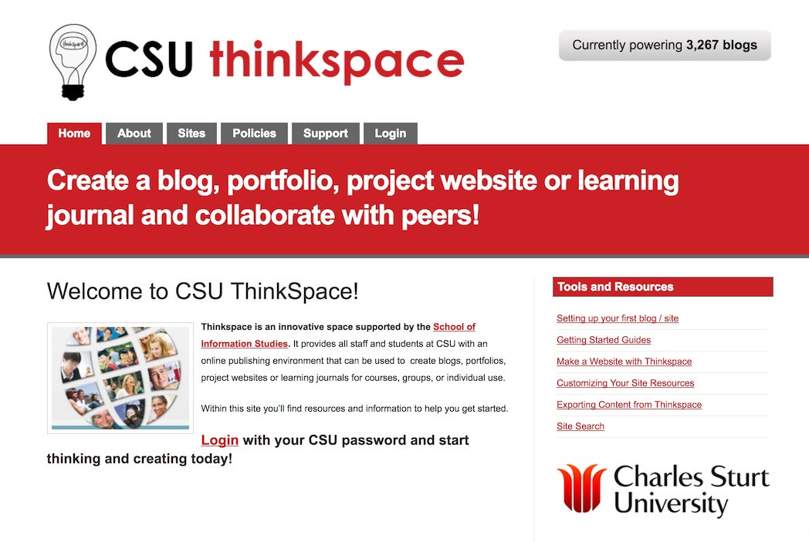
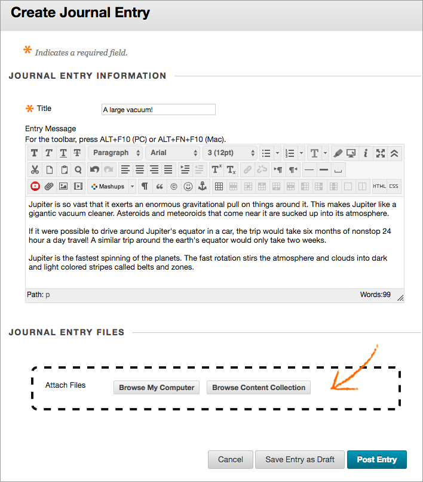

---

layout: strategy
title: "Reflecting Upon Professional Experience"
category: strategy
tags: [Interaction with the Professions, ]
description: "Developing student awareness of their own professional practice."
subjects: "ULM502, HRM502, "
subjectnames: "Leadership Perspective and Processes, Human Resource Management, "

---

### Overview

Reflective practice is a key skill in many professions. It is also a technique which supports life-long learning. As such it is an ideal strategy for students to evidence connections between their learning and their chosen profession.

It is widely advised that reflective practice techniques be introduced to students early within their university courses with continued support throughout their study.  As noted by Petorius and Ford, students are able to make meaningful deductions about reflective practice and their own learning once they have a basic framework (2016, p.241).  To do so, they suggest providing students questions which prompt reflection. These questions are quite straight-forward and may be applied to any professional learning experience. They include:

* What happened?
* How did this make you feel?
* What went well?
* What could you have done better?
* What did you learn from this?
* How will this information be useful in future?

These questions guide students as they develop their own professional narrative and reflective writing skills.

By embedding reflective practice throughout a course, students are given many opportunities to develop their writing skills and demonstrate a deep understanding of their profession. As suggested by Bolton (2010) reflective practice is a state of mind that needs to pervade the whole curriculum and be an ongoing element of practice. Aligning reflective writing assessments such as journaling or blogging with professional placement subjects is an ideal way to achieve this outcome.

### Engagement

Students engage with the professions by reflecting upon their own learning both in theory and application. Their reflections may be private, shared with their lecturer, or with classmates. Reflections may also be shared more widely as in the case of a CSU Thinkspace blog within a cohort or even publicly.

### In Practice

#### Subject

ULM502 Leadership Perspective and Processes

#### Teaching Staff

Marcelle Droulers

#### Motivation

This strategy was deployed to provide students the opportunity for reflective practice on a private as well as shared basis. Student use their [Thinkspace](http://thinkspace.csu.edu.au/) blog to reflect on weekly topics and readings as they apply to their own professional practice and beliefs.

#### Implementation

Each student creates their own CSU [Thinkspace](http://thinkspace.csu.edu.au/) blog. Some posts and pages within the blog are private (shared only with the lecturer) while others are shared with classmates. This is the first subject within the Graduate Certificate of University Leadership and Management, and as such students are given guidance in developing their blog as well as prompts for reflective writing.

{: .u-full-width}

#### Subject

HRM502 Human Resource Management

#### Teaching Staff

Chrys Gunasekara

#### Motivation

Journaling was deployed in this subject using the Interact2 journal tool. Student entries were private; only the lecturer saw postings. This gave students a ‘safe’ place to critically evaluate the role of human resource management while reflecting upon their own practice and workplace

#### Implementation

Students were asked to write 6 short journal entries (one per week). Each entry allows students to apply newly gained knowledge to their professional practice. The lecturer provides private feedback. This assessment task is worth 30% and prepares the students to participate in a subsequent group activity and final reflective essay.

{: .u-full-width}

### Guide

In the case of a course-wide implementation a journaling tool such as the *Interact2 journal*, *PebblePad* or *CSU Thinkspace* may already have been selected. In any instance, it is important to decide with whom the journal entries are to be shared. Will they be private (shared with lecturer only)? Will they be shared within the cohort?  Or, perhaps the student reflections will be shared more widely. Once this is established, the rationale and task should be clearly explained, as with any assessment task.

**CSU Thinkspace**

If using CSU *Thinkspace* it is important to be aware of privacy settings. Journals/Blogs can be set to private or accessible via CSU login, or public. The lecturer may use ‘alternative submissions’ within the subject outline  assessment section or students may submit a URL to their lecturer using EASTS.

**Interact2 Journal**

When used as an assessment activity, the Interact2 Journal appears within gradebook, so lecturers may record results as required. When setting up the journal, it may be useful to copy any instructions from the subject outline into to journal page itself.

### Tools

Are a variety of technologies supporting blogging in a variety of ways and publishing to different audiences. From internal system available only to the class and teacher, to CSU integrated systems that enable blogging in public through to self hosted and managed platforms that allow students to develop their own digital presence. Tools worth exploring include:

* Interact2 Blogs and Journals
* [Thinkspace](http://thinkspace.csu.edu.au)
* [Wordpress](http://wordpress.com)
* [Blogger](https://www.blogger.com/)
* [Known](http://withknown.com)
* [Domain Of One’s Own](https://reclaimhosting.com)

### Additional Resources

Bolton, G. (2010). Reflective practice: Writing and professional development. (3rd ed.). London: sage.

Lawrence-Wilkes, L. & Ashmore, L. (2014).*The reflective practitioner in professional education*. Retrieved from EBook Library - [Available Online](http://www.csuau.eblib.com.ezproxy.csu.edu.au/patron/FullRecord.aspx?p=1662774)

Pretorius, L., & Ford, A. (2016). Reflection for Learning: Teaching Reflective Practice at the Beginning of University Study. *International Journal Of Teaching And Learning In Higher Education, 28*(2), 241-253. [Available Online](http://ezproxy.csu.edu.au/login?url=http://search.ebscohost.com/login.aspx?direct=true&db=eric&AN=EJ1111149&site=ehost-live)

Van Dijk, T. (2012). Looping up professional reflection in honours programmes,* Journal of the National Collegiate Honours Council 13*(2)259 - 264. [Available Online](http://web.a.ebscohost.com.ezproxy.csu.edu.au/ehost/pdfviewer/pdfviewer?sid=a721d163-a29c-4044-8b3f-f7ca2626cac1%40sessionmgr4008&vid=4&hid=4206)

Wingrove, D. & Turner, M. (2015). Where there Is a WIL there Is a way: Using a critical reflective approach to enhance work readiness. *Asia-Pacific Journal of Cooperative Education, 16*(3) 211-222. [Available Online](http://ezproxy.csu.edu.au/login?url=http://search.ebscohost.com/login.aspx?direct=true&db=eric&AN=EJ1113550&site=ehost-live)

