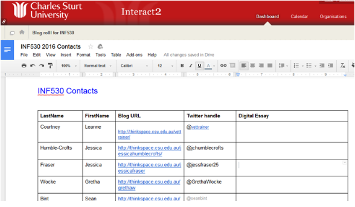
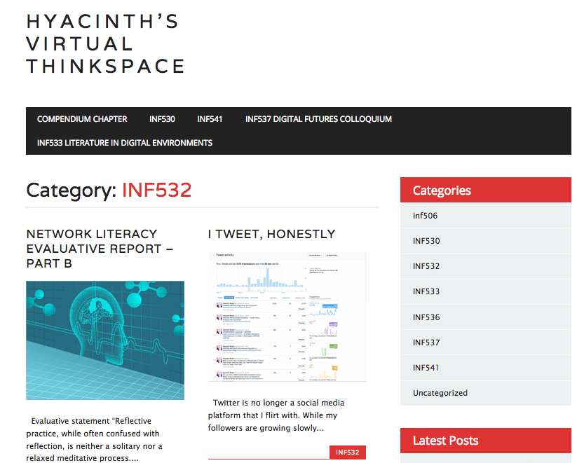

---

layout: strategy
title: "Reflective Journals"
category: strategy
tags: [Interaction Between Students, ]
description: "Students develop the ability to express and assess their own learning & experience."
subjects: "INF530, INF532, "
subjectnames: "Concepts and Practices in a Digital Age, Knowledge Networking For Educators, "

---

### Overview

Reflection is an internal dialogue facilitated by writing and creative strategies as a way of expressing, sharing, assessing and developing professional experience. Knowing what to reflect upon is as critical a part of the educative process as the reflection action itself, and is a pedagogical approach that draws in reflective practice and reflexivity - finding strategies to question attitudes, values and limits of personal knowledge.

Digital reflective journals are part of a pedagogically enriched learning design within online or technology-rich context to support and improve learning experiences. A reflective journal is also especially useful for assessing intended learning outcomes relating to the application of content knowledge, professional judgement and reflection on past decisions and problem solving, with a view to improving them. Reflective thinking also helps students develop a questioning attitude and new perspective; identify areas for change and improvement; respond effectively to challenges; and generalise and apply what they have learned from one situation to other situations.

This strategy has strong links to [Student ePortfolios]({{ site.baseurl }}/strategies/Student-ePortfolios.html).

### Engagement

A digital reflective journal written as a blog provides students with the freedom to engage with content, ideas, discoveries, disappointments, or to simply ponder their learning. Online learning journals should be open and shared spaces, ready for enjoyment as well as providing an opportunity for students to demonstrate functioning knowledge. Part of the engagement is being able to share with others in the cohort, as a participatory learning experience, and to make use of (or learn how to) leverage the affordances of online platforms to better engage with content or leverage available resources to communicate thoughts, discoveries, academic reflections, and multimedia artefacts. Students are also able to demonstrate learning through multimodal additions to the online reflective journal. A reflective journal provides a flexible and responsive way to share the joy of learning!

### In Practice

#### Subject

INF530 Concepts and Practices in a Digital Age

#### Teaching Staff

Judy O’Connell, June Wall

#### Motivation

This keystone subject establishes the reflective journal process for use within the subject, but more particularly within the whole course. Students are encouraged to extend themselves by peer responses to their work, and are motivated to explore and embrace the affordances of the online environment to explore their knowledge and share their experiences.

#### Implementation

CSU Thinkspace provided the ideal vehicle for transforming learning experiences through the use of a reflective journal. Using a CSU username and password students are introduced to a platform that has full flexibility for customisation to reflect personal preferences and provide a touch of motivation. Importantly this is also linked to a range of formative steps supported by the academic in building knowledge and understanding: Key topics for reflection; Peer-to-peer responses; Teacher feedback; Literacy and communication; and Celebration of learning achievements.

Feedback from students provides an insight into how this strategy was received:

>"I found the blogging aspect really helpful to make connections and illustrate my learning to myself and others."

>“HAVING to create a professional blog - helpful for me to clarify and reflect on my learning throughout this subject; and great to be able to share my classmates learning via their blogs too.”

A simple Google Doc embedded in the Interact2 site creates a space for students to provide their CSU Thinkspace link and Twitter details so students can interact with each other in an asynchronous manner.

{: .u-full-width}

#### Subject

INF532 Knowledge Networking For Educators

#### Teaching Staff

Julie Lindsay

#### Motivation

This subject examines the educational practices of connected learning environments within distributed networks of people and institutions, including schools, information organisations and online communities. Students are actively encouraged and supported to:

- Maintain a blog to document reflections and evaluations of connected learning experiences with posts demonstrating the affordances of blogs such as tags, categories, embeds etc.					
- Complete a network literacy evaluative report drawing upon blog posts throughout the session to document how your practice-based and experiential learning activities helped you meet the learning objectives of this subject

#### Implementation

Every student has a Thinkspace blog. Each subject they complete is added as a ‘category’ on the blog which then helps to filter posts. Therefore for INF532 it is expected students write a series of blog posts throughout the session. These are then used in the final assignment Network literacy evaluative report’, which is also posted as a blog post in two parts - 1) A 900 word evaluative statement using previous blog posts as evidence of meeting the learning objectives; 2) A 900 word reflective statement on development as a connected educator and implications as a connected leader.

You can view some of the student's ‘Network literacy evaluative reports’ here (may need CSU login to access):

- [Karen M](http://thinkspace.csu.edu.au/karenmalbon/category/inf532/)
- [Jordan G](http://thinkspace.csu.edu.au/iteachilearn/category/inf532/)
 - [Hyacinth S](http://thinkspace.csu.edu.au/hyacinth/category/knowledge-networking-for-educators/)

{: .u-full-width}

### Guide

In looking for opportunities to develop and offer students an opportunity to engage in reflective journalling there are a range of considerations that need to be made:

* Reflective journals provide an opportunity for students to explore, ask questions, respond to readings, summarize key ideas, recognise strengths and weaknesses in their emerging professional understanding and/or practice.
* Understand why you are introducing this strategy. Reflective journals can be a powerful way to build understanding while also providing a responsive mechanism for personalisation of the learning process. However the process is unlikely to be nurtured by introducing too many compulsory posts, tight timelines, or other artificial constraints particularly where there is no teacher presence visible.
* Consider your strategy for engaging interaction between students, in order to build community while also fostering a capacity for personal autonomy and accountability in the process of knowledge networking. Link the reflective journal activity to connected learning experiences or elements of professional practice.
* Make a decision about the contextual setting of your reflective journal activities. Will your cohort be working in Interact2 in a ‘closed’ learner-community space, or will your cohort be working in open, collaborative public spaces engaging with the cohort and beyond with the discipline and/or profession?
* All forms of online learning journals are valuable, but should be designed to best support the required participatory experiences of individual subjects or courses.
* It is best not to ask students to cut and paste blog posts and place them into a discussion forum, or vice versa. The best way to share this content is for students to provide a link to their post via Twitter and the subject hashtag, or perhaps begin a discussion forum post with "I have just written a post about…." and provide a URL to the individual post, commenting on why that post has been important to their emerging understanding relevant to the Discussion forum.
* An online journal post can extend on, or allow deeper personal deliberation of content emerging in the class discussion forum.
* Work may be formative or summative, therefore careful consideration of the learning design of the subject and/or course is essential

### Tools

Typical tools used for reflective journals within the i2 platform are PebblePad and the Interact2 blog

The [CSU Thinkspace](http://thinkspace.csu.edu.au/) platform provides a real-world tool (Wordpress) where students can customise using themes and embed, hyperlink as well as comment and co-comment on other student's.

### Additional Resources

Bull, G., Thompson, A., Searson, M., Garafalo, J., Park, J., Young, C., et al, (2008). Connecting informal and formal learning experiences in the age of participatory media. *Contemporary issues in technology and teacher education*, 8(2), 100-107.

Cho, M. H., & Kim, B. J. (2013). Students' self-regulation for interaction with others in online learning environments. *The Internet and Higher Education*, *17*, 69-75.

Garrison, D.R. (2015). *Thinking collaboratively: Learning in a community of enquiry*. London: Taylor & Francis.

