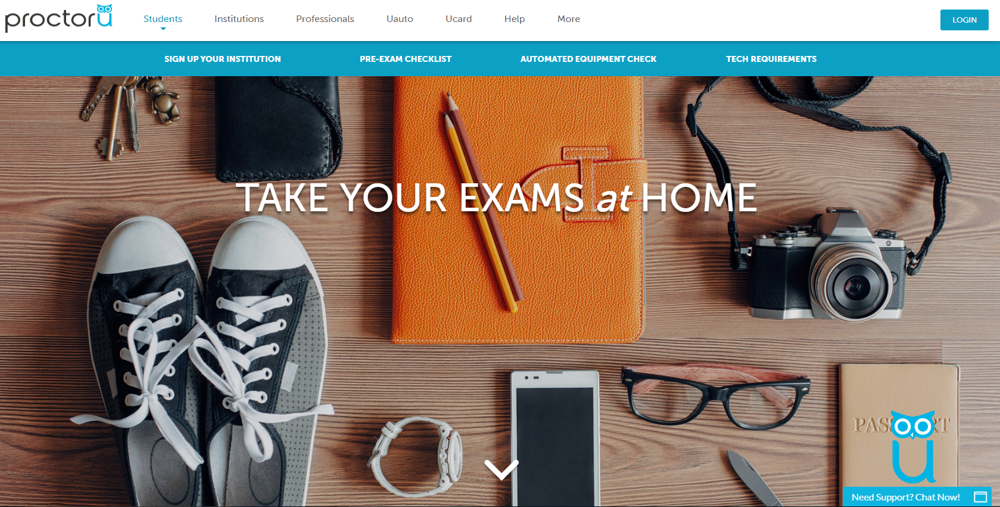

---

layout: strategy
title: "Remote Exam Invigilation"
date: 2018-12-17 10:00:00 +1100
category: strategy
tags: [E-Assessment,]
description: "Provide students with a flexible way of completing their examinations."
subjects: "EED308"
subjectnames: "Adolescence and Learning, "
label: new

---

### Overview

One of the more interesting affordances of the current trends in technology and the proliferation of broadband is the ability to facilitate remote exam invigilation. Rather than students being required to attend a specific site at a specific time for their exam, they are able to take the exam from their own home or in another suitable location. Students are observed through a combination of screen capture, microphone and the computer's webcam (Ahlawat et al. 2014; Lilley et al. 2016) . Together these technologies provide a new way to verify and invigilate students that creates new opportunities for existing examinations but also new ways that students can be assessed (Ahlawat et al. 2014; Lilley et al. 2016).

### Engagement

Remote exam invigilation technology provides students with much more flexibility and freedom around one of the most stressful times of their study, without sacrificing the academic vigour that exams can provide. Online/distance education students are not required to undertake additional travelling to exam centres or make their own arrangements for invigilation services. Lilley et al. (2016) report that in spite of some initial concerns around data security and that students may feel ‘watched’, thus distracting them from the assessment process, participants of the study provided overall positive feedback. Some feedback even suggested that the presence of an invigilator might reduce stress if things go wrong. The technology opens up the potential for new ways to assess students which can take advantage of the real-time, verified and digital nature of the technology.

### In Practice

#### Subject
EED308 Adolescence and Learning

#### Teaching Staff
Heather Campbell

#### Motivation

This subject has a number of online students who are required to complete a final exam. In the past this has been in a CSU exam centre which may require students to travel large distances. Many of the students are also on placement during the exam period and this also made it difficult for some to travel to their nominated exam centre. Thus it was thought that providing students with the opportunity to complete their final exam online while still maintaining the integrity of a formal exam would be beneficial to their learning experience.

#### Implementation

The eExam is offered over a 24-hour period the day before the scheduled paper-based exam. Students book a time that best suits them.
There is no charge for students to take an eExam, however, if they need to change the time of the exam within 72 hours of the scheduled period, there is a $US 5 charge paid directly to the invigilator – [Proctor U](https://www.proctoru.com).
If students choose to participate in the eExam they follow these steps:

1. Check the suitability of their computer and equipment by using the ProctorU test page which will test their system and internet connection.
2. If their equipment successfully passes the test they set up an account and book their exam time (within the allotted period).
3. On the day and time of their exam they log into the ProctorU system using the link provided in the email or using the portal link.
Once in the system an invigilator will go through the process of verification and set up for the exam which will take around 10-15 minutes. This includes any conditions set by the exam (e.g., open book), and the invigilator can check if any other browsers are open or if there is any prohibited material on the desk etc.). The exam will not start until the student has been verified and logged into the exam which in this case was delivered through Interact2 test centre.

The invigilator ensures normal exam conditions and conduct are met, including:

- A clear work surface
- A mirror or phone to show the invigilator the area behind the computer
- Current student and personal ID (licence or passport is advisable)
- Your computer should have all applications closed except the browser
- You should also quit or disable messaging and notifications on your machine

{: .u-full-width}

### Guide

Students need to have a proper introduction, so an online meetings to explain the process would be useful.

It is possible students may be not be comfortable with the technology required for remote invigilation or the idea of being watched so closely. An introduction to the process might include familiarisation with the technology if this is available.

### Tools

Remote exam invigilation service: [ProctorU](https://www.proctoru.com/)

### Further Reading

Ahlawat, V., Pareek, A., & Singh, S. K. (2014). Online invigilation: A holistic approach. International Journal of Computer Applications, 90(17) doi:[http://dx.doi.org/10.5120/15814-4673](http://dx.doi.org/10.5120/15814-4673)

Lilley, M., Meere, J. & Barker, T., (2016). Remote Live Invigilation: A Pilot Study. Journal of Interactive Media in Education. 2016(1), p.6. DOI:

