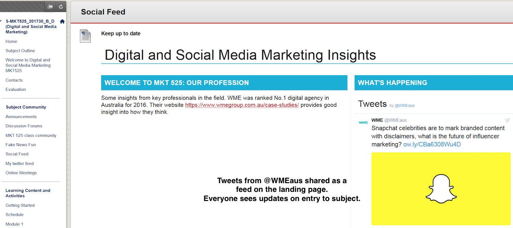

---

layout: strategy
title: "Social Media Streams"
category: strategy
tags: [Learning Communities, ]
description: "Utilise social media for real-time sharing and aggregation."
subjects: "INF530, MKT525, "
subjectnames: "Concepts and Practices for a Digital Age, Digital and Social Media Marketing, "

---

### Overview

Social media provides an incredibly powerful tool for learning and teaching. It enables sharing as well as asynchronous and in some cases, synchronous communication, to occur at a global level.

The streams created by social media provide a mobile tool for publishing and accessing information relevant to students’ learning. Educators can use social media streams to promote their learning and professional communities of practice by sharing interesting stories or news relating to course work. Social media streams provide an opportunity for substantial collective thinking and action (NMC, 2014).

### Engagement

Social media streams provide a convenient way to publish, collect and curate information. Because students generally access social media through their phones, this communication may occur anytime and anywhere. Students may engage in a variety of ways, with not only lecturers and peers but with individuals, professionals and experts worldwide.  This contextualises study beyond the University, reflecting the broader profession and global setting. It also helps to build online learning communities of practice around essential ideas and concepts.

### In Practice

#### Subject

INF530 Concepts and Practices for a Digital Age

#### Teaching Staff

Judy O’Connell, June Wall

#### Motivation

Social media and networking tools are used to connect all cohorts within the course and promote ongoing dialogue, sharing of resources and the development of professional presence.

#### Implementation

The course-level site, [Knowledge Networks and Digital Innovation](http://csu.edu.au/digital) has served as a portal, housing links to individual subjects as well as a Twitter feed, Thinkspace login (ePortfolio, blogging tool) and Diigo (social bookmarking).



#### Subject

MKT525 Digital and Social Media Marketing

#### Teaching Staff

Michael Mehmet

#### Motivation

Social media provides an incredibly powerful tool for dynamic communication, sharing and dialogue 'in situ', or where learning occurs. It can also be used to connect students to broader, ongoing learning and professional communities, helping them transition beyond the university. In this subject it is particularly relevant as it allows students to share examples of social media as well as their reflections throughout the session. This is done using the ‘tools of the trade’ making it an authentic learning experience.

#### Implementation

Social media streams were incorporated into the i2 learning environment, allowing for dynamic sharing of interesting stories, news or resources related to subject coursework.

{: .u-full-width}

### Guide

Utilising hashtags and creating specialised accounts to harness social media streams means that the learning community as a whole can benefit from the wealth of information available. They provide a way to structure and share interactions, thoughts, ideas and relevant information. While each platform can be used on it’s own the streams created can often be embedded into course and organisational sites in Interact2, providing students with a simple way of interacting and engaging.

As education aligns more closely with technological trends, lecturers need to carefully consider the use of social media for teaching and learning purposes. Students will often set up their own Facebook groups, but whether or not lecturers use social media in their teaching is another matter. It is recommended they consider the appropriateness and desired outcomes when using social media and the affordances of the different platforms.

Tomayess’ 2015 examination of social media use within Australian higher education identifies clear advantages and disadvantages. While in general terms social media and networking tools can improve students’ personal and professional skills such as writing, speaking, listening, discussion and debating, she goes on to argue that the risks should be considered from four perspectives: cognitive development, social development, physical development and security (Tomayess, 2015, p. 18).

### Tools

There are several social media and networking tools to choose from. Harold Jarche (2015) discusses some of the differences between the social media platforms in this short [video](https://www.youtube.com/watch?v=g_is3gT7X0Y). Facebook, Twitter, Instagram and Pintrest are popular choices for sharing content and media. Diigo is a handy tool for sharing useful websites. PebblePad and Thinkspace are both blogging, ePortfolio tools supported by CSU which allow student to publish externally.

### Additional Resources

Harold Jarche. (2015, January 24). Harold Jarche on social media platforms [Video file]. Retrieved from [https://www.youtube.com/watch?v=g_is3gT7X0Y](https://www.youtube.com/watch?v=g_is3gT7X0Y)

Charles Sturt University. (2014). [Social media use policy for staff](https://policy.csu.edu.au/view.current.php?id=00384)

Ferris, S. & Wilder, H. (2013)[ The plugged in professor: Tips and techniques for teaching with social media](http://www.csuau.eblib.com.ezproxy.csu.edu.au/patron/FullRecord.aspx?p=1574982). Ebook Library

Manca, S. & Ranieri, M. (2016). [Facebook and the others. Potentials and obstacles of Social Media for teaching in higher education](http://www.sciencedirect.com.ezproxy.csu.edu.au/science/article/pii/S0360131516300185). *Computers & Education, 95*.  216-230. doi:10.1016/j.compedu.2016.01.012

NMC Horizon Report: 2014 Higher Education Edition
[https://www.nmc.org/pdf/2014-nmc-horizon-report-he-EN.pdf](https://www.nmc.org/pdf/2014-nmc-horizon-report-he-EN.pdf)

Social Media News Australia 2016 access July 20, 2016 website [http://www.socialmedianews.com.au/social-media-statistics-australia-february-2015/](http://www.socialmedianews.com.au/social-media-statistics-australia-february-2015/)

Tomayess, I. (2015).[ Social Networking in Australia: Opportunities and risks](http://www.csuau.eblib.com.ezproxy.csu.edu.au/patron/Read.aspx?p=4178203&pg=25), In I. Tomayess,  P. Isaias, & P. Kommers, *Social networking and education: Global perspectives*. Ebook Library

[How to Embed Facebook Feed](https://cms.drupal.ku.edu/how-embed-facebook-feed)

[How to Embed Twitter Feed](https://elearn.southampton.ac.uk/blackboard/addtwitter/)

