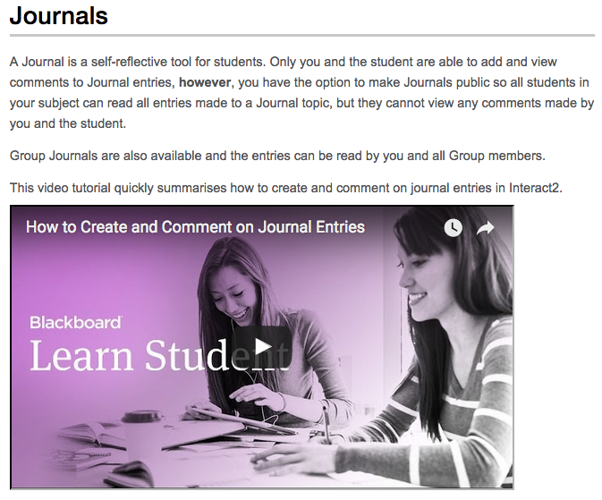

---

layout: strategy
title: "Student ePortfolios"
category: strategy
tags: [E-Assessment,]
description: "Students collect evidence of their learning over time."
subjects: "ETL401, ETL507, BMS237, "
subjectnames: "Introduction to Teacher Librarianship, Professional Experiences and Portfolio, Integrated Clinical Placement, "

---

### Overview

An ePortfolio can be described as a selective and structured collection of information gathered for specific purposes and showing/evidencing one’s accomplishments, growth and professional reflections. Content is stored and managed digitally using appropriate multimedia and web environments (Challis, 2005). ePortfolios are planned and compiled by the owner (students) rather than by the educator. ePortfolios can provide ways for students to use feedback from assessment to support their learning. The ability to collect, reflect and connect aligns with assessment-as-learning principles. ePortfolios can encourage a self-directed, individualised approach to learning that students use throughout their lives. Throughout the ePortfolio process, students develop the appropriate skills to regulate their own learning and become responsibly engaged both individually and collaboratively in the ePortfolio process. This development of an ePortfolio, both creation and curation, can be sustained across subjects, within courses and beyond.

When to use use ePortfolios (UNSW, 2016):

* to enable students to reflect on their learning, performance and /or achievement in both formative and summative assessment
* to encourage independent learning
* to support students in planning their personal, educational and career development
* as ways for students to present evidence of achieving program outcomes through artefacts that demonstrate transferable skills to support life-long learning attributes by providing electronic learning records that students can take with them into employment
* in capstone courses and programs that require professional accreditation.

### Engagement

Educators can use ePortfolios in their assessment design to develop personalised learning spaces. The cognitive skills required for self-directed students in an ePortfolio are "collect, select, reflect, connect" (Hughes, 2008).These skills are inherently expected of any university graduate.

In ePortfolios students build themselves a resource that, once assessment is complete, they can take with them into the workplace. ePortfolios thus constitute a form of "sustainable assessment" (Boud, 2000). They enable students to present themselves in a number of ways, empowering them as learners.

### In Practice

#### Subjects

ETL401 - Introduction to Teacher Librarianship, ETL507 - Professional Experiences and Portfolio

#### Teaching Staff

Lee Fitzgerald, Kasey Garrison, Ray Crotty

#### Motivation

ETL401 is the first subject of the Master of Education, Teacher Librarianship and sets up student eportfolios as an essential requirement for assessment and ‘to record your learning journey throughout the session’ (from the Subject Outline, SO). CSU Thinkspace is the preferred platform. ETL507 is the capstone for the same course and uses the student’s existing eportfolio to support final reflective practice and field work.

ETL507 is the capstone for the same course and uses the student’s existing eportfolio to support final reflective practice and field work.

#### Implementation

The use of a reflective journal in ETL401is seen an opportunity for students to demonstrate functioning knowledge in the context of the intended learning outcomes for the subject and/or course. The portfolio can be a tool for transformative reflection, allowing students to describe what they know, understand and can do with their knowledge, as well as what they feel and believe as a result of their learning experiences. Portfolios, often in the form of ongoing blogs, are used by professionals to articulate their opinions and promote intellectual discussion and commentary on topics of interest. Students then set up a professional blog on Thinkspace where they discuss relevant issues and what they are learning about teacher librarianship during this subject and the Masters course.

Many resources are provided to students via Interact2 and share how to setup and use the Thinkspace blog and how to set out writing/blogging for their portfolio. These are then linked to assessment tasks, their first being a blog task where they reflect on their experiences as a teacher, and write a 500 word piece about their understandings of the role in schools. A later assessment is a reflective blog post on how the student views the role of the librarian and includes examples from the collection of blog posts throughout the session.

This portfolio is maintained through the students study and becomes the reference point in ETL507 for a key assessment task where students provide a critical synthesis and reflection on how their views, knowledge and understanding of the work of a teacher librarian has been formed and shaped to be a responsive and effective information services leader and teacher librarian.

Examples of student work:
- [Letters, words, a story…](http://thinkspace.csu.edu.au/letterswordsastory/)
- [Online learning journal](http://thinkspace.csu.edu.au/megancrawford/)



#### Subject

BMS237 Integrated Clinical Placement

#### Teaching Staff

Noelia Roman

#### Motivation

This subject provides students with the opportunity to integrate and develop the theoretical knowledge they have already gained into a clinical setting. It is expected that students will learn to transfer knowledge from theory to clinical practice, to undertake reflection and self-appraisal and to critique the knowledge acquired through workplace learning.

This subject requires students to undertake a minimum of 148 hours of clinical placement. There is flexibility built into this subject with regard to when the placement hours can be completed and this is needed in order to aid in logistics of this type of learning. Therefore, a ePortfolio is considered an ideal tool for monitoring and assessing the students learning while they are on placement. This type of reflective practice is highly relevant to healthcare and other disciplines to develop the student's ability to reflect on their own performance and consolidate practical skills and theoretical concepts. The reflective ePortfolio that students will commence in BMS237 can be used throughout the remainder of the course for students to further develop their reflective skills, as well as to comprehensively record additional skills that are gained throughout the duration of their degree.

#### Implementation

The ePortfolio is created and submitted using the Journal tool in Interact2 and students are to include the following items:

1. Logbook/ Daily Journal
2. Reflection on Clinical Placement Experience
3. Diagram illustrating the organisational structure and personnel in the workplace
4. Description of Workplace Health and Safety Hazards
5. Placement Supervisor Report
6. Pathology Clinical Placement Guides (if applicable)

Students are required to organise their placement and submit the ePortfolio within 2 weeks of the conclusion of the placement period. Individual feedback regarding the student performance whilst on clinical placement is provided by the placement supervisor. The subject coordinator then provides comments and feedback on the assessment item submitted and students can contact the subject coordinator for additional individual feedback on the assessment item.

{: .u-full-width}

### Guide

When designing a learning task that assesses with blogs, your instructions need to be explicit about the learning you expect. This can be achieved by the following strategies:

* Develop the learning outcomes first and ensure that the technology, the content and the task align with them.
* Decide whether you will use group or individual blogs. Which suits your course and your students' learning objectives better? Group blogs and individual blogs have differing purposes and require different assessment features and rubrics.
* Develop formative assessment before you develop summative. Formative assessment indicates to students how they are tracking against what they are expected to achieve, but does not penalise them if they get things wrong.
* Plan to formatively assess a blog early in the semester, when students are posting and commenting frequently. Students who receive feedback early on will continue to post and comment throughout the course.
* Plan for inclusion: develop strategies for students from different socio-cultural backgrounds and with different levels of technology usage, ownership and knowledge.
* Develop assessment criteria and rubrics for student use as self and peer reviewers. Self and peer review promote collaboration and help develop a trusting community of practice.
* Using a rubric and marking criteria to support the student learning process can remove some fear of the unknown for students who have never blogged, or have only used micro-blogging sites such as Facebook. Show students the style of language, standard of writing and content expectations you have of their blog posts, reflective journal posts and comments. Provide examples so that they can see these aspects clearly.
* Post the rubric and criteria on the group blog or as a comment in the individual blogs.
* Hold an initial online meeting or make a podcast. Show the students the different elements of a blog, and examples of exemplary blogs. Explicitly outline your requirements of them, and discuss these with them.
* Ensure that your expectations about the number of posts, comments and reviews are absolutely clear to your students.
* Provide a safe, flexible and inclusive environment where students can develop skills for risk taking and self-regulation. Blogs should offer "an environment where learners can practice, fail, succeed and learn in a rich and realistic setting" (Morison, 2003, 359).
* Encourage student reflection using leading questions, statements and content, and ask students to present their reflection and its results in writing on the blog.
* Provide students with a range of potential blog content and ideas to encourage their learning beyond the classroom.
* [Utilise RSS](https://help.edublogs.org/introduction-to-rss-and-subscribing-using-rss/ ) or Hashtags to aggregate content for the class.

### Tools

Are a variety of technologies supporting the development of Student ePortfolios. Tools worth exploring include:

- Blackboard Blogs and Journals
- [Thinkspace](http://thinkspace.csu.edu.au)
- [Wordpress](http://wordpress.com)
- [Blogger](https://www.blogger.com/)
- [Known](http://withknown.com)
- [Domain Of Ones Own](https://reclaimhosting.com)

### Additional Resources

[Interact2 journal tool](http://www.csu.edu.au/division/student-learning/interact2_help/faculty-and-csu-staff/interact-with-students/journals) - Tutorial videos and help section of CSU website

Pebble pad ([https://www.csu.edu.au/division/student-learning/home/technologies-for-learning-and-teaching/eportfolio](https://www.csu.edu.au/division/student-learning/home/technologies-for-learning-and-teaching/eportfolio))

Lindsay, J. (2016). Beyond blogging: Reflective and responsive practice using Thinkspace [Slideshow]. Retrieved from [Google Docs](https://docs.google.com/presentation/d/1yE6pIZmtxCg2JB3HcbaeXG6loQp8DM8YpVFg10O5LNA/pub?start=false&loop=false&delayms=3000)

Judy O’Connell. (2016, June 2). Thinkspace - ePortfolio and online enhancement [Video file].



DSL website ‘Portfolio’ - Specific how to [information on ePortfolios can be found here](http://www.csu.edu.au/division/student-learning/home/csu-academics/learning-and-teaching-at-csu/portfolio)

CSU Thinkspace - [http://thinkspace.csu.edu.au](http://thinkspace.csu.edu.au)

Challis, D. (2005). Towards the mature ePortfolio: Some implications for higher education. *SANDBOX-Canadian Journal of Learning and Technology/La revue canadienne de l’apprentissage et de la technologie, 31*(3).

Foster, S. (2007). Exploring a learning journal (http://www.education.vic.gov.au/Documents/childhood/professionals/support/ljourn.pdf). *Reflective Practice *[CD ROM].

Foster, S. (2007). A "critical’ reflection framework (http://www.education.vic.gov.au/Documents/childhood/professionals/support/reffram.pdf). *Reflective Practice *[CD ROM].

Housego, S. and Parker, N. (2009). Positioning ePortfolios in an integrated curriculum. *Education and Training* 51(5/6), 408–421.

Krause, K. (2006). ePortfolios for graduate students: A discussion paper. Centre for the Study of Higher Education. University of Melbourne.

Mason, R., Pegler, C. and Weller, M., 2004. E‐portfolios: an assessment tool for online courses. *British Journal of Educational Technology*, *35*(6), pp.717-727.

The Learning Centre. (2010). *Reflective writing *(http://www.lc.unsw.edu.au/onlib/pdf/reflective.pdf). University of NSW.

UNSW (2016) [https://teaching.unsw.edu.au/assessing-eportfolios](https://teaching.unsw.edu.au/assessing-eportfolios)

