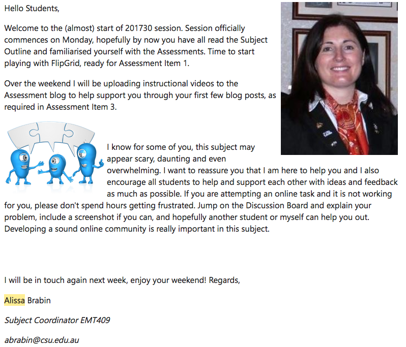
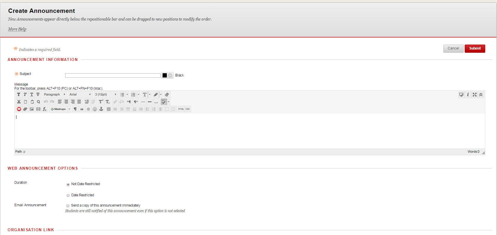

---

layout: strategy
title: "Successful Announcements"
category: strategy
tags: [Teacher Presence, ]
description: "An effective and immediate tool for communicating directly with students."
subjects: "HCS102, INF447, "
subjectnames: "Communication and Human Services, Research in Practice, "

---

### Overview

Teacher interaction with students is directly supported by the skillful use of announcements. Announcements provide an effective, immediate tool for communicating directly with students. They also provide an avenue for responding directly to issues and enhance the sense that the lecturer is up to date, directly available and responsive. Designed announcements provide a platform for the establishment of a positive, supportive tone which is associated with successful teacher presence.

### Engagement

An announcement may be the first direct contact with  students so it offers the opportunity to establish tone and delineate lecturer expectations of lines of communication and engagement. Announcements may be sent directly through student email providing direct, responsive communication of expectations as a foundation for relationship building and enhanced engagement. Announcements are of course, available for viewing within the Interact2 environment.  

### In Practice

#### Subjects

HCS102 Communication and Human Services, INF447 Research in Practice

#### Teaching Staff

Susan Mlcek, Jennie Bales

#### Motivation

Two subjects are featured for this ‘in-practice’ example. Each of the subject coordinators personalise their approach through the use of images, coloured text or highlights, hyperlinks, and/or other organising features that become regular inclusions in the Interact 2 Announcements. The basic motivation for each subject is to provide regular communication that is informative and engaging and supports student learning.

#### Implementation

A common strategy for all three subjects is to send out one or more announcements each week of the subject. At some pertinent stages of the subject, e.g. the first couple of weeks or when assessment is pending, multiple announcements are sent out. Announcements include a range of individual and template approaches and include substantial information to reinforce what students should/could be doing to gain success in the subject. Some features noted include:
- ‘Rules of Engagement’ for discussion forums (sent out Week 1)
- Where to find help - including guest contributions from Academic iteracy and Numeracy support and library personnel
- Help with referencing and citations
- Information about online meetings
- Relaying important university information e.g. applying for Grade Pending (GP)

HSC102 uses the Russian nesting doll images as a metaphor for communication layers and packing and unpacking understanding of the subject content throughout the announcements.



#### Subject

EMT409 Technology for Adult Learning and Teaching

#### Teaching Staff

Alissa Brabin

#### Motivation

EMT409 is a technology subject with lots of practical activities for students. A lot of students express early concern over their skills and comfort using technology, which means it takes them 3-4 weeks to settle in and start applying the content of this subject. The subject coordinator wanted to allay student fears and instead demonstrate that regardless of student skill or ability with technology, this subject provides a supportive community of practice. This first Announcement also highlights the most important Assessment activities that students need to be starting immediately.

#### Implementation

Creating Announcements using a friendly tone, 1 or 2 images, and keeping it concise are important considerations. Providing staff email at the bottom of each Announcement means students can quickly contact the Subject Coordinator if they need to, instead of having to log into i2 (because EMT409 Announcements are also emailed to students).

{: .u-full-width}

### Guide

Whilst the ‘Announcements’ Tool within Interact2 is relatively simple to use, thinking about how, when and why you utilise the announcement functionality can enhance your online teaching and learning environment. Some simple aspects to consider to help guide your decision making:

* **Clarity** – is it clear what you are trying to convey to students in the announcement? The most successful use of announcement functionality comes when this clarity is evident. For example, an announcement that deals with issues of logistics, such as the change of address for an adobe connect meeting room, is not likely to be successful if subsequent other details are added to the announcement.
* **Concise** – for most situations, announcements are more effective when they are relatively short and act as a signpost for students to take further action (i.e. ‘watch the recording’) rather than try to recap or convey too much information.
* **Crowd** – as the announcement tool is a ‘broadcast’ approach, it’s worth thinking about how useful the announcement will be to the majority of students. If the substance of the announcement applies to only a handful of students, is there another way to communicate with students concerned? Use of announcements which don’t apply to most students can contribute to ‘noise’ within an online teaching and learning space and students can tune out as a result. This is closely followed by the next point.
* **Channel** – Is the ‘Announcement’ tool the best one for your purposes? Announcements running to multiple pages in length may be a clear indication that another tool/approach may be needed; for example, an announcement concerning assessment which runs to multiple pages may indicate a need to instead offer an online meeting, screencast or other way of making this information accessible to students.

### Tools

Creating an announcement within the i2 environment presents users with the usual editing toolbar, which presents options to embed, link, create and edit text etc.

{: .u-full-width}

The options relating to ‘date’ and ‘availability also present useful forward planning options for academics. You are able to make announcements ahead of time and schedule both their initial release to students, as well as set the length of time that the announcement is available for viewing. To do this:

* Select the Display After and Display Until check boxes to enable the date and time selections.
* Type dates and times in the boxes or use the pop-up Date Selection Calendar and Time Selection Menu to select dates and times. Display restrictions do not affect the announcement availability, only when it appears. [(Source, ‘Teaching with Interact2 (Sessional Staff). ](https://interact2.csu.edu.au/webapps/blackboard/execute/displayLearningUnit?course_id=_10897_1&content_id=_454753_1)

### Additional Resources

Hunter, C. (2016, October 26). Announcements: What’s your style? [Blogpost]. Retrieved from [http://uimagine.edu.au/qltonline/announcements/](http://uimagine.edu.au/qltonline/announcements/)

O’Connell, J. (2016, May 30). Images in announcements: What’s the catch? [Blogpost]. Retrieved from [http://uimagine.edu.au/qltonline/quick-tip-images-in-announcements-whats-the-catch/](http://uimagine.edu.au/qltonline/quick-tip-images-in-announcements-whats-the-catch/)

[Blackboard support materials](http://ondemand.blackboard.com/r91/movies/bb91_tools_creating_announcements.htm)

