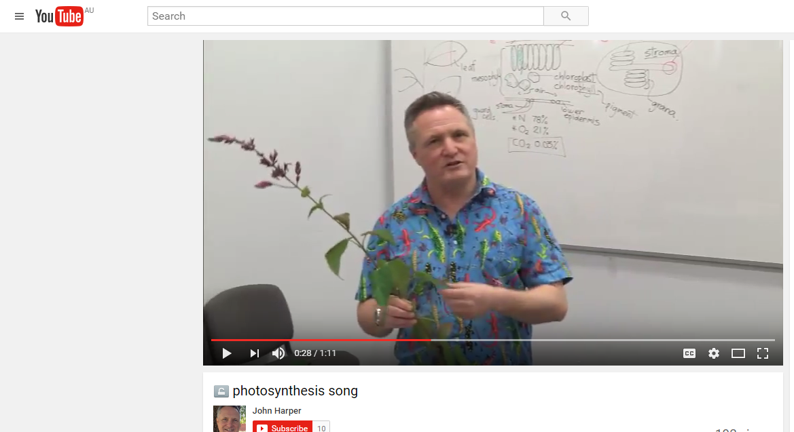
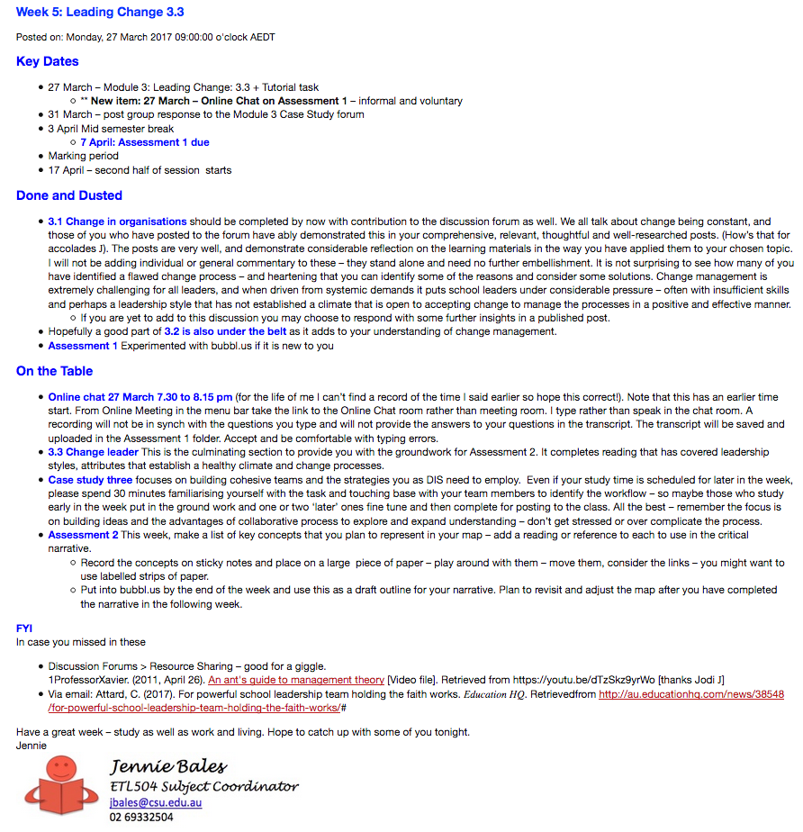

---

layout: strategy
title: "Tone of Communication"
category: strategy
tags: [Teacher Presence, ]
description: "Adjusting your tone to change classroom dynamics."
subjects: "PSC102, ETL504,"
subjectnames: "Botany, Teacher Librarian as Leader, "

---

### Overview

Considering and utilising an appropriate tone of communication with students can help establish and maintain an effective teacher presence within the online learning environment. The tone of communication can be influenced by the content within a particular communication exchange; the way the communication is delivered and the way the communication is perceived by the intended audience. It’s important to remember that tone might look and sound very different from one person or subject to the next-the preferences of the staff member and needs of the students dictate there is no one (i.e. ‘upbeat’) preferred tone. For example, students in a first year, first session subject might require and be more engaged by a tone that is welcoming, supportive and inclusive, whilst final year students might be more engaged by a tone that is highly professional, reflective of practice in the real world and portrays a sense of content expertise and mastership-of course, these aspects are not mutually exclusive.

### Engagement

Numerous models and theories of learning in the online environment emphasise that many students need to feel included, safe and confident in order to be an effective member of a particular online learning community. The emotional tone that the teacher creates in the learning space can help show interest in the students’ learning and success and is related to ‘instructor immediacy.’ Given that the online learning environment removes many of the visual cues that students can gauge in a physical learning space such as a classroom, (body language, non verbal cues, facial expressions etc) learning in the online environment can be a disorientating experience where these cues are not available for students to establish and maintain engagement. Planning for an appropriate, welcoming and clear tone of communication is an important part in enhancing the online learning experience.

### In Practice

#### Subject

PSC102 Botany

#### Teaching Staff

John Harper

#### Motivation

PSC 102 Botany is a large, foundational science subject that serves a wide range of courses. The motivation that the teaching team in PSC102 has in regard to the development of a certain tone of communication is based on a belief that a welcoming, inclusive tone is more engaging and therefore supportive of students and helps to make students feel included, even when studying online.

#### Implementation

This subject is one which requires students to cover a significant volume of content. As this subject is offered both online and face to face, the challenge is providing students with communication which enables them to stay on track, but which isn’t so ‘dry’ that students skip it and thus risk missing out on interesting or important information. Therefore, throughout this subject, students are able to see some of the lighter moments from the teaching team in a similar way to the face to face students do in class, in the case below, a simple YouTube video of a ‘photosynthesis song’ linked to the subject site.

{: .u-full-width}

#### Subject

ETL504 Teacher Librarian as Leader

#### Teaching Staff

Jennie Bales

#### Motivation

There is a deliberate and successful practice employed in this subject to construct a friendly, authoritative and engaging learning place for all students.

#### Implementation

In conjunction with a well-designed landing page, other strategies include the use of a designed discussion forum and template-based announcements. The forum has a clear structure with areas for general questions, student social interaction and focus on content and assessment. Each forum is described with purpose and expectation so students are clear where to go. The announcements use a template that includes, ‘key dates’, ‘done and dusted’ and ‘on the table’. This segments the material into readable chunks and provides a supportive tone to the essential communication.

{: .u-full-width}

### Guide

A simple, user friendly guide for planning for the tone of your communication style is the use of the W (who, what, when, where, how and why are you communicating) ‘Questioning Framework’. Simply put, consideration of your tone should be part of the broader consideration you make as part of an overall approach to communicating with students.

* **Be Authentic** – When considering your tone, plan an approach which reflects your personality
* **Invitational** – Tone isn’t just what you say, but what you facilitate on behalf of your students. Invite your students to share something of themselves, either general or more specifically relating to the content matter. This can be achieved through the use of open questions which creates a virtual ‘space’ which students can then fill as desired.
* **Perception** – The tone of your communication can be perceived very differently depending on the medium of delivery-the use of ‘absolutes’ and ultimatums in text can be perceived very differently when the same kind of information is delivered in an environment where students have the chance to ask further questions and seek clarifications-discussions around assessment expectations are an example of how the same information can be made much more accessible in an adobe connect meeting instead of an announcement.
* **Roles** – Reconceptualising your role in the online teaching and learning space may lead to a completely different way of communicating with students. For example, thinking about yourself as a ‘learning guide’ and encouraging students to view you as this instead of a ‘lecturer’  would necessitate a different way of communicating with students. For example, ‘This week you will be studying’ might become ‘This week we will be looking at.’
* **Multiple Channels** – Tone is a multi tool, multi dimensional approach-creating and portraying an authentic and engaging tone will rarely be effective through a single medium-using an appropriate tone might mean that you utilise an active presence on forums, portray your passion for the subject through learning commentary on related but not assessable information, engage with students on non teaching and learning related content (i.e. inquiring about their work/family/social activity).

### Tools

The use of tools to provide an appropriate tone of communication is a consideration, but in reality runs the full spectrum of tools available to staff to deliver effective online teaching and learning. What is of perhaps greater importance is the consideration of using the right tool for the right purposes to convey an appropriate tone, and to this end, considering how your might make experiences more engaging or student friendly forms an important part of your overall communication strategy within a subject.
