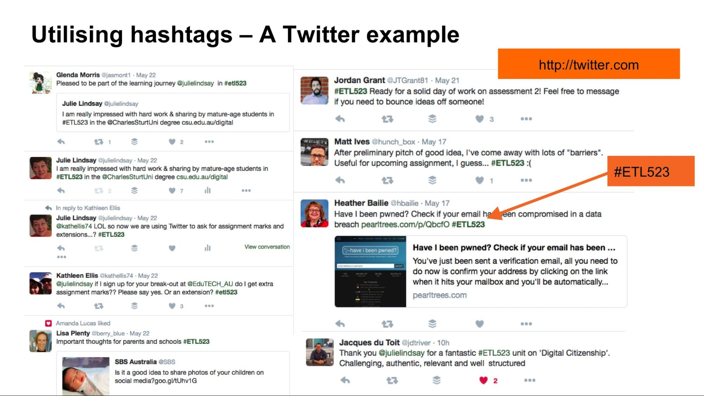

---

layout: strategy
title: "Utilising Hashtags"
date: 2018-12-17 11:40:00 +1100
category: strategy
tags: [Learning Communities]
description: "Collect, curate and trace learning through social media."
subjects: "ETL523"
subjectnames: "Digital Citizenship in Schools, "
label: new

---

### Overview

Hashtags provide a way to curate and filter social media, blogs and online discussions. The proliferation of the hashtag over the last decade is a result of the overabundance of information available to us online. The simple #hashtag makes it easier for users to find messages and media for a specific theme or context. Hashtags allow for co-curation of learning resources, whereby users can make resources available to others through the use of a particular hashtag. It lessens the notion of a divide between the academic as the source of all information and the student as a passive recipient by allowing students to more actively participate in these online conversations.

### Engagement

Creating a learning community around a subject hashtag, e.g. #ETL523, provides a means for learners to engage with each other and the subject content in a broader sense. It expands the scope of learning beyond a subject site or other e-learning space. It leverages social media (and the content provided by thought leaders and experts within a discipline) and allows the academic to position themselves as the curator, guide and facilitator of learning within a learning community.

Utilising existing and established hashtags allow students to "listen in" to the conversation. Creating subject, even assignment specific hashtags allow students to share work and commentary between themselves and with the teacher.

### In Practice

#### Subject
ETL523 Digital Citizenship in Schools

#### Teaching Staff
Julie Lindsay

#### Motivation
The use of hashtags is an important concept and practice in a subject, especially this subject ETL523 that focuses on digital citizen online practices for learning and teaching. The use of Twitter (amongst other tools) as a specific focus was implemented to encourage wider use of social media by students, and to foster student to student as well as teacher to student interaction. Twitter became another place for the class, as a learning community, to share, comment, respond, reflect and learn how to use this medium to build a personal learning network within and beyond the immediate subject. The sociability of online learning is an important factor in the development of online learning communities. A simple Twitter hashtag provides this opportunity.

#### Implementation
A link to Twitter and the #ETL523 hashtag is provided in the subject navigation. Students are encouraged to create a Twitter account and use the hashtag when posting relevant material about the class material and associated content. It is interesting that students continue to use this hashtag way beyond the end of the class and it has become a regular part of their online interaction and maintaining a PLN.

{: .u-full-width}

Read more in the [‘Multi-modal presence’]({{ site.baseurl }}/strategies/multimodal-presence.html) strategy for Teacher Presence.

### Guide

Hash tags are a great way to bring together like content, topics, places or individuals. You can use #hashtags across a variety of platforms, Twitter, Facebook, Instagram, Tumblr, Pinterest, The beauty of using a hashtag is that you can follow or subscribe to a topic, using a descriptive word without having to follow an individual. This will hopefully give a broader range of views and opinions.

**How to create a #hashtag**

There is no preset list of hashtags. Create a brand new hashtag simply by putting the hash before a series of words (you can use numbers and letters, NO spaces, punctuation marks or special characters) and, if it hasn't been used before, *voilà*! You've invented a hashtag. If it has be used before you will be joined into that conversation.

- Try to pick something unique - but not too long e.g. #HRM320, #bullying.
- Don’t use years unless you really need to so that you can create a history with rich content across offerings of the subject.

If you would like to archive the hashtags around an event e.g. subject or assessment you can with [Twitter Archive](https://mashe.hawksey.info/2011/11/twitter-how-to-archive-event-hashtags-and-visualize-conversation/), this tool also lets you create a visualisation of the hashtags to share with the class.

### Tools
Use across social media platforms: Twitter, Facebook, Instagram, Tumblr, Pinterest

To look at the top tags used [https://www.tubebuddy.com/tools#tagexplorer](https://www.tubebuddy.com/tools#tagexplorer)

There are tools that help you track the popularity or analytics associated with your #hashtag [https://www.talkwalker.com/blog/6-free-hashtag-tracking-tools-from-the-experts](https://www.talkwalker.com/blog/6-free-hashtag-tracking-tools-from-the-experts)

[https://www.pixlee.com/blog/the-best-free-content-aggregator-tool-for-hashtag-analytics/](https://www.pixlee.com/blog/the-best-free-content-aggregator-tool-for-hashtag-analytics/)

You can even curate your hashtags across platforms into a story using Storify [https://storify.com/](https://storify.com/)

### Further Reading

[Explore the Hashtag on Wikipedia](https://en.wikipedia.org/wiki/Hashtag)

