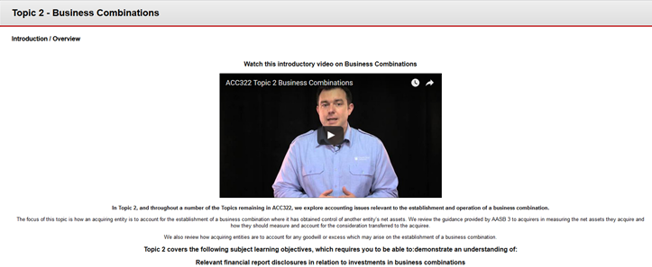

---

layout: strategy
title: "Video Lectures"
date: 2018-12-17 11:10:00 +1100
category: strategy
tags: [Teacher Presence]
description: "Recording video lectures specifically for online students"
subjects: "SCI103, ACC322"
subjectnames: "Communicating Environmental Data, Company Accounting"

---

### Overview

Recording video lectures for online students provides a richer engagement with the subject concepts than is possible with text. The sound and ‘live’ nature of the resource helps to convey the presence of the teacher. The tone of voice and other aspects of the audio contribute to students understanding of the topic and possible nuances in concepts. Video provides a rich medium to convey information as it can combine visual elements with animation and footage of the lecturer speaking. It also provides an avenue to embed and share some of the teacher's personality.

### Engagement

Video lectures provide a version of ‘the lecture’ that is more tailored to the online environment. CSU Replay recordings of the internal lecture can sometimes have issues with the audio as the lecturer moves in relation to the microphone and can come across to students as second best. Specifically recording videos shifts the priority to the online students and opens up new possibilities for internal students as well.

### In Practice

#### Subject
SCI103 Communicating Environmental Data

#### Teaching Staff
Ana Horta

#### Motivation
The video lectures help the online students to feel that they are not missing out because of their study mode. They provide an effective way of augmenting the existing content students have and provide a timely way to address questions and provide support to the entire cohort of students.

#### Implementation
The SCI103 video lectures include screen-captures as well as audio and video, and mostly range from 20-40 minutes. They were created to provide online  students with more coverage and explanation of the concepts presented in the online modules, textbook and recommended readings. Like lectures, there is one for each week. Through these video lectures the voice and personality of the lecturer comes through as a real human being, helping to convey teacher presence.



#### Subject
ACC322 Company Accounting

#### Teaching Staff
Emmett Berry

#### Motivation
The School of Accounting and Finance has recently invested in developing quality online resources for their students, which also benefit the many International students who study accounting subjects at the Sydney and Melbourne Study Centres. Providing quality topic video lectures is an expectation of the school and sessional staff are funded accordingly. The International students in particular value having a resource that they can watch repeatedly, and pause to explore concepts in more detail using the textbook.

#### Implementation
The Subject Coordinator requested DSL support to film a series of short professional video lectures for each topic in ACC322. These videos are purposely brief (under 5 mins) and focus on one or two key concepts. They provide an excellent starting point for each topic in preparing students to learn.

{: .u-full-width}

### Guide
Video lectures can be utilised in a variety of ways to augment and support your teaching and engagement with students. They provide a way to communicate directly with the class as a whole but also provide a channel to embed your personality into the subject too. There are some important affordances you can take advantage of:

* **Pause and Rewind** -  One of the unique aspects of video lectures is that it provides students with the ability to pause and rewind. Pausing means that they can come back to the lecture and provides students with added flexibility. The rewind allows students to re-watch the video multiple times. This is great for demonstrations or showing processes to students. It allows them to see how it fits together.
* **Communicate** - Use video lectures to maintain a dialogue with your students. Keep them up to date with their progress, upcoming deadlines, tips for study and assessment tasks and respond to their questions from the forums or email as a group.

There are also some pitfalls that make transferring face-to-face lectures quite challenging:

* **Maintaining Attention** - This can be a challenge in a video and it’s why many experts suggest keeping the length of online videos short. There are often more distractions available when studying online and it’s a lot easier to duck off to another Tab in the browser than it is to leave a classroom.
* **Audio and Visuals** - Videos require attention to quality in both audio and visual components. Talking to a single slide is quite common in a face-to-face lecture because there is other visual stimuli available, but that’s not the case in a video. Spending less time on a slide and creating some visual diversity is desirable.

### Tools

[CSU Replay](https://www.csu.edu.au/division/dit/staff/training/self-help/teaching-technology-and-support) provides a desktop capture solution that allows you to record and upload presentations back into the system for students to access, all from your desktop (or lecture theatre if utilising recorded lectures and repurposing for online.)

There is a wide range of additional tools available beyond the scope of CSU supported technologies, such as ‘screencastomatic’ which also provide a range of similar functionalities.

### Further Reading

Anderson T. (Ed.), (2008) *Theory and practice of online learning* (pp. 343-365). Athabasca University, Edmonton, AB: AU Press.

Anderson, T., Rourke, L., Garrison, D. R., & Archer, W. (2001). Assessing teacher presence in a computer conferencing context. *Journal of the Asynchronous Learning Network, 5*(2),

Arbaugh, J. B. (2001). How Instructor Immediacy Behaviors Affect Student Satisfaction and Learning in Web-Based Courses. [Article]. *Business Communication Quarterly, 64*(4), 42-54.  [Suggests that video can convey teacher immediacy]

Borup, J. West, R.E., Graham C.R. (2012) *The Internet and Higher Education*, Elsevier

Dunlap, J. C., & Lowenthal, P. R. (2009). Tweeting the night away: Using twitter to enhance social presence. *Journal of Information Systems Education, 20*(2), 129-135.

Faculty of Science CSU. (2017, March 22). *How to make a video for your subject site and using YouTube to edit*. Retrieved from https://youtu.be/cAnAFdTCF8Y

Garrison, D. R., & Arbaugh, J. B. (2007). Researching the community of inquiry framework: Review, issues, and future directions. *The Internet and Higher Education, 10*(3), 157-172.  and  p.168

Ostashewski, N. (2015). A tale of three MOOCs: Designing for meaningful teacher presence in large-enrolment courses. In S. Carliner, C. Fulford & N. Ostashewski (Eds.), *Proceedings of EdMedia: World Conference on Educational Media and Technology 2015* (Vol. 2015, pp. 1279-1284): Association for the Advancement of Computing in Education (AACE).

Sheridan, T. B. (1992). Musings on telepresence and virtual presence. *Presence: Teleoper. Virtual Environ., 1*(1), 120-126 [Mentions video as part of conveying telepresence]

Swan, K., Shea, P., Richardson, J., Ice, P., Garrison, D., Cleveland-Innes, M., et al. (2008). Validating a measurement tool of presence in online communities of inquiry. *E-mentor, 2*(24), 1-12.

