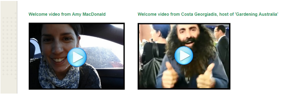

---

layout: strategy
title: "Welcome Videos"
category: strategy
tags: [Teacher Presence, ]
description: "Introduce the teacher and the subject to new students."
subjects: "EMC305, LAW221, "
subjectnames: ["Investigation: Mathematics, Science and Technology", "Law for the Human Services 2", ]

---

### Overview

A welcome video of between 5-10 minutes can be used at the commencement of a new subject to provide insight into different aspects of the subject such as introductory information about the subject, such as how it fits in with the students wider course that the student is completing (e.g., What prior learning it builds upon). They can also be used to clarify early concerns or preconceptions that the teacher suspects students may hold based on his/her prior experience in delivering the subject. The teacher can also make clear the primary methods of communication that will be utilised throughout the subject. Students can get to know the individual teaching them too by providing some introductory background regarding the academic’s experience and background in this field of study, giving students a sense of confidence. These videos also provide an opportunity to highlight key aspects of assessment for the subject and key teaching and learning information.

### Engagement

The use of a welcome video, available before or at the start of session helps a student establish the context for the teaching, learning and assessment that will occur in the subject. Providing this information in a video, instead of solely relying on a text-based approach, helps students more readily identify with the academic. A welcome video which clearly articulates expectations and highlights important aspects of the subject can be a foundation to increase learner-to-academic interaction, this being a key aspect in increasing learner engagement. Research such as that carried out as part of the [LSES report](https://www.google.com.au/url?sa=t&rct=j&q=&esrc=s&source=web&cd=1&cad=rja&uact=8&ved=0ahUKEwifu5LL8vHNAhUEKJQKHdytAGYQFggdMAA&url=http%3A%2F%2Fwww.lowses.edu.au%2Fassets%2FALTC%2520LSES%2520Final%2520Report%25202012.pdf&usg=AFQjCNHXFHEZfr3ZJFvXP3FMhYkoJLOWbQ&sig2=PuMuohIhHQ2oXL3ZcdoeKg&bvm=bv.127178174,d.dGo) clearly highlights the need for students, particularly those from non traditional backgrounds, to be able to feel that their lecturers are approachable and support their learning journey. Providing a welcome video is an important part of the strategy mix in achieving these aims.

### In Practice

#### Subject

EMC305 Investigation: Mathematics, Science and Technology

#### Teaching Staff

Amy MacDonald, Paige Lee, Amber Marcus, Michelle Muller, Jody Rumble, Virginia Sexton

#### Motivation

Within this subject a majority of the students are juggling the demands of working and family life whilst completing their studies. The lecturer has recognised that studying online means that it is therefore harder for these students to form connections between themselves and with the content and has endeavoured to provide regular touch points for students to connect with. In this instance the use of an iPhone to record a ‘low fi’ video welcome message sends a strong message to students that she empathises with the demands placed on their time, whilst still providing valuable welcome information about the teaching team, the content and the assessments.

#### Implementation

In this instance implementation of the use of a welcome video was relatively straightforward, with the academic recording this welcome video in the ‘selfie’ style and uploading it to the subject site. For additional context, the academic has taken the ad-hoc opportunity to include a ‘guest expert welcome’, which, beyond acting as a point of interest and engagement, gives some additional insight into the importance of the content matter within the subject.

{: .u-full-width}

#### Subject

LAW221 Law for the Human Services 2

#### Teaching Staff

Cecelia Lenagh

#### Motivation

In this example the lecturer wanted a good quality video that provided essential context for the subject. It was important to share information about the lecturer to build empathy with students, and also to share what the subject is about and a little about the history of law in Australia to ignite interest. This subject has a lot of reading and can be quite intense therefore the opening video also reassures students and provides advice as to how they can do well.

#### Implementation

This video was professionally recorded on the Port Macquarie campus. It was then edited to maximise impact. It was placed on the landing page at the start of the subject in 201730. A thoughtful static image has been set, not of the lecturer in this instance.



### Guide

To create a successful Welcome Video there are some decisions to make:

* Don’t try to explain every topic/week within the video -  focus on aspects such as summarising the learning outcomes and mention assessment tasks as needed. The intention should be to welcome students and complement the information that is already available to them. To that end, prioritise the key messages you want students to know when they finish your welcome video.
* Consider the context for recording the video - can you get creative and record the video in a location other than your office? For example, for a science subject, could you record the welcome video in the lab? Getting a colleague to assist you to record via e.g. smartphone in a genuine setting is at least as powerful for students as a click through powerpoint with voiceover, and your enthusiasm for the subject will be readily apparent to students.
* The creation of a welcome video need not be onerous - rather than creating a start to finish ‘script’, an equally useful approach is to create a series of headings with supporting ‘talking points.’ A ‘welcome’ video will potentially feel more welcoming if it is relatively informal and accessible, with just the key aspects conveyed to students. Equally important is the fact that you needn’t feel compelled to have every latest feature in your video production - a simply delivered clear message that students can identify with is more than adequate.
* Think about how your use of a welcome video fits in with your broader plan to build and maintain your teacher presence and how you will communicate with students throughout the subject. Successful student communication is relevant, timely and accessible. Your communication approach shouldn’t be a moving target for students-in other words, utilising a smaller range of communication strategies in an effective and efficient way means greater consistency and provides one less barrier for success for online learners who will quickly learn where and how you communicate-a trait online students appreciate.

### Tools

To create a welcome video there is a wide variety of tools available, many of them CSU supported technologies:

* CSU Replay/Personal Capture (Echo360) - Useful when you wish to capture both yourself as a ‘talking head’ in conjunction with what you are presenting. Of course this software provides options such as voice capture with screen only. A useful tool because the start to finish process can be handled from your desktop;it’s a CSU supported technology and provides ease of insertion into your subject space within interact2
* Adobe Connect - Used primarily within CSU as a meeting tool, but does provide a screenshare and recording functionality-particularly useful if you intend on providing a recording of an online meeting you have run as a ‘Welcome’ type meeting at the start of your subject.
* Computer Webcams - You can create a direct to camera recording utilising the webcam and microphone on your desktop/laptop (PC or mac) and there are numerous options for making this available e.g. storing and streaming in YouTube as a private channel and embedding in your Interact2 homepage or uploading the file into Interact2 as well (not recommended as students will incur greater download charges).
* Mobile technologies such as ipads and smartphones can provide you with a quick and easy way to capture footage ‘in the real world.’ Be aware that these files can quickly become large in size and emailing as a means of moving files can quickly degrade the quality, rendering them unusable. The best way to move these files is through a cloud storage solution such as Google Drive or Dropbox.

### Additional Resources

Borup, J., West, R. E., & Graham, C. R. (2012). Improving online social presence through asynchronous video. *The Internet and Higher Education*,*15*(3), 195-203.

Faculty of Science CSU. (2017, March 22). _How to make a video for your subject site and using YouTube to edit_. Retrieved from [https://youtu.be/cAnAFdTCF8Y](https://youtu.be/cAnAFdTCF8Y)

